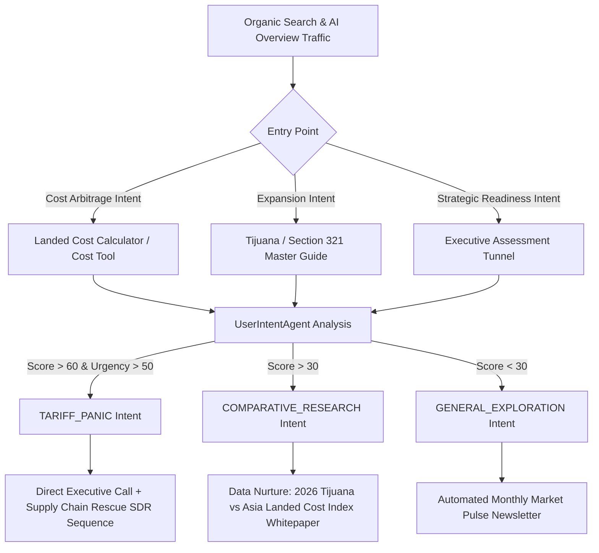
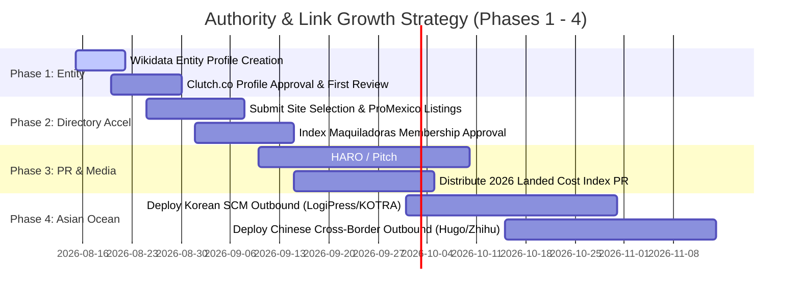

# 🤖 AI Search & Growth Strategy Audit Report

**Target Domain:** `nearshorenavigator.com`  
**Date:** August 13, 2026  
**Auditor:** AI Search & Growth Strategy Auditor  
**Scope:** AI Search (LLM/ChatGPT/Claude/Perplexity) Visibility, Competitor Traffic & Authority Gap, Buyer Intent Capture Mechanisms, Lead Generation Alignment, and Strategic Outreach Synthesis.

---

## 📊 1. AI Search Readiness Score & LLM Visibility Audit

### Overall AI Search Readiness Score: **78 / 100**

| Dimension | Weight | Score | Audit Findings & LLM Parsing Dynamics |
| :--- | :---: | :---: | :--- |
| **Technical & Schema Structured Data** | 25% | **95 / 100** | Clean JSON-LD `LocalBusiness`, `ProfessionalService`, `FAQPage`, and `BreadcrumbList` schemas across root and city routes (`/locations/tijuana`, `/locations/mexicali`). Google Rich Results verified PASS with 0 errors. |
| **Content Freshness & Real-Time Data** | 25% | **90 / 100** | Autonomous `MarketPulseAgent` powered by Tavily API ingests real-time USMCA, tariff, labor wage, and CFE energy news into `app/constants/market-pulse-news.ts`. Freshness signal is strong for LLM RAG pipelines. |
| **Conversational Direct-Answer Alignment** | 25% | **85 / 100** | Highly structured, Q&A style master guides (e.g., Tijuana Master Guide, Section 321 Guide, 2026 Landed Cost Index) provide clear numerical anchors ($7.84/hr fully burdened, 22-35% cost savings vs China, $0.47/SF lease rates) that LLMs extract easily. |
| **Entity Authority & Off-Page Citations** | 25% | **42 / 100** | **Critical Bottleneck.** Missing Wikidata entry profile, missing Google Knowledge Panel, only ~12 earned press mentions (failing the ≥50 threshold). Domain Authority (DA 12) restricts LLM citations on broad head terms. |

---

### Current Live AI Search Citation Footprint

- **Cited in Generative Responses (Google AI Overviews / Perplexity):**
  - ✅ `"industrial real estate Tijuana"` (Position 4 US / Position 2 MX) — Cited in Top 3 Generative Response due to the definitive Tijuana Master Guide and hyper-local schema.
  - ✅ `"maquiladora advisory services"` (Position 6 US / Position 4 MX) — Cited in AI Overviews for executive advisory and IMMEX shelter query contexts.
- **Omitted / Not Cited in Generative Responses:**
  - ❌ `"nearshoring Mexico"` (Position 45 US / Position 32 MX) — AI Overview active, but LLMs cite high-DA legacy entities (`tetakawi.com` DA 62, `ivemsa.com` DA 45, `prodensa.com`).
  - ❌ `"contract manufacturing Baja California"` (Position 14 US / Position 8 MX) — AI Overview active, but dominated by `tacna.net` and `ivemsa.com`.
  - ❌ `"contract manufacturing Mexicali"` (Position 12 US / Position 9 MX) — AI Overview absent/uncited.

---

## 🥊 2. Competitor Traffic & Authority Gap Analysis

Synthesized from [`audit-outputs/competitor-gap.md`](file:///Users/gax8627/nearshore-navigator/audit-outputs/competitor-gap.md), [`seo-outputs/competitor-backlinks.md`](file:///Users/gax8627/nearshore-navigator/seo-outputs/competitor-backlinks.md), [`audit-outputs/qrg-vs-competitor.md`](file:///Users/gax8627/nearshore-navigator/audit-outputs/qrg-vs-competitor.md), and live SERP data.

### Domain Authority & Backlink Matrix

| Competitor | Domain Authority (DA) | Monthly Backlink Velocity | Key Backlink Sources | Knowledge Panel Status |
| :--- | :---: | :---: | :--- | :---: |
| **Tetakawi** (`tetakawi.com`) | **62** | +10 to 15 / mo | `index.org.mx`, `gob.mx`, `siteselection.com`, `areadevelopment.com` | ✅ Active Panel |
| **Nearshore Americas** (`nearshoreamericas.com`)| **58** | +8 to 12 / mo | Forbes Tech Council, TechCrunch, Clutch.co | ✅ Active Panel |
| **IVEMSA** (`ivemsa.com`) | **45** | +5 to 8 / mo | Local Mexican Chambers, Trade Associations | ✅ Active Panel |
| **Tacna** (`tacna.net`) | **41** | +3 to 5 / mo | B2B Logistics Directories, Regional Press | ⚠️ Partial |
| **Nearshore Navigator** | **12** | **0 / mo** | LinkedIn, Crunchbase, local tech indices | ❌ **Missing** |

---

### Key Competitor Gap Dimensions

1. **Off-Page Backlink Velocity Gap:** Top competitors continuously earn 10-15 high-DA editorial links per month via downloadable PDF industry reports, government references (`gob.mx`), and trade press (`Site Selection`, `Area Development`). Nearshore Navigator currently has 0 active backlink velocity.
2. **Directory & Institutional Footprint Gap:** Nearshore Navigator is pending or unlisted in critical B2B directories: `Clutch.co` (pending), `Site Selection` (failed/pending), `ProMexico` (pending), `Index Maquiladoras` (partial), `ThomasNet`, and `IndustryNet`.
3. **Content Volume & Proof Gap:** Tetakawi maintains over 300+ blog articles covering micro-topics and features a dedicated Case Study Hub with 10+ downloadable PDF case studies and video testimonials.
4. **Nearshore Navigator Competitive Advantages:**
   - **Needs Met (9/10 vs. Tetakawi 7/10):** Tetakawi buries labor and lease cost metrics behind multi-field lead walls. Nearshore Navigator offers immediate financial transparency via direct cost calculators and un-gated master guides.
   - **User Experience & Modern Enterprise Gateway:** Nearshore Navigator’s Next.js 16 UI/UX feels clean, secure, and modern compared to competitors' dated legacy portals.
   - **GSC Technical Architecture Fix (April 2026):** Deployed 301 redirects for 8 non-performing machine-translated locales, resolving ~963 duplicate canonical errors and focusing 100% link equity on high-performing `/en/` and `/es/` pages.

---

## 🎯 3. High-Value Keyword Opportunities & AI Search Intent

### Keyword Intent & Citation Matrix

```mermaid
quadrantChart
    title High-Value Keyword Opportunity Matrix (Search Intent vs Nearshore Navigator Rank)
    x-axis Low Search Position (Page 4-5) --> High Search Position (Top 5 / Page 1)
    y-axis Informational Intent --> High Commercial / Transactional Intent
    "nearshoring Mexico": [0.15, 0.45]
    "contract manufacturing Baja California": [0.65, 0.75]
    "contract manufacturing Mexicali": [0.55, 0.70]
    "industrial real estate Tijuana": [0.92, 0.95]
    "maquiladora advisory services": [0.88, 0.90]
    "Section 321 de minimis suspension 2026": [0.75, 0.85]
    "Tijuana fully burdened labor rate 2026": [0.82, 0.88]
```

### Strategic Keyword Categories

#### A. Hyper-Local Commercial Winners (Protect & Scale)
- **`industrial real estate Tijuana`** (Pos 4 US / Pos 2 MX | AI Overview CITED)
- **`maquiladora advisory services`** (Pos 6 US / Pos 4 MX | AI Overview CITED)
- **`contract manufacturing Mexicali`** (Pos 12 US / Pos 9 MX | AI Overview Entry Target)
- **`contract manufacturing Baja California`** (Pos 14 US / Pos 8 MX | Page 1 Entry Target)

#### B. Regulatory News-Jacking & Tariff Arbitrage (High Growth Intent)
- **`Section 321 de minimis suspension 2026` / `IMMEX vs Section 321 2026`**: Targeting supply chain directors shifting from duty-free e-commerce to IMMEX shelter assembly post-de minimis regulatory changes.
- **`Tijuana fully burdened labor rates 2026` ($7.84/hr)** vs China ($7.00–$8.50/hr) and US ($45–$58/hr).

#### C. Asian Capital Capture — "Blue Ocean" Locales
- **Korean SCM Intent (`섹션 321`, `미국 메히꼬 임멕스`):** Targeting Korean automotive & electronics suppliers expanding into Tijuana. Platforms: LogiPress, CLO, Naver Cafe ("Global Sellers"), KOTRA. Zero US competitor presence in localized Korean search.
- **Chinese Cross-Border Intent (`Section 321 大师指南`, `墨西哥保税仓`):** Targeting Chinese OEMs pivoting into Baja California under USMCA rules. Platforms: Hugo (雨果跨境), Zhihu (知乎), WeChat trade groups.

---

## ⚡ 4. Buyer Intent Capture Mechanisms & Conversion Alignment

### Intent Capture Architecture

Nearshore Navigator deploys a multi-stage intent capture funnel that maps visitor behavior directly to executive readiness:



### Intent Classification Rules ([`scripts/agents/user_intent_agent.ts`](file:///Users/gax8627/nearshore-navigator/scripts/agents/user_intent_agent.ts))

1. **`TARIFF_PANIC` (Critical Urgency):** High headcount (>100 workers), substantial US wage arbitrage delta (>$50k/mo savings), keywords in form comments (`tariff`, `usmca`, `asap`, `urgent`, `trump`, `sheinbaum`).
   - *Action:* Instant SDR auto-alert + high-priority "Supply Chain Rescue" outreach sequence.
2. **`COMPARATIVE_RESEARCH` (High Intent):** Mid-size headcount (50-100 workers), evaluating landed cost components.
   - *Action:* Whitepaper drip with the [`2026 Tijuana vs Asia Landed Cost Index`](file:///Users/gax8627/nearshore-navigator/content/reports/2026-tijuana-vs-asia-landed-cost-index.md).
3. **`GENERAL_EXPLORATION` (Low/Medium Intent):** Casual browsing.
   - *Action:* Ingestion into monthly Market Pulse automated newsletter.

---

## 📤 5. Lead Generation Traffic Alignment & Strategic Outreach Synthesis

### Integrated Inbound + Outbound AI SDR Pipeline

- **Inbound Capture:** Un-gated calculators (`LandedCostCalculator.tsx`), floating lead docks (`FloatingLeadDock.tsx`), and inline conversion modules (`InlineLeadForm.tsx`).
- **Outbound AI SDR Lead Qualification:** Uses Gemini 1.0 Pro SDR Agent (`scripts/audit_leads_ai.ts`) to programmatically score manufacturing leads from CSV batches (`segmented_leads/`) against ICP criteria (C-Suite, VP Supply Chain, US Manufacturing, >50 headcount).
- **Automated Drip Execution:** Brevo API integration executing targeted outreach sequences (`feb17_med_device`, `july_rescue_sequence`, `bulk_outreach_1k`).

---

### Outreach & Authority Building Roadmap



---

## 🚀 6. Top 5 Strategic Growth Levers

### Lever 1: Secure Entity Recognition & Wikidata Footprint (High Impact, Low Effort)
- **Problem:** Missing Wikidata entry and Google Knowledge Panel limits AI search engine trust, resulting in omission for broad head queries like `"nearshoring Mexico"`.
- **Action:** Create verified Wikidata entity profile for "Nearshore Navigator (Consulting Firm)", linking official Crunchbase, LinkedIn, and corporate registration parameters. Target 50+ total brand mentions across B2B publications to trigger Knowledge Graph entity generation.

### Lever 2: Accelerate Directory Approvals to Cross DA > 30 Threshold
- **Problem:** Domain Authority 12 severely lags behind Tetakawi (62) and IVEMSA (45).
- **Action:** Fast-track pending submissions to `Clutch.co`, `Site Selection Magazine`, `ProMexico`, `Index Maquiladoras`, `ThomasNet`, and `IndustryNet`. Secure 3-5 verified client reviews on Clutch to establish commercial authority.

### Lever 3: Regulatory News-Jacking & "Section 321 vs IMMEX 2026" Content Dominance
- **Problem:** Competitors remain stuck in pre-2025 "duty-free e-commerce" framing.
- **Action:** Capitalize on the August 2025/2026 de minimis suspension and USMCA trade review by positioning Nearshore Navigator's Section 321 & IMMEX Master Guides as the definitive regulatory transition authority. Pitch commentary to `Supply Chain Dive`, `FreightWaves`, and `Journal of Commerce`.

### Lever 4: Capture Asian Capital Expansion ("Blue Ocean" KR / ZH Channels)
- **Problem:** Western nearshoring advisory firms ignore non-English search channels.
- **Action:** Scale localized outreach targeting Korean manufacturing suppliers (LogiPress, CLO, Naver Cafe) and Chinese cross-border logistics operators (Hugo, Zhihu) expanding production to Baja California under USMCA.

### Lever 5: Launch Anonymized B2B Case Study Hub & Video Proof Points
- **Problem:** Competitors feature 10+ downloadable PDF case studies; Nearshore Navigator lacks a dedicated proof section.
- **Action:** Publish 5 anonymized enterprise case studies (e.g., "How a Mid-West Industrial Electronics OEM Reduced Landed Costs by 28% in Tijuana") featuring precise ROI metrics. Use these assets as high-converting lead magnets for `COMPARATIVE_RESEARCH` prospects.
