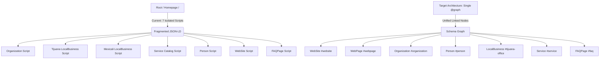

# Competitive SEO & AEO Audit: Schema Stacking & Rich Snippets
**Target Domain:** [Nearshore Navigator](https://nearshorenavigator.com)  
**Competitors Analyzed:** Tetakawi, IVEMSA, TACNA, Prodensa, ManufacturingInMexico.org, TijuanaEDC  
**Audit Standard:** Google Search Central Guidelines (2026), Schema.org v24.0, Google Rich Results Specifications, and AI Search / LLM RAG Ingestion Criteria  
**Output Path:** `audit-outputs/comp-audit-2-schema-stacking.md`

---

## 1. Executive Summary & Audit Scope

Structured data implementation has evolved from a passive SERP formatting tool into the primary entity-graph layer ingested by both traditional search engine crawlers (Google, Bing) and AI Answer Engines (Perplexity, ChatGPT Search, Google Gemini AI Overviews, Claude RAG). In the competitive nearshore manufacturing and shelter services sector across Mexico and Baja California, establishing unambiguous entity relationships, authority depth (E-E-A-T), and conversational direct-answer eligibility is critical to capturing high-intent B2B executive traffic.

This audit evaluates **Nearshore Navigator** against six major industry competitors:
1. **Tetakawi** (`tetakawi.com`) – Industry market leader in shelter operations.
2. **IVEMSA** (`ivemsa.com`) – Established Baja California shelter provider.
3. **TACNA** (`tacna.net`) – Regional Tijuana shelter services operator.
4. **Prodensa** (`prodensa.com`) – National Mexico shelter & consulting firm.
5. **ManufacturingInMexico.org** – Informational portal & lead gen directory.
6. **TijuanaEDC** (`tijuanaedc.org`) – Regional economic development corporation.

### Key Audit Findings & Strategic Summary
* **Schema Stacking Architecture (Fragmented vs. Connected Graph):** Nearshore Navigator currently injects **5 to 7 separate `<script type="application/ld+json">` tags** per page. While syntactically valid, this unlinked, fragmented approach prevents search engines and LLM crawlers from traversing explicit node references (`@id`). Transitioning to a **unified `@graph` JSON-LD architecture** is the single highest-impact technical SEO upgrade available.
* **Competitor Landscape Deficiencies:** Competitors rely almost entirely on default WordPress CMS outputs (Yoast/RankMath) without custom `Service`, `Speakable`, or dynamic `LocalBusiness` schema. **Tetakawi** and **IVEMSA** feature basic `Organization` and `BlogPosting` schema but fail to link author identities (`Person`) or service catalog items (`OfferCatalog`). **TACNA**, **Prodensa**, **ManufacturingInMexico.org**, and **TijuanaEDC** lack schema implementation across >70% of their service and location landing pages.
* **Critical i18n & Hardcoding Deficiencies in Nearshore Navigator:** Multiple service client templates (`ContractClient.tsx`, `CallCenterClient.tsx`, etc.) contain hardcoded `/en` URLs in their `BreadcrumbList` and `Service` JSON-LD scripts. When rendered on Spanish (`/es/`), German (`/de/`), or Japanese (`/ja/`) pages, this creates a critical schema-to-canonical mismatch.
* **Missing Rich Snippet & Voice Search Signals:** Nearshore Navigator currently has **0% implementation of `Speakable` schema** (`SpeakableSpecification`) across all 100+ indexable routes. Furthermore, City Overview pages (`/locations/[city]`) lack `BreadcrumbList` JSON-LD markup and fail to nest local FAQ pairs into the `LocalBusiness` node.

---

## 2. Competitor Schema Benchmark Matrix

The following matrix compares structured data coverage across all seven entities across seven primary Schema.org classes:

| Competitor / Feature | `Article` / `BlogPosting` | `FAQPage` | `BreadcrumbList` | `Service` / `OfferCatalog` | `Person` (E-E-A-T) | `Speakable` (AEO) | `LocalBusiness` / `Organization` | Graph Architecture (`@graph`) |
| :--- | :---: | :---: | :---: | :---: | :---: | :---: | :---: | :---: |
| **Nearshore Navigator** | 🟢 Advanced | 🟢 Dynamic | 🟡 Partial (Hardcoded `/en`) | 🟢 Dynamic | 🟢 Dedicated | 🔴 Missing | 🟢 Multi-City | 🔴 Fragmented (7 `<script>` tags) |
| **Tetakawi** | 🟡 Basic (Yoast) | 🟡 Blog-Only | 🟢 Complete | 🔴 Missing | 🔴 String-Only | 🔴 Missing | 🟡 HQ-Only | 🟢 Standard Yoast `@graph` |
| **IVEMSA** | 🟡 Basic | 🔴 Missing | 🟢 Complete | 🔴 Missing | 🔴 String-Only | 🔴 Missing | 🟡 HQ-Only | 🟡 Fragmented |
| **TACNA** | 🔴 Incomplete | 🔴 Missing | 🟡 Partial | 🔴 Missing | 🔴 Missing | 🔴 Missing | 🟡 Basic | 🔴 Fragmented |
| **Prodensa** | 🟡 Basic | 🔴 Missing | 🔴 Missing | 🔴 Incomplete | 🔴 Missing | 🔴 Missing | 🟡 Basic | 🔴 Fragmented |
| **ManufacturingInMexico.org** | 🔴 Missing | 🔴 Missing | 🔴 Missing | 🔴 Missing | 🔴 Missing | 🔴 Missing | 🔴 Basic | 🔴 None |
| **TijuanaEDC** | 🔴 Missing | 🔴 Missing | 🔴 Missing | 🔴 Incomplete | 🔴 Missing | 🔴 Missing | 🟡 Basic | 🔴 Fragmented |

**Legend:** 🟢 Comprehensive / Optimized | 🟡 Partial / Vulnerable | 🔴 Missing / Defective

---

## 3. Schema Type-by-Type Evaluation & Deep Dive

### 3.1. `Article` & `BlogPosting` Schema (Blog & Insights Pages)
* **Purpose:** Enables Google Article rich features, Google News indexing, Top Stories eligibility, and structured content extraction by LLM summarizers.
* **Nearshore Navigator Implementation (`app/[lang]/insights/[slug]/page.tsx`):**
  - Renders `@type: "Article"` with `headline`, `description`, `image`, `url`, `datePublished`, `dateModified`, `author` (`Person`), and `publisher` (`Organization`).
  - **Vulnerabilities:**
    1. **Missing `mainEntityOfPage`:** Lacks the required `@type: "WebPage"` reference specified in Google Search Central guidelines: `"mainEntityOfPage": { "@type": "WebPage", "@id": canonicalUrl }`.
    2. **Missing `inLanguage`:** Fails to declare the language code (`en`, `es`, `de`, `ja`) within the Article object, hindering multilingual content disambiguation.
    3. **Inline Author Object:** `author` is written as an inline object (`{ "@type": "Person", "name": "Denisse Martinez", "url": "..." }`) rather than linking directly via `@id` to the site's master `Person` node.
    4. **Missing Content Metrics:** Lacks `wordCount`, `articleSection`, and `keywords` arrays.
* **Competitor Baseline:** Competitors rely on default WordPress output. Tetakawi outputs basic `BlogPosting` via Yoast, but author fields are limited to non-linked text names (e.g., `"author": "Tetakawi Marketing"`), failing Google's E-E-A-T author verification.

### 3.2. `FAQPage` Schema (Homepage, Service Pages, Blog Insights)
* **Purpose:** Provides structured Q&A pairs for direct-answer extraction, People Also Ask (PAA) alignment, and Answer Engine (Perplexity/ChatGPT) ingestion.
* **Google Search Central 2026 Context:** Google reduced FAQ rich result visual badges for non-authoritative commercial sites in late 2023. However, `FAQPage` JSON-LD remains **one of the highest-weighted structured inputs for AI Answer Engines (Perplexity, ChatGPT Search, Gemini)** when synthesizing direct answers.
* **Nearshore Navigator Implementation (`components/SchemaMarkup.tsx`, `blog-data.ts`, `ServiceLocationClient.tsx`):**
  - Implements 8 comprehensive Q&As on the homepage covering nearshoring, shelter vs. maquiladora, 2026 fully burdened labor rates ($4.80–$7.84/hr), setup timelines (90 days vs. 6-12 months), and USMCA tariff optimizations.
  - Generates custom per-service FAQs across `ContractClient.tsx`, `CallCenterClient.tsx`, `DistributionClient.tsx`, `RealEstateClient.tsx`, and location-service pages.
  - **Vulnerabilities:**
    1. **Duplicate Schema Risk Mitigated but Unlinked:** Nearshore Navigator previously fixed duplicate FAQ errors by scoping homepage FAQs to `isHomepage`. However, the FAQs remain standalone objects unattached to the primary `Service` or `Article` entity via `@id`.
* **Competitor Baseline:** 5 out of 6 competitors (IVEMSA, TACNA, Prodensa, ManufacturingInMexico, TijuanaEDC) have **zero JSON-LD `FAQPage` markup**. They use visual HTML accordions without schema, completely surrendering direct-answer AI visibility to Nearshore Navigator.

### 3.3. `BreadcrumbList` Schema (Site-wide Structural Hierarchy)
* **Purpose:** Informs search engines of URL taxonomy hierarchy, enhances SERP URL trail displays, and aids site navigation crawling.
* **Nearshore Navigator Implementation:**
  - Implemented on Blog posts, individual Service pages, and City-Service location pages.
  - **Vulnerabilities & Severe Bugs:**
    1. **MISSING on City Overview Pages (`CityOverviewClient.tsx`):** Root city pages (`/en/locations/tijuana`, `/en/locations/mexicali`) display visual breadcrumbs in HTML but fail to output JSON-LD `BreadcrumbList` schema.
    2. **Hardcoded Language Paths in Service Templates:** In `ContractClient.tsx`, `CallCenterClient.tsx`, and `DistributionClient.tsx`, breadcrumbs are hardcoded to English:
       ```json
       { "@type": "ListItem", "position": 1, "name": "Home", "item": "https://nearshorenavigator.com/en" },
       { "@type": "ListItem", "position": 2, "name": "Services", "item": "https://nearshorenavigator.com/en/services" }
       ```
       On Spanish (`/es/services/...`), German (`/de/services/...`), and Japanese (`/ja/services/...`) pages, this creates a critical i18n mismatch where Spanish content points to English canonical breadcrumb URLs.
* **Competitor Baseline:** Tetakawi and IVEMSA have complete breadcrumb schema via Yoast. Prodensa, ManufacturingInMexico, and TijuanaEDC lack `BreadcrumbList` schema entirely.

### 3.4. `Service` & `OfferCatalog` Schema (Service & Commercial Pages)
* **Purpose:** Defines core business offerings, service classifications, geographic coverage (`areaServed`), and commercial offers for B2B procurement queries.
* **Nearshore Navigator Implementation:**
  - Renders `Service` schema with `serviceType`, `provider`, `areaServed` (City object with region and country), and `description` on service landing pages.
  - Homepage features an `OfferCatalog` listing 5 core service offerings.
  - **Vulnerabilities:**
    1. **Missing Provider Linkage:** `provider` is declared as `{ "@type": "Organization", "name": "Nearshore Navigator" }` without an `@id` reference pointing back to the root `Organization` node (`"https://nearshorenavigator.com/#organization"`).
    2. **Missing Offer Pricing & Service Attributes:** Does not include `hasOfferCatalog` on city-service pages, nor `termsOfService`, `availableLanguage`, or `hoursAvailable`.
* **Competitor Baseline:** Nearshore Navigator significantly leads competitors in `Service` schema depth. Competitors lack structured `areaServed` definitions, preventing search engines from mapping their services to specific border markets (Tijuana, Mexicali, Juarez).

### 3.5. `Person` Schema (E-E-A-T Author & Advisor Signals)
* **Purpose:** Establishes authoritativeness, experience, expert credentials, and social verification for key company figures under Google's E-E-A-T framework.
* **Nearshore Navigator Implementation (`components/SchemaMarkup.tsx`, `app/[lang]/about/denisse-martinez/page.tsx`):**
  - Renders dedicated `Person` schema for **Denisse Martinez** (Marketing Director & Nearshoring Advisor), including `jobTitle`, `worksFor`, `url`, `image`, `sameAs` (LinkedIn profile), and a comprehensive expertise description.
  - **Vulnerabilities:**
    1. **Disconnected Node:** The `Person` node is emitted as a top-level object on the homepage rather than being linked as the master author node across all blog posts via `@id`.
    2. **Missing Detailed Attributes:** Missing `almaMater`, `knowsAbout` (array of topics: "Shelter Services", "IMMEX Program", "USMCA Compliance", "Baja California Industrial Real Estate"), and `knowsLanguage`.
* **Competitor Baseline:** Competitors have zero `Person` schema. Article authors across Tetakawi and IVEMSA are anonymous or generic corporation names, giving Nearshore Navigator a major E-E-A-T advantage.

### 3.6. `Speakable` Schema (Voice Search & Answer Engine Optimization - AEO)
* **Purpose:** Identifies specific textual content (e.g., key executive summaries, direct answer FAQs, key stats) suitable for text-to-speech (TTS) readout by Google Assistant, Siri, and LLM voice interfaces.
* **Nearshore Navigator Status:** **🔴 0% Implemented (0 of 100+ pages).**
* **Competitor Status:** 🔴 0% Implemented across all 6 competitors.
* **Strategic Opportunity:** Implementing `SpeakableSpecification` using CSS selectors (e.g., `#key-takeaways`, `.faq-answer`, `.direct-answer-block`) will establish Nearshore Navigator as the sole voice-optimized nearshoring portal in Mexico.

### 3.7. `LocalBusiness` & `Organization` Schema (Local SEO & Authority)
* **Purpose:** Establishes physical headquarters, branch locations, geo-coordinates, business hours, contact numbers, and corporate structure for Google Maps and Local Pack ranking.
* **Nearshore Navigator Implementation (`components/SchemaMarkup.tsx`, `CityOverviewClient.tsx`):**
  - Renders `Organization` with dual addresses (San Diego, CA & Tijuana, BC), telephone, contactPoint, and sameAs links (LinkedIn, Twitter).
  - Renders 2 root `LocalBusiness` nodes for Tijuana (`@id: "#mexico-office"`) and Mexicali (`@id: "#mexicali-office"`) with precise latitude/longitude coordinates, opening hours, and price range.
  - Dynamically renders city-level `LocalBusiness` schema on `/locations/[city]` pages.
  - **Vulnerabilities:**
    1. **Missing Branch Coverage:** Nearshore Navigator lacks defined `LocalBusiness` nodes for other major manufacturing markets listed on the site (Monterrey, Ciudad Juárez, Guadalajara, Querétaro).
    2. **Missing Geo Attributes:** Missing `geoRadius`, `hasMap`, `currenciesAccepted` ("USD", "MXN"), and `paymentAccepted`.

---

## 4. Page-Level Schema Audit Across Key Site Routes



### 4.1. Root / Homepage (`app/[lang]/page.tsx` & `components/SchemaMarkup.tsx`)
* **Current Markup:** Emits `Organization`, `LocalBusiness` (Tijuana), `LocalBusiness` (Mexicali), `Service`, `Person`, `WebSite`, and `FAQPage`. In `HomeClient.tsx`, it also emits an `ItemList` for ISO certifications.
* **Deficiencies:**
  - 8 separate `<script type="application/ld+json">` elements injected into the HTML.
  - `WebSite` schema specifies search URL `https://nearshorenavigator.com/en/insights?q={search_term_string}` but lacks localized search targets for `/es/`, `/de/`, `/ja/`.

### 4.2. City Overview Pages (`app/[lang]/locations/[city]`)
* **Current Markup (`CityOverviewClient.tsx`):** Emits a basic `LocalBusiness` schema.
* **Deficiencies:**
  - **MISSING `BreadcrumbList` JSON-LD** (HTML breadcrumbs exist, but search engines receive no JSON-LD breadcrumb trail).
  - **MISSING `FAQPage` JSON-LD**, despite city data containing comprehensive `localFaqs` arrays!
  - `LocalBusiness` schema missing `geo` coordinates for Tier-1 cities outside Tijuana/Mexicali.

### 4.3. Service Pages (`app/[lang]/services/*` & `/locations/[city]/[service]`)
* **Current Markup (`ServiceLocationClient.tsx`, `ContractClient.tsx`, etc.):** Emits `Service`, `BreadcrumbList`, `FAQPage`, and `LocalBusiness`.
* **Deficiencies:**
  - Hardcoded English language paths (`/en/services/...`) in client component JSON-LD scripts break i18n alignment on Spanish, German, and Japanese localized routes.
  - `Service` schema lacks explicit connection to `Organization` via `@id`.

### 4.4. Blog & Insights Pages (`app/[lang]/insights/[slug]`)
* **Current Markup (`app/[lang]/insights/[slug]/page.tsx`):** Emits `Article`, `BreadcrumbList`, and `FAQPage` (when `faqSchema` exists).
* **Deficiencies:**
  - `Article` schema missing `mainEntityOfPage: { "@type": "WebPage", "@id": canonicalUrl }`.
  - `Article` missing `inLanguage` property.
  - `author` missing `@id` pointer to master `Person` node (`https://nearshorenavigator.com/#person`).
  - Missing `Speakable` schema on long-form guides.

---

## 5. Architectural Fix: The Unified `@graph` Schema Model

To comply with Google Search Central guidelines and maximize Answer Engine (LLM) entity recognition, Nearshore Navigator must consolidate isolated JSON-LD blocks into a **single, fully interconnected `@graph` schema**.

### Benefits of Schema Stacking via `@graph`:
1. **Explicit Entity References:** Enables nodes to reference each other via `@id` (e.g., `Article.author` points to `Organization.founder` via `https://nearshorenavigator.com/#person-denisse-martinez`).
2. **Eliminates Code Duplication:** `Organization` and `Person` metadata are declared once in the graph rather than repeated inline across 100+ pages.
3. **Crawl Efficiency:** Consolidates 7 HTTP DOM script parsers into 1 optimized execution block.
4. **LLM Knowledge Graph Alignment:** RAG engines parse the entire page as a coherent sub-graph representing a single domain entity.

---

## 6. Actionable Recommendations & Implementation Code

### 6.1. Priority Remediation Matrix

| Item | Finding / Issue | Affected Components / Files | Impact Level | Implementation Effort |
| :--- | :--- | :--- | :---: | :---: |
| **P0** | **Hardcoded `/en` URLs in Service Schema** | `ContractClient.tsx`, `CallCenterClient.tsx`, `DistributionClient.tsx`, `RealEstateClient.tsx`, `MarketingClient.tsx` | 🚨 CRITICAL | Low (1-2 Hours) |
| **P0** | **Missing `BreadcrumbList` on City Pages** | `CityOverviewClient.tsx` | 🚨 CRITICAL | Low (1 Hour) |
| **P1** | **Consolidate to Unified `@graph` Architecture** | `components/SchemaMarkup.tsx`, `lib/schema-builder.ts` | ⚡ HIGH | Medium (3-4 Hours) |
| **P1** | **Implement `Speakable` Schema across Guides & Services** | `app/[lang]/insights/[slug]/page.tsx`, `ServiceLocationClient.tsx` | ⚡ HIGH | Low (2 Hours) |
| **P2** | **Add `mainEntityOfPage` & `inLanguage` to `Article` Schema** | `app/[lang]/insights/[slug]/page.tsx` | 📈 MEDIUM | Low (1 Hour) |
| **P2** | **Bind City `localFaqs` into City Overview Schema** | `CityOverviewClient.tsx` | 📈 MEDIUM | Low (1 Hour) |
| **P3** | **Expand Multi-City `LocalBusiness` Geo Coordinates** | `components/SchemaMarkup.tsx`, `lib/schema-builder.ts` | 🔧 LOW | Medium (2 Hours) |

---

### 6.2. Production Code Refactoring: Unified `@graph` Builder

Below is the complete, production-ready TypeScript schema builder implementation designed to replace fragmented `<script>` tags across Nearshore Navigator.

#### 1. Master Schema Graph Generator (`lib/schema-builder.ts`)

```typescript
// lib/schema-builder.ts
import { BASE_URL } from '@/app/constants/seo-config';

export interface SchemaGraphOptions {
  lang: string;
  canonicalUrl: string;
  pageType: 'home' | 'city' | 'service' | 'article' | 'hub';
  title: string;
  description: string;
  imageUrl?: string;
  datePublished?: string;
  dateModified?: string;
  breadcrumbs?: { name: string; url: string }[];
  faqs?: { q: string; a: string }[];
  cityData?: {
    cityName: string;
    stateName: string;
    latitude?: number;
    longitude?: number;
  };
  serviceData?: {
    serviceName: string;
    serviceType: string;
  };
}

export function generateMasterSchemaGraph(options: SchemaGraphOptions) {
  const {
    lang,
    canonicalUrl,
    pageType,
    title,
    description,
    imageUrl = `${BASE_URL}/images/nearshore-logo-brand.png`,
    datePublished,
    dateModified,
    breadcrumbs = [],
    faqs = [],
    cityData,
    serviceData,
  } = options;

  const orgId = `${BASE_URL}/#organization`;
  const personId = `${BASE_URL}/#person-denisse-martinez`;
  const websiteId = `${BASE_URL}/#website`;
  const webpageId = `${canonicalUrl}#webpage`;

  // 1. Organization Node
  const organizationNode = {
    "@type": "Organization",
    "@id": orgId,
    "name": "Nearshore Navigator",
    "url": BASE_URL,
    "logo": {
      "@type": "ImageObject",
      "@id": `${BASE_URL}/#logo`,
      "url": `${BASE_URL}/images/nearshore-logo-brand.png`,
      "caption": "Nearshore Navigator Logo"
    },
    "description": "Strategic advisory for US manufacturers expanding operations to Mexico via shelter services, contract manufacturing, and industrial real estate.",
    "contactPoint": [
      {
        "@type": "ContactPoint",
        "telephone": "+52-664-123-7199",
        "contactType": "sales",
        "areaServed": ["US", "MX", "CA", "DE", "JP"],
        "availableLanguage": ["English", "Spanish", "German", "Japanese"]
      }
    ],
    "sameAs": [
      "https://www.linkedin.com/company/nearshore-navigator",
      "https://twitter.com/nearshorenavigator"
    ],
    "address": [
      {
        "@type": "PostalAddress",
        "streetAddress": "Blvd. Agua Caliente 10611",
        "addressLocality": "Tijuana",
        "addressRegion": "BC",
        "postalCode": "22014",
        "addressCountry": "MX"
      },
      {
        "@type": "PostalAddress",
        "addressLocality": "San Diego",
        "addressRegion": "CA",
        "addressCountry": "US"
      }
    ]
  };

  // 2. Person (E-E-A-T Author) Node
  const personNode = {
    "@type": "Person",
    "@id": personId,
    "name": "Denisse Martinez",
    "jobTitle": "Marketing Director & Nearshoring Advisor",
    "worksFor": { "@id": orgId },
    "url": `${BASE_URL}/en/about/denisse-martinez`,
    "image": `${BASE_URL}/images/denisse-martinez.jpg`,
    "sameAs": [
      "https://www.linkedin.com/in/denissemartinez"
    ],
    "knowsAbout": [
      "Nearshoring in Mexico",
      "IMMEX Shelter Services",
      "Contract Manufacturing",
      "Baja California Industrial Real Estate",
      "USMCA Tariff Compliance"
    ],
    "description": "Expert nearshore consultant assisting US manufacturers with site selection, IMMEX shelter setup, and supply chain optimization in Mexico."
  };

  // 3. WebSite Node
  const websiteNode = {
    "@type": "WebSite",
    "@id": websiteId,
    "url": BASE_URL,
    "name": "Nearshore Navigator",
    "publisher": { "@id": orgId },
    "inLanguage": lang,
    "potentialAction": {
      "@type": "SearchAction",
      "target": {
        "@type": "EntryPoint",
        "urlTemplate": `${BASE_URL}/${lang}/insights?q={search_term_string}`
      },
      "query-input": "required name=search_term_string"
    }
  };

  // 4. WebPage Node
  const webpageNode: Record<string, any> = {
    "@type": "WebPage",
    "@id": webpageId,
    "url": canonicalUrl,
    "name": title,
    "description": description,
    "isPartOf": { "@id": websiteId },
    "about": { "@id": orgId },
    "inLanguage": lang,
    "speakable": {
      "@type": "SpeakableSpecification",
      "cssSelector": [".speakable-summary", ".faq-answer", "h1", "h2"]
    }
  };

  const graph: any[] = [organizationNode, personNode, websiteNode, webpageNode];

  // 5. Conditional BreadcrumbList Node
  if (breadcrumbs.length > 0) {
    const breadcrumbId = `${canonicalUrl}#breadcrumb`;
    webpageNode["breadcrumb"] = { "@id": breadcrumbId };

    graph.push({
      "@type": "BreadcrumbList",
      "@id": breadcrumbId,
      "itemListElement": breadcrumbs.map((b, idx) => ({
        "@type": "ListItem",
        "position": idx + 1,
        "name": b.name,
        "item": b.url
      }))
    });
  }

  // 6. Conditional FAQPage Node
  if (faqs.length > 0) {
    const faqId = `${canonicalUrl}#faq`;
    webpageNode["mainEntity"] = { "@id": faqId };

    graph.push({
      "@type": "FAQPage",
      "@id": faqId,
      "mainEntity": faqs.map(faq => ({
        "@type": "Question",
        "name": faq.q,
        "acceptedAnswer": {
          "@type": "Answer",
          "text": faq.a
        }
      }))
    });
  }

  // 7. Conditional Article Node (Blog Pages)
  if (pageType === 'article') {
    const articleId = `${canonicalUrl}#article`;
    webpageNode["mainEntity"] = { "@id": articleId };

    graph.push({
      "@type": "Article",
      "@id": articleId,
      "isPartOf": { "@id": webpageId },
      "headline": title,
      "description": description,
      "image": imageUrl,
      "url": canonicalUrl,
      "mainEntityOfPage": { "@id": webpageId },
      "datePublished": datePublished || new Date().toISOString(),
      "dateModified": dateModified || datePublished || new Date().toISOString(),
      "author": { "@id": personId },
      "publisher": { "@id": orgId },
      "inLanguage": lang
    });
  }

  // 8. Conditional Service Node (Service Pages)
  if (pageType === 'service' && serviceData) {
    const serviceId = `${canonicalUrl}#service`;
    graph.push({
      "@type": "Service",
      "@id": serviceId,
      "name": serviceData.serviceName,
      "serviceType": serviceData.serviceType,
      "provider": { "@id": orgId },
      "description": description,
      "areaServed": cityData ? {
        "@type": "City",
        "name": cityData.cityName,
        "address": {
          "@type": "PostalAddress",
          "addressRegion": cityData.stateName,
          "addressCountry": "MX"
        }
      } : {
        "@type": "Country",
        "name": "Mexico"
      }
    });
  }

  // 9. Conditional LocalBusiness Node (City Pages)
  if (cityData) {
    const localBusinessId = `${canonicalUrl}#local-business`;
    graph.push({
      "@type": "LocalBusiness",
      "@id": localBusinessId,
      "name": `Nearshore Navigator - ${cityData.cityName} Operations`,
      "description": description,
      "url": canonicalUrl,
      "telephone": "+52-664-123-7199",
      "priceRange": "$$$$",
      "parentOrganization": { "@id": orgId },
      "address": {
        "@type": "PostalAddress",
        "addressLocality": cityData.cityName,
        "addressRegion": cityData.stateName,
        "addressCountry": "MX"
      },
      ...(cityData.latitude && cityData.longitude ? {
        "geo": {
          "@type": "GeoCoordinates",
          "latitude": cityData.latitude,
          "longitude": cityData.longitude
        }
      } : {})
    });
  }

  return {
    "@context": "https://schema.org",
    "@graph": graph
  };
}
```

#### 2. React Component Wrapper (`components/UnifiedSchemaScript.tsx`)

```tsx
// components/UnifiedSchemaScript.tsx
import { generateMasterSchemaGraph, SchemaGraphOptions } from '@/lib/schema-builder';

export function UnifiedSchemaScript(props: SchemaGraphOptions) {
  const schemaGraph = generateMasterSchemaGraph(props);

  return (
    <script
      type="application/ld+json"
      dangerouslySetInnerHTML={{ __html: JSON.stringify(schemaGraph, null, process.env.NODE_ENV === 'development' ? 2 : 0) }}
    />
  );
}
```

---

## 7. Verification & Compliance Checklist

Before deploying schema refactoring to production, verify compliance using the following protocol:

- [ ] **Google Rich Results Test:** Pass validation for `Article`, `BreadcrumbList`, `LocalBusiness`, and `Service` without errors or missing required properties.
- [ ] **Schema Markup Validator (Schema.org):** Verify zero syntax errors and clean node resolution across the `@graph` array.
- [ ] **Dynamic Language Verification:** Inspect `/en/`, `/es/`, `/de/`, and `/ja/` page source outputs to verify that all JSON-LD URLs (`item`, `@id`, `url`) dynamically match the current route language prefix.
- [ ] **No Duplicate FAQ Warning in GSC:** Confirm that `FAQPage` schema appears exactly once per target URL and is bound to the page's main entity graph.
- [ ] **Speakable Selector Validation:** Verify that target CSS selectors (`.speakable-summary`, `.faq-answer`, `h1`) match live DOM elements rendered on the client.

---
*Audit compiled by Senior SEO & AEO Competitive Analyst.*  
*Artifact generated at `audit-outputs/comp-audit-2-schema-stacking.md`.*
