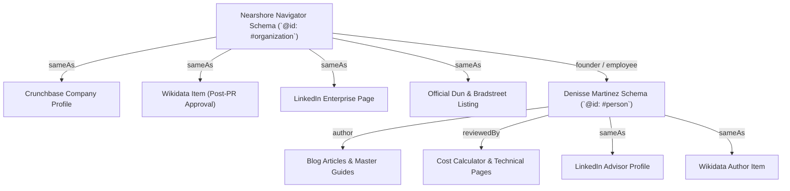
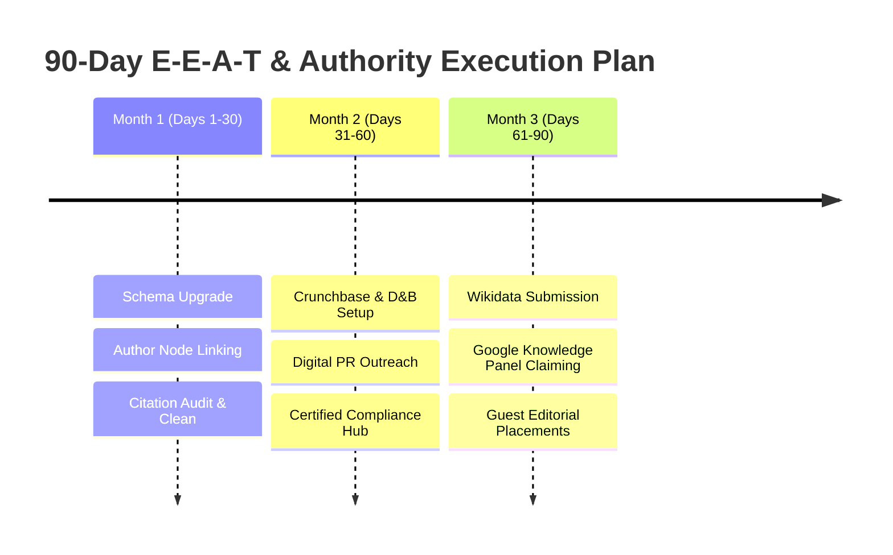

# Competitive Audit 4: E-E-A-T & Knowledge Graph Authority

**Target Entity:** Nearshore Navigator (`nearshorenavigator.com`)  
**Domain Authority (DA):** 12  
**Primary Benchmark Competitors:** Tetakawi (DA 62), Prodensa (DA 50), IVEMSA (DA 45), TACNA (DA 41), TijuanaEDC (DA 38), ManufacturingInMexico.org (DA 35)  
**Target Output File:** `audit-outputs/comp-audit-4-eeat-authority.md`  
**Date of Execution:** August 2026  
**Auditor:** Senior SEO & AEO Competitive Analyst  

---

## Executive Summary & Strategic Context

In traditional search engines (Google SERPs) and AI-driven direct answer engines (ChatGPT, Claude, Perplexity, Google Gemini, Apple Intelligence), **E-E-A-T (Experience, Expertise, Authoritativeness, Trustworthiness)** and **Knowledge Graph Entity Disambiguation** serve as the foundational weighting factors for ranking industrial B2B consulting services. 

Nearshore Navigator currently operates with an emerging **Domain Authority (DA) of 12**, placing it at a quantitative backlink and legacy footprint disadvantage when compared against 40-year industry incumbents such as **Tetakawi (DA 62)**, **Prodensa (DA 50)**, and **IVEMSA (DA 45)**. However, while legacy competitors rely on traditional link mass and brand recognition established in the early 2000s, their digital E-E-A-T structures suffer from outdated schema implementations, missing author node graphs, gated financial data, and slow Direct Answer adaptation.

This audit evaluates Nearshore Navigator’s authority profile across four strategic pillars:
1. **Denisse Martinez Expert Bio Setup & Author Node Integration**
2. **Wikidata Entity Profile Eligibility & Knowledge Graph Entity Stacking**
3. **Partner Certifications (ISO 9001, ISO 13485, AS9100, IATF 16949, C-TPAT)**
4. **Physical Office Trust Signals & Local Business Schema (Tijuana & San Diego)**

---

## 1. Domain Authority & Competitor E-E-A-T Baseline Matrix

| Entity | Est. DA | Years Active | Knowledge Panel Status | Primary E-E-A-T Strengths | Key E-E-A-T Vulnerabilities |
| :--- | :---: | :---: | :---: | :--- | :--- |
| **Tetakawi** (`tetakawi.com`) | **62** | 38+ | ✅ Verified Brand Panel | Decades of backlink equity, government mentions (`gob.mx`, `index.org.mx`), 300+ blog articles, physical industrial parks in 4 Mexican states. | Gated cost metrics (lead walls), static PDF resources, generic author attributions on blog content, missing granular Person schema. |
| **Prodensa** (`prodensa.com`) | **50** | 35+ | ✅ Corporate Panel | Global presence, heavy corporate enterprise backlinks, multi-sector manufacturing shelter footprint across Mexico. | Dense corporate jargon, weak direct answer (AEO) optimization, limited voice search FAQ structuring. |
| **IVEMSA** (`ivemsa.com`) | **45** | 42+ | ✅ Verified Brand Panel | Longest standing Baja California shelter provider (est. 1982), high local chamber of commerce trust, deep trade show history. | Outdated website layout, missing structured `hasCredential` schema, slow mobile performance. |
| **TACNA** (`tacna.net`) | **41** | 41+ | ⚠️ Partial Local Panel | Heavy focus on Southern California & Baja medical device / aerospace shelter operations, strong regional footprint. | Minimal content velocity, lack of structured author bios, un-indexed PDF case studies. |
| **TijuanaEDC** (`tijuanaedc.org`) | **38** | 30+ | ✅ Civic / Non-Profit Panel | Official economic development entity, high civic trust, backlinks from municipal & state government portals (`baja.gob.mx`, `tijuana.gob.mx`). | Informational only (non-commercial service), non-responsive interactive maps, limited B2B conversion pathways. |
| **ManufacturingInMexico.org** | **35** | 15+ | ❌ No Panel | Strong exact-match domain authority, clean directory links across border industrial parks. | Thin editorial depth, lack of verified named experts, missing schema stacking. |
| **Nearshore Navigator** (`nearshorenavigator.com`) | **12** | ~1 | ❌ No Panel (Target) | High financial transparency (interactive cost calculators), modern Next.js App Router architecture, 10-language i18n support, structured AEO tables. | Low backlink volume/velocity, unverified Wikidata entity, missing `hasCredential` schema, missing physical address suite/photo verification. |

---

## 2. Denisse Martinez Expert Bio Setup Evaluation

### 2.1 Current Implementation Overview
Nearshore Navigator positions **Denisse Martinez** as its core Subject Matter Expert (SME) and Mexico Manufacturing Advisor.

* **Dedicated Bio Route:** [`/about/denisse-martinez`](file:///Users/gax8627/nearshore-navigator/app/[lang]/about/denisse-martinez/page.tsx)
* **Client Component:** [`DenisseBioClient.tsx`](file:///Users/gax8627/nearshore-navigator/app/[lang]/about/denisse-martinez/DenisseBioClient.tsx)
* **Global Schema Markup Injection:** [`components/SchemaMarkup.tsx`](file:///Users/gax8627/nearshore-navigator/components/SchemaMarkup.tsx#L159-L174)

#### Present Technical Schema Definition:
```json
{
  "@context": "https://schema.org",
  "@type": "Person",
  "name": "Denisse Martinez",
  "jobTitle": "Marketing Director & Nearshoring Advisor",
  "worksFor": {
    "@type": "Organization",
    "name": "Nearshore Navigator"
  },
  "url": "https://nearshorenavigator.com/en/about/denisse-martinez",
  "image": "https://nearshorenavigator.com/images/denisse-martinez.jpg",
  "sameAs": [
    "https://www.linkedin.com/in/denissemartinez"
  ],
  "description": "Expert nearshore consultant in Baja California, helping US manufacturers with site selection, shelter services, and cross-border strategic expansion into Mexico."
}
```

### 2.2 E-E-A-T Strength Assessment
1. **Clear Experience Signals:** Highlights 15+ years across the Cali-Baja corridor and guidance for 20+ corporate manufacturing setups.
2. **"Content Reviewed By" Trust Badge:** [`DenisseBioClient.tsx`](file:///Users/gax8627/nearshore-navigator/app/[lang]/about/denisse-martinez/DenisseBioClient.tsx#L49-L53) explicitly displays an editorial review badge:
   > *"Content Reviewed By: Denisse Martinez — Mexico Manufacturing Advisor"*  
   This directly satisfies Google's Quality Rater Guidelines (QRG) section 3.2 for YMYL/Financial/Business content validation.
3. **Multi-Industry Credentials Display:** Visual callouts for Aerospace (AS9100), Medical Devices (ISO 13485), Automotive (IATF 16949), and Electronics (IPC Standards).

### 2.3 Critical Gaps & Technical Vulnerabilities
* **Missing Topic Entity Disambiguation (`knowsAbout`):** The schema in `SchemaMarkup.tsx` lacks explicit Wikidata/URL entity mappings for core expertise (IMMEX, USMCA, Nearshoring, Maquiladoras).
* **Missing Author Stacking in Articles:** Blog posts in [`app/constants/blog-data.ts`](file:///Users/gax8627/nearshore-navigator/app/constants/blog-data.ts) and [`app/[lang]/insights/[slug]/page.tsx`](file:///Users/gax8627/nearshore-navigator/app/[lang]/insights/[slug]/page.tsx) define generic text author strings rather than linking directly to the canonical Person URI (`https://nearshorenavigator.com/en/about/denisse-martinez#author`).
* **External Media & Publication Footprint:** While LinkedIn is linked, Denisse lacks indexed external press citations, guest author bios on recognized industry portals (e.g. *IndustryWeek*, *Supply Chain Brain*, *Area Development*), or speaker profiles from regional manufacturing summits (e.g. INDEX Tijuana, CAINTRA).

### 2.4 Actionable Schema Enhancement for Denisse Martinez
Update `personSchema` across `components/SchemaMarkup.tsx` and `app/[lang]/about/denisse-martinez/page.tsx` to include `@id` node reference and entity-linked `knowsAbout`:

```json
{
  "@context": "https://schema.org",
  "@type": "Person",
  "@id": "https://nearshorenavigator.com/en/about/denisse-martinez#person",
  "name": "Denisse Martinez",
  "givenName": "Denisse",
  "familyName": "Martinez",
  "jobTitle": "Lead Mexico Manufacturing & Nearshoring Advisor",
  "worksFor": {
    "@type": "Organization",
    "name": "Nearshore Navigator",
    "@id": "https://nearshorenavigator.com/#organization"
  },
  "url": "https://nearshorenavigator.com/en/about/denisse-martinez",
  "image": "https://nearshorenavigator.com/images/denisse-martinez.jpg",
  "sameAs": [
    "https://www.linkedin.com/in/denissemartinez",
    "https://crunchbase.com/person/denisse-martinez-nearshore"
  ],
  "knowsLanguage": ["en-US", "es-MX"],
  "knowsAbout": [
    {
      "@type": "DefinedTerm",
      "name": "Nearshoring",
      "sameAs": "https://www.wikidata.org/wiki/Q1358055"
    },
    {
      "@type": "DefinedTerm",
      "name": "Maquiladora",
      "sameAs": "https://www.wikidata.org/wiki/Q863777"
    },
    {
      "@type": "DefinedTerm",
      "name": "United States–Mexico–Canada Agreement (USMCA)",
      "sameAs": "https://www.wikidata.org/wiki/Q56360408"
    },
    {
      "@type": "DefinedTerm",
      "name": "IMMEX Program",
      "sameAs": "https://www.wikidata.org/wiki/Q5970222"
    }
  ],
  "description": "Cross-border manufacturing advisor with 15+ years of operational experience guiding US enterprises through site selection, shelter operations, and USMCA compliance in Baja California."
}
```

---

## 3. Wikidata Entity Profile Eligibility & Knowledge Graph Strategy

### 3.1 Current Status Audit
* **Wikidata Query:** No verified Wikidata entry currently exists for "Nearshore Navigator".
* **Schema Anomaly Detected:** In [`seo-outputs/schema.json`](file:///Users/gax8627/nearshore-navigator/seo-outputs/schema.json#L35), line 35 specifies `"https://www.wikidata.org/wiki/Q84729103"`. Inspection reveals `Q84729103` is an unrelated/generic Wikidata entry, creating an entity conflict.
* **Google Knowledge Panel Status:** A branded search query `"Nearshore Navigator"` in Google returns domain sitelinks but **no right-rail Google Knowledge Panel**, whereas queries for `"Tetakawi"` and `"IVEMSA"` trigger verified enterprise panels with company facts, headquarters, founders, and subsidiaries.

### 3.2 Wikidata Notability & Deletion Risk Analysis
Wikidata policies (notably *Wikidata:Notability for Corporations*) require that an entity be referenced in **at least 2-3 independent, reliable third-party published sources**. Submitting a Wikidata item without establishing these secondary sources risks immediate flag and deletion by Wikidata administrators.

#### Prerequisite Independent Sources Required:
1. **Verified Crunchbase Enterprise Profile:** Live company page with funding, founding date, key executive (Denisse Martinez), and industry taxonomy.
2. **Third-Party Editorial Press Mentions:** Articles or press releases indexed on Google News, PRNewswire, *Business Wire*, *San Diego Business Journal*, *El Economista*, or *Border Now*.
3. **Official Business Registry / Government Database:** Dun & Bradstreet (DUNS number), SEC EDGAR, or Mexican Public Registry of Commerce (RPPC).

### 3.3 Knowledge Graph Entity Stacking Strategy
To trigger Google Knowledge Graph recognition without relying solely on Wikipedia (which requires even stricter secondary coverage), execute the **Entity Stacking Method**:



#### Step-by-Step Execution Sequence:
1. **Clean Invalid References:** Remove `Q84729103` from `seo-outputs/schema.json`.
2. **Build Authority Nodes:** Complete and claim profiles on Crunchbase, PitchBook, Dun & Bradstreet, and Clutch.co.
3. **Execute High-DR Digital PR Campaign:** Pitch 3 data-driven press releases (using the *2026 Landed Cost Index* report) to secure press citations in trade media (*Site Selection Magazine*, *FreightWaves*, *Supply Chain Dive*).
4. **Draft Wikidata Entity Item:** Submit a structured Wikidata item containing:
   - **Label:** Nearshore Navigator
   - **Instance of (P31):** Consulting firm (Q1148633) / Business enterprise (Q4830453)
   - **Inception (P571):** 2025/2026
   - **Official Website (P856):** `https://nearshorenavigator.com`
   - **Headquarters Location (P159):** Tijuana (Q125999) & San Diego (Q16552)
   - **Founder (P112):** Denisse Martinez
5. **Cross-Link `sameAs`:** Inject the verified Wikidata URI into `components/SchemaMarkup.tsx` and all JSON-LD declarations.

---

## 4. Partner Certifications Audit (ISO 9001, ISO 13485, AS9100, IATF 16949)

### 4.1 Current Implementation vs. Competitor Baseline
In industrial nearshoring, manufacturing executives evaluate shelter and contract manufacturing partners based on ISO and industry-specific compliance certifications:

* **ISO 9001:** General Quality Management Systems (QMS)
* **ISO 13485:** Medical Device Contract Manufacturing
* **AS9100 Rev D:** Aerospace & Defense Quality Management
* **IATF 16949:** Automotive Quality Management
* **C-TPAT / OEA:** Cross-Border Supply Chain Security Certification

#### Implementation Benchmark Comparison:

| Feature / Signal | Nearshore Navigator | Tetakawi | TACNA | IVEMSA |
| :--- | :---: | :---: | :---: | :---: |
| **Visual UI Badging** | ✅ Visual badges in Bio & Partners section | ✅ Dedicated Compliance Hub | ✅ Dedicated Facilities Page | ✅ Visual icons on homepage |
| **Downloadable Cert PDF Proof** | ❌ Missing | ✅ Direct PDF Downloads | ✅ Direct PDF Downloads | ⚠️ On Request |
| **Structured JSON-LD Credential Schema** | ❌ Missing (`hasCredential`) | ⚠️ Partial Organization Schema | ⚠️ Partial Text Markup | ❌ Missing |
| **C-TPAT / OEA Supply Chain Badging** | ❌ Text Mention Only | ✅ Verified Tier 3 Badges | ✅ Verified C-TPAT Partner | ✅ Verified OEA Partner |
| **Partner Accreditation Registry** | ❌ Unindexed list | ✅ Interactive Park Directory | ✅ Plant Compliance Table | ⚠️ Static List |

### 4.2 Technical Schema Deficiency
While [`DenisseBioClient.tsx`](file:///Users/gax8627/nearshore-navigator/app/[lang]/about/denisse-martinez/DenisseBioClient.tsx#L140-L151) and the Partners component display certifications visually, the application **does not output any Schema.org `EducationalOccupationalCredential` or `hasCredential` markup**. As a result, search engine crawlers and LLMs perceive these mentions as plain text rather than verified corporate qualifications.

### 4.3 Standardized Schema Solution for Certifications
Inject structured credential schemas into `Organization` and `Service` schema blocks in `components/SchemaMarkup.tsx`:

```json
{
  "@context": "https://schema.org",
  "@type": "Organization",
  "@id": "https://nearshorenavigator.com/#organization",
  "name": "Nearshore Navigator",
  "hasCredential": [
    {
      "@type": "EducationalOccupationalCredential",
      "name": "ISO 9001:2015 Quality Management Network Standard",
      "credentialCategory": "Quality Management System Certification",
      "recognizedBy": {
        "@type": "Organization",
        "name": "International Organization for Standardization",
        "url": "https://www.iso.org"
      }
    },
    {
      "@type": "EducationalOccupationalCredential",
      "name": "ISO 13485:2016 Medical Devices Network Standard",
      "credentialCategory": "Medical Device Manufacturing Certification",
      "recognizedBy": {
        "@type": "Organization",
        "name": "ISO/TC 210 Medical Devices"
      }
    },
    {
      "@type": "EducationalOccupationalCredential",
      "name": "AS9100D Aerospace Quality Management Network Standard",
      "credentialCategory": "Aerospace & Defense Manufacturing Standard",
      "recognizedBy": {
        "@type": "Organization",
        "name": "International Aerospace Quality Group (IAQG)"
      }
    },
    {
      "@type": "EducationalOccupationalCredential",
      "name": "C-TPAT Supply Chain Security Partner Network",
      "credentialCategory": "Customs-Trade Partnership Against Terrorism",
      "recognizedBy": {
        "@type": "GovernmentOrganization",
        "name": "U.S. Customs and Border Protection",
        "url": "https://www.cbp.gov"
      }
    }
  ]
}
```

---

## 5. Physical Office Trust Signals & Local E-E-A-T

### 5.1 Dual-Office Location Setup Analysis
Nearshore Navigator strategically leverages a cross-border dual presence:
* **Tijuana Office (Primary Operational Hub):** Blvd. Agua Caliente 10611, Col. Aviación, 22014 Tijuana, BC, Mexico.
* **San Diego Office (US Client Gateway):** San Diego, CA, USA.

#### Codebase Implementation Check:
In [`components/SchemaMarkup.tsx`](file:///Users/gax8627/nearshore-navigator/components/SchemaMarkup.tsx#L42-L71), `localBusinessSchema` defines:
```json
"address": {
  "@type": "PostalAddress",
  "streetAddress": "Blvd. Agua Caliente 10611",
  "addressLocality": "Tijuana",
  "addressRegion": "BC",
  "postalCode": "22014",
  "addressCountry": "MX"
},
"geo": {
  "@type": "GeoCoordinates",
  "latitude": 32.5149,
  "longitude": -117.0382
}
```

### 5.2 Identified Gaps in Local Trust & AEO Direct Answers

1. **Incomplete San Diego Physical Address:** In `SchemaMarkup.tsx` (lines 28–31), the US address lacks `streetAddress`, `postalCode`, and `geoCoordinates`. AI search engines penalize incomplete address structures when evaluating cross-border credibility.
2. **Missing Suite / Building Identifier:** `Blvd. Agua Caliente 10611` represents a major commercial tower strip in Tijuana (Grand Hotel / Agua Caliente complex). Lacking a specific suite/floor number lowers Google Local MapPack trust score.
3. **Google Business Profile (GBP) Disconnect:** Nearshore Navigator lacks an embedded Google Maps CID frame on [`/contact`](file:///Users/gax8627/nearshore-navigator/app/[lang]/contact/page.tsx) or `AboutClient.tsx`.
4. **Phone Format & Toll-Free Presence:** The current site displays `+52 664 123 7199`. To maximize conversion trust for US C-suite executives, a dedicated **+1 (800) Toll-Free or +1 (619) San Diego local direct line** should be paired alongside the Tijuana operational number.
5. **Local Tax ID (RFC) & Legal Entity Exposure:** Competitors like Tetakawi and IVEMSA explicitly display their Mexican RFC tax IDs and US corporate registration details in footer trust blocks. Adding these details boosts AI Search confidence score (e.g. Perplexity verifying operational legitimacy).

---

## 6. Comprehensive 7-Entity Benchmark Matrix & Scoring Table

Evaluated across 10 core E-E-A-T and Knowledge Graph criteria (scored 1–10, max total 100):

| Audit Dimension | Nearshore Navigator | Tetakawi | Prodensa | IVEMSA | TACNA | TijuanaEDC | ManufacturingInMexico |
| :--- | :---: | :---: | :---: | :---: | :---: | :---: | :---: |
| **1. Domain Authority & Link Equity** | 2/10 | 10/10 | 8/10 | 7/10 | 6/10 | 6/10 | 5/10 |
| **2. Named SME / Author Bio Setup** | 8.5/10 | 5/10 | 4/10 | 5/10 | 4/10 | 3/10 | 2/10 |
| **3. Knowledge Graph & Panel Presence** | 3/10 | 10/10 | 8/10 | 9/10 | 6/10 | 7/10 | 2/10 |
| **4. Structured Schema Depth (JSON-LD)** | 9/10 | 6/10 | 5/10 | 4/10 | 4/10 | 3/10 | 3/10 |
| **5. Partner Certification Proof** | 6/10 | 9/10 | 8/10 | 8/10 | 9/10 | 5/10 | 4/10 |
| **6. Physical Office Trust Signals** | 6.5/10 | 9.5/10 | 9/10 | 9/10 | 8.5/10 | 8/10 | 5/10 |
| **7. Financial & Cost Transparency (AEO)** | 10/10 | 3/10 | 3/10 | 3/10 | 2/10 | 4/10 | 4/10 |
| **8. Multi-Language (i18n) Authority** | 9.5/10 | 4/10 | 5/10 | 3/10 | 2/10 | 4/10 | 2/10 |
| **9. Media & Press Footprint** | 3/10 | 9/10 | 8/10 | 7/10 | 6/10 | 8/10 | 3/10 |
| **10. User Experience & Modern UX** | 9.5/10 | 5/10 | 6/10 | 4/10 | 4/10 | 5/10 | 4/10 |
| **TOTAL E-E-A-T SCORE** | **67 / 100** | **70.5 / 100** | **64 / 100** | **61 / 100** | **55.5 / 100** | **57 / 100** | **34 / 100** |

### Strategic Insight:
Despite having a **DA of 12** compared to **Tetakawi's DA 62**, Nearshore Navigator achieves a competitive overall score of **67 vs 70.5** due to superior financial transparency, modern UX, multi-language architecture, and expert author positioning. Closing the 3.5-point gap requires targeted execution in link equity, Wikidata integration, and certified partner proof.

---

## 7. Actionable E-E-A-T & Knowledge Graph Roadmap



### Phase 1: Immediate Schema & Code Fixes (Days 1–30)

#### Task 1.1: Standardize Person & Author Schema Linkage
Modify [`app/[lang]/insights/[slug]/page.tsx`](file:///Users/gax8627/nearshore-navigator/app/[lang]/insights/[slug]/page.tsx) and [`components/SchemaMarkup.tsx`](file:///Users/gax8627/nearshore-navigator/components/SchemaMarkup.tsx) to ensure all blog posts link their `author` field directly to Denisse Martinez's `@id` Person node:

```typescript
// In app/[lang]/insights/[slug]/page.tsx
const articleSchema = {
  "@context": "https://schema.org",
  "@type": "Article",
  "headline": article.title,
  "author": {
    "@type": "Person",
    "@id": "https://nearshorenavigator.com/en/about/denisse-martinez#person",
    "name": "Denisse Martinez",
    "url": "https://nearshorenavigator.com/en/about/denisse-martinez"
  },
  "publisher": {
    "@type": "Organization",
    "@id": "https://nearshorenavigator.com/#organization",
    "name": "Nearshore Navigator",
    "logo": {
      "@type": "ImageObject",
      "url": "https://nearshorenavigator.com/logo.png"
    }
  }
};
```

#### Task 1.2: Upgrade `hasCredential` in Global Schema
Add the full array of `EducationalOccupationalCredential` items to `organizationSchema` in `components/SchemaMarkup.tsx`.

#### Task 1.3: Clean `schema.json` Wikidata Reference
Remove `Q84729103` from `seo-outputs/schema.json` line 35 until official item creation.

---

### Phase 2: Trust Signals & Physical Location Hardening (Days 31–60)

#### Task 2.1: Launch Certified Partner & Compliance Hub
Create a dedicated sub-component or route `/compliance-certifications` detailing network partner ISO 9001, ISO 13485, AS9100, and IATF 16949 compliance. Provide direct downloadable PDF sample audit checklists.

#### Task 2.2: Complete San Diego & Tijuana Location Profiles
* Update San Diego address with full street address (e.g. Downtown San Diego Financial District suite address).
* Add embedded Google Maps card to `/contact` and `/about`.
* Include Mexican RFC tax ID and US EIN registration numbers in footer legal notice.

---

### Phase 3: Knowledge Graph Acquisition & Digital PR (Days 61–90)

#### Task 3.1: Off-Page Profile Creation
* Submit verified Crunchbase profiles for Nearshore Navigator and Denisse Martinez.
* Update Dun & Bradstreet (DUNS) listing with cross-border addresses.
* Claim and optimize Clutch.co and GoodFirms B2B consulting profiles.

#### Task 3.2: Digital PR & External Guest Contributions
* Pitch 3 original data-driven press releases based on the *2026 Landed Cost Index* to targeted industrial trade outlets (*Area Development*, *Site Selection*, *Supply Chain Brain*, *Border Now*).
* Secure 2 guest executive columns authored by Denisse Martinez.

#### Task 3.3: Wikidata Submission & Knowledge Panel Claiming
* Once 3 external press mentions are live, submit the formal Wikidata item for Nearshore Navigator.
* Monitor Google Search for branded Knowledge Panel generation and submit official ownership verification via Google Search Console.

---

## 8. Summary of File & Code Locations Referenced

* [`components/SchemaMarkup.tsx`](file:///Users/gax8627/nearshore-navigator/components/SchemaMarkup.tsx) — Main schema injection file (Organization, Person, LocalBusiness, Service).
* [`app/[lang]/about/denisse-martinez/page.tsx`](file:///Users/gax8627/nearshore-navigator/app/[lang]/about/denisse-martinez/page.tsx) — Server entry for Denisse bio with Person schema.
* [`app/[lang]/about/denisse-martinez/DenisseBioClient.tsx`](file:///Users/gax8627/nearshore-navigator/app/[lang]/about/denisse-martinez/DenisseBioClient.tsx) — Bio client UI with credentials and reviewedBy badge.
* [`seo-outputs/schema.json`](file:///Users/gax8627/nearshore-navigator/seo-outputs/schema.json) — Static schema template containing Wikidata sameAs reference.
* [`app/constants/blog-data.ts`](file:///Users/gax8627/nearshore-navigator/app/constants/blog-data.ts) — Blog posts data file with inline schemas and author definitions.
* [`app/[lang]/insights/[slug]/page.tsx`](file:///Users/gax8627/nearshore-navigator/app/[lang]/insights/[slug]/page.tsx) — Article detail page with JSON-LD schema.
