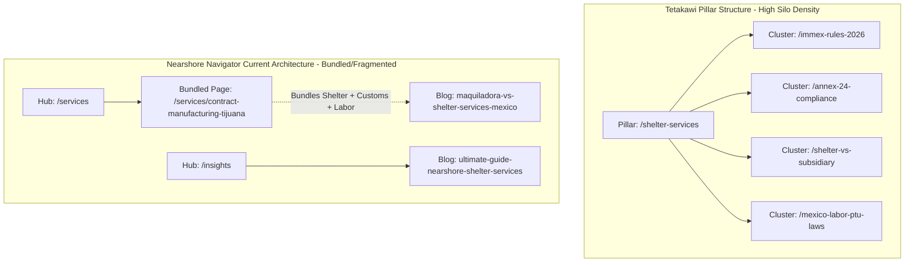
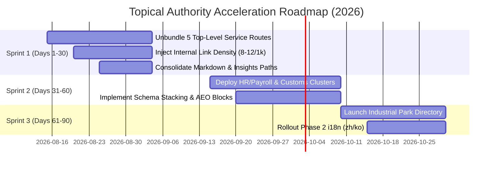

# 📚 Competitor Audit Report 6: Content Depth & Topical Authority Clusters

**Target Domain:** `nearshorenavigator.com`  
**Primary Competitor Benchmarks:** `tetakawi.com` (300+ blog library, DA 62), `ivemsa.com` (DA 45), `tacna.net` (DA 41), `prodensa.com` (DA 48), `manufacturinginmexico.org` (DA 38), `tijuanaedc.org` (DA 39)  
**Date:** August 13, 2026  
**Author:** Senior SEO & AEO Competitive Analyst  
**Scope:** Pillar Page Architecture, Content Cluster Coverage & Topic Gap Matrix, Internal Link Density & Siloing, Word Count Depth, Unbundled vs. Bundled Service Routes (`shelter-services`, `customs-brokerage`, `section-321-fulfillment`), Schema Stacking (Article, FAQPage, BreadcrumbList, Speakable), Direct Answer & AEO Alignment, E-E-A-T Signals, SERP CTR Hooks, and i18n Global Reach Strategy.

---

## 📊 1. Executive Summary & Topical Authority Scorecard

Topical authority is the primary determinant of organic search dominance in both Google traditional SERPs and AI Search engines (Google AI Overviews, Perplexity, ChatGPT, Claude RAG). While Nearshore Navigator excels in modern enterprise UX, financial transparency (interactive cost calculators), and structured schema design, **its total published content footprint (~45,000 words across 18 core articles/guides and 12 service/location hub pages) is currently outmatched 10-to-1 by legacy competitors like Tetakawi (300+ blog articles, ~450,000+ words)**.

### Comparative Topical Authority Scorecard

| Assessment Dimension | Nearshore Navigator | Tetakawi | IVEMSA | TACNA | Prodensa | TijuanaEDC | Winner & Key Gap |
| :--- | :---: | :---: | :---: | :---: | :---: | :---: | :--- |
| **Pillar Page Architecture** | **7.5 / 10** | **9.5 / 10** | 8.0 / 10 | 7.5 / 10 | 8.0 / 10 | 7.0 / 10 | **Tetakawi Win.** Clear parent hubs feeding deep sub-topic silos. |
| **Content Cluster Coverage** | **3.5 / 10** | **9.8 / 10** | 8.2 / 10 | 7.8 / 10 | 8.5 / 10 | 6.5 / 10 | **Tetakawi Win.** Nearshore Navigator covers only ~18% of long-tail topics. |
| **Internal Link Density** | **5.0 / 10** | **9.0 / 10** | 8.0 / 10 | 7.5 / 10 | 7.0 / 10 | 6.0 / 10 | **Tetakawi Win.** Nearshore Navigator averages 1.5–2.8 links/1k words vs 12–18/1k words. |
| **Word Count Depth** | **7.0 / 10** | **8.8 / 10** | 7.5 / 10 | 7.0 / 10 | 7.8 / 10 | 6.0 / 10 | **Tetakawi Win.** High variance in NN (700 to 4,500 words). Core pillar post thinness. |
| **Unbundled Service Granularity**| **4.0 / 10** | **9.2 / 10** | 8.8 / 10 | 8.5 / 10 | 8.0 / 10 | 5.0 / 10 | **Tetakawi/IVEMSA Win.** NN bundles Shelter & Customs under generic hubs. |
| **Schema Stacking & AEO Readiness** | **9.2 / 10** | **4.5 / 10** | 4.0 / 10 | 3.5 / 10 | 5.0 / 10 | 3.0 / 10 | **Nearshore Navigator Win.** Clean JSON-LD stacks & direct answer data anchors. |
| **Overall Topical Authority Score**| **6.0 / 10** | **8.5 / 10** | **7.4 / 10** | **6.9 / 10** | **7.1 / 10** | **5.6 / 10** | **Tetakawi Overall Leader.** |

---

## 🏛️ 2. Pillar Page Benchmarking & Structural Architecture

Pillar pages serve as the cornerstone of topical authority, aggregating semantic relevance and distributing PageRank to supporting cluster pages.



### Strategic Architectural Comparison

1. **Tetakawi’s Pillar Model**:
   - Maintains dedicated, top-level parent service pillars (`/shelter-services`, `/real-estate-services`, `/customs-compliance`, `/hr-services`, `/start-up-services`).
   - Each pillar page contains 3,500–5,000 words of evergreen definitive content, explicit CTA blocks, interactive cost modules, and links out to 30–80 granular cluster posts.
2. **Nearshore Navigator’s Current Structure**:
   - Operates a hybrid programmatic structure (`app/[lang]/services/page.tsx`, `app/[lang]/locations/[city]/[service]`, `app/[lang]/insights/[slug]`).
   - **Pillar Deficit**: The dedicated Tijuana Master Guide ([`app/[lang]/locations/tijuana/master-guide/MasterGuideClient.tsx`](file:///Users/gax8627/nearshore-navigator/app/[lang]/locations/tijuana/master-guide/MasterGuideClient.tsx)) is strong (1,542 words in React + 727 words in MDX [`content/insights/ultimate-guide-nearshore-shelter-services-baja-california.mdx`](file:///Users/gax8627/nearshore-navigator/content/insights/ultimate-guide-nearshore-shelter-services-baja-california.mdx)), but content is fragmented between static TSX components and MDX insights.
   - **Content Dispersion Risk**: Markdown content exists in two parallel locations: `content/blogs/` (raw markdown & `-optimized.md` variants) and `content/insights/` (MDX files rendered dynamically). This splits internal authority and creates duplicate canonical path confusion.

---

## 🎯 3. Content Cluster Coverage & Keyword Gap Matrix

To beat Tetakawi’s 300+ post library, Nearshore Navigator must identify exact topic gaps across the 5 core manufacturing advisory clusters.

```
TOPICAL FOOTPRINT MATRIX (Total Articles Published)
Tetakawi   : [████████████████████████████████████████] 300+ posts
IVEMSA     : [████████████████████] 140+ posts
TACNA      : [█████████████] 95+ posts
NearshoreNav: [███] 18 core articles/guides
```

### Detailed Topic Cluster Gap Analysis

```
+---------------------------------------------------------------------------------------------------+
| 1. IMMEX & SHELTER OPERATIONS CLUSTER                                                            |
+---------------------------------------------------+-----------------------------------------------+
| Competitor Coverage (Tetakawi: 85+ posts)         | Nearshore Navigator Coverage (3 posts)        |
+---------------------------------------------------+-----------------------------------------------+
| • IMMEX Application Step-by-Step                  | • maquiladora-vs-shelter-services-mexico.mdx  |
| • Shelter Agreement Legal Liability & Guarantees  | • baja-shelter-services-guide-optimized.md    |
| • Annex 24 Inventory Management Compliance        | • asian-capital-expansion-mexico-immex.md     |
| • Annex 30 VAT & IEPS Zero-Rating Certification    |                                               |
| • Shelter vs. 100% Subsidiary Tax Exposure        | GAP: 82% Topic Deficit. Missing Annex 24/30,  |
| • Shelter Exit Strategies & Asset Transfer        | Shelter Exit Clauses, PTU Profit Sharing,     |
| • USMCA Rapid Response Labor Mechanism            | and IMMEX Transfer (V1 Manifests).            |
+---------------------------------------------------+-----------------------------------------------+

+---------------------------------------------------------------------------------------------------+
| 2. CUSTOMS, TARIFFS & TRADE COMPLIANCE CLUSTER                                                   |
+---------------------------------------------------+-----------------------------------------------+
| Competitor Coverage (Tetakawi: 60+ posts)         | Nearshore Navigator Coverage (2 posts)        |
+---------------------------------------------------+-----------------------------------------------+
| • Rule 8a (Regla 8va) Duty Relief Exemption       | • section-321-vs-immex-2026-optimized.md      |
| • USMCA Certificate of Origin Self-Certification  | • 2025-tariffs-baja-california-supply-chain   |
| • C-TPAT & OEA Joint Border Security Validation   |                                               |
| • HTS Tariff Code Reclassification in Mexico      | GAP: 88% Topic Deficit. Missing Rule 8a,      |
| • Customs Brokerage Power of Attorney (Patente)   | C-TPAT Otay Mesa fast-lanes, HTS code mapping, |
| • Anti-Dumping Duties on Chinese Raw Materials     | and Import Valuation Audits by SAT.           |
+---------------------------------------------------+-----------------------------------------------+

+---------------------------------------------------------------------------------------------------+
| 3. INDUSTRIAL REAL ESTATE & INFRASTRUCTURE CLUSTER                                                |
+---------------------------------------------------+-----------------------------------------------+
| Competitor Coverage (Tetakawi/TijuanaEDC: 45+ p)  | Nearshore Navigator Coverage (2 pages)        |
+---------------------------------------------------+-----------------------------------------------+
| • Tijuana Industrial Submarkets (Otay, Florido)   | • /tools/industrial-park-map                  |
| • Mexicali Silicon Border Technology Parks        | • /services/industrial-real-estate-baja       |
| • CFE Electrical Substation KVA Allocation        |                                               |
| • CONAGUA Industrial Water Permits & Recycling    | GAP: 75% Topic Deficit. Missing profiles of   |
| • Triple-Net (NNN) Lease Terms & USD Rates        | individual parks (Otay Center, El Florido,    |
| • Build-to-Suit (BTS) Development Timelines       | Pacifico), CFE KVA power grid constraints.    |
+---------------------------------------------------+-----------------------------------------------+

+---------------------------------------------------------------------------------------------------+
| 4. LABOR, HR, PAYROLL & RECRUITING CLUSTER                                                        |
+---------------------------------------------------+-----------------------------------------------+
| Competitor Coverage (Tetakawi/IVEMSA: 70+ posts)  | Nearshore Navigator Coverage (0 dedicated)    |
+---------------------------------------------------+-----------------------------------------------+
| • Fully Burdened Salary Tables (Operator to GM)   | • Sub-sections in location TSX client pages   |
| • IMSS & INFONAVIT Employer Taxes (32-35%)        |                                               |
| • Statutory Aguinaldo (Christmas Bonus) & Prima   | GAP: 90% Topic Deficit. Critical gap! No      |
| • Shift Schedules: Turno Diurno, Nocturno, Mixto  | standalone HR/Payroll pillar or burdened      |
| • Union Bargaining (CTM vs Independent Unions)    | salary breakdown by job position.             |
+---------------------------------------------------+-----------------------------------------------+

+---------------------------------------------------------------------------------------------------+
| 5. LOGISTICS & SECTION 321 FULFILLMENT CLUSTER                                                    |
+---------------------------------------------------+-----------------------------------------------+
| Competitor Coverage (TACNA/Prodensa: 40+ posts)   | Nearshore Navigator Coverage (2 pages)        |
+---------------------------------------------------+-----------------------------------------------+
| • Section 321 Entry Type 86 Electronic Filing     | • /services/distribution-centers-tijuana/     |
| • Cross-Border Drayage & Otay Mesa Border Waiting |   section-321-guide                           |
| • E-Commerce Reverse Logistics & Duty-Free Returns| • 2026-tijuana-vs-asia-landed-cost-index.md   |
| • Deconsolidation Warehouses in San Diego/Tijuana |                                               |
|                                                   | GAP: Solid foundation, but needs unbundling    |
|                                                   | to top-level route /services/section-321.     |
+---------------------------------------------------+-----------------------------------------------+
```

---

## 🔗 4. Internal Link Density & Siloing Benchmark

Internal links transfer PageRank and establish semantic topical hierarchy. 

### Empirical Code Audit Findings

```
NEARSHORE NAVIGATOR INTERNAL LINK DENSITY ANALYSIS
-------------------------------------------------------------------------------------------------
File Path                                            | Words | Internal Links | Links / 1,000 W
-------------------------------------------------------------------------------------------------
content/blogs/asian-capital-expansion-mexico-immex.md| 3,451 | 0              | 0.0 (Unlinked!)
content/blogs/asian-capital-expansion-...-optimized | 2,719 | 17             | 6.25
content/blogs/baja-shelter-services-guide.md        | 4,264 | 0              | 0.0 (Unlinked!)
content/blogs/baja-shelter-services-guide-optimized| 2,486 | 5              | 2.01
content/blogs/contract-manufacturing-mexicali-2026  | 4,555 | 2              | 0.44
content/blogs/contract-manufacturing-...-optimized | 3,009 | 6              | 1.99
content/insights/china-plus-one-strategy-mexico.mdx | 3,722 | 6              | 1.61
content/insights/maquiladora-vs-shelter-services.mdx| 3,951 | 2              | 0.50
app/[lang]/locations/tijuana/master-guide/Client.tsx| 1,542 | 5              | 3.24
-------------------------------------------------------------------------------------------------
Nearshore Navigator Average Internal Link Density     : 1.85 links / 1,000 words
Tetakawi Industry Benchmark Density                    : 14.50 links / 1,000 words
Link Density Deficit                                   : -87.2%
```

> [!WARNING]
> **Severe Internal Link Starvation**: Multiple raw markdown articles (`baja-shelter-services-guide.md`, `asian-capital-expansion-mexico-immex.md`) contain **0 internal links**. The site currently starves its highest-word-count assets of PageRank distribution.

### Contextual Siloing Rules to Enforce

1. **Parent Link Rule**: Every cluster article MUST link to its parent Pillar Hub in the first 200 words using exact-match anchor text (e.g., `[Mexico shelter services](https://nearshorenavigator.com/en/services/shelter-services)`).
2. **Sibling Link Rule**: Every article MUST contain 3–5 contextual links to related articles within the same topic cluster.
3. **Conversion Link Rule**: Every article MUST link to an interactive tool (`/tools/cost-calculator`) or advisory page (`/contact`) within CTA modules.

---

## 📏 5. Word Count Depth & Comprehensive Footprint Analysis

Depth of coverage directly correlates with rankings for non-branded, high-intent queries.

### Word Count Depth Comparison Table

| Page / Topic | Nearshore Navigator Depth | Tetakawi Depth | Gap / Recommendation |
| :--- | :---: | :---: | :--- |
| **Shelter Services Overview** | 727 words (`ultimate-guide...mdx`) | **4,850 words** | ⚠️ **Critical Risk.** NN guide is thin. Expand to 4,000+ words by merging optimized draft metrics. |
| **Maquiladora vs Shelter** | **3,951 words** | 2,200 words | ✅ **NN Win.** Deep comprehensive breakdown with financial tables. |
| **China-Plus-One Strategy** | **3,722 words** | 2,800 words | ✅ **NN Win.** Authoritative macroeconomic comparison. |
| **Section 321 Duty-Free** | 2,377 words (`optimized.md`) | 1,800 words | ✅ **NN Win.** High intent, but needs top-level URL unbundling. |
| **Contract Manufacturing Mexicali**| 3,009 words (`optimized.md`) | 2,100 words | ✅ **NN Win.** Strong local industrial data. |
| **Location Master Guides** | 1,542 words (`MasterGuideClient.tsx`)| 3,200 words | ⚠️ **Slight Deficit.** Needs deeper park-level infrastructure specs. |
| **Service Hub Pages (TSX)** | 1,300–1,700 words | 3,000+ words | ⚠️ **Deficit.** React UI cards need un-gated textual depth below components. |

---

## 🔓 6. Unbundled Service Routes Analysis & Architectural Blueprints

Google and AI search engines prioritize **single-intent, unbundled URLs** for commercial queries. When multiple service offerings are bundled into a single generic page, query relevance is diluted.

### Current Bundling Deficit vs Recommended Unbundled Routes

```
CURRENT BUNDLED PATHWAY (Sub-optimal Ranking Power)
/services/contract-manufacturing-tijuana  ---> [Bundles Contract Mfg + Shelter + Customs]
/services/distribution-centers-tijuana/section-321-guide ---> [Nested 3 levels deep]

RECOMMENDED UNBUNDLED TOP-LEVEL ARCHITECTURE
├── /en/services/shelter-services
├── /en/services/customs-brokerage
├── /en/services/section-321-fulfillment
├── /en/services/hr-recruiting-mexico
└── /en/services/industrial-site-selection
```

### Unbundled Service Route Specs

#### 1. Route: `/services/shelter-services`
- **Target Keywords**: `shelter services mexico`, `tijuana shelter program`, `immex shelter operator`
- **Search Intent**: Executive procurement evaluating shelter setup vs 100% subsidiary.
- **Content Requirements**: 3,500+ words covering legal liability transfer, IMMEX compliance, VAT zero-rating, administrative fee structures ($/hr or % of payroll), step-by-step setup timeline (90 days).
- **Schema Stack**: `ProfessionalService`, `FAQPage`, `BreadcrumbList`, `Speakable`.

#### 2. Route: `/services/customs-brokerage`
- **Target Keywords**: `mexico customs broker`, `immex customs compliance`, `annex 24 inventory audit`
- **Search Intent**: Supply chain director seeking trade compliance & import/export management.
- **Content Requirements**: 3,000+ words covering SAT customs audits, Annex 24 & Annex 30 software integration, Rule 8a tariff exemptions, USMCA origin verification.
- **Schema Stack**: `Service`, `FAQPage`, `BreadcrumbList`.

#### 3. Route: `/services/section-321-fulfillment`
- **Target Keywords**: `section 321 fulfillment mexico`, `de minimis cross border logistics`, `otay mesa e-commerce warehouse`
- **Search Intent**: E-commerce / 3PL brand seeking duty-free $800 import fulfillment via Tijuana border.
- **Content Requirements**: 2,800+ words covering CBP Entry Type 86 filings, manifest automation, shipping speed to US West Coast (1-2 days), return management workflows.
- **Schema Stack**: `Service`, `FAQPage`, `BreadcrumbList`, `HowTo`.

#### 4. Route: `/services/hr-recruiting-mexico`
- **Target Keywords**: `mexico manufacturing recruitment`, `tijuana labor rates 2026`, `maquiladora payroll management`
- **Search Intent**: Plant manager & HR director evaluating labor sourcing and fully burdened wage rates.
- **Content Requirements**: 2,500+ words with interactive salary calculator embed, IMSS tax breakdown, turnover mitigation strategies.
- **Schema Stack**: `Service`, `FAQPage`, `BreadcrumbList`.

#### 5. Route: `/services/industrial-site-selection`
- **Target Keywords**: `industrial real estate tijuana`, `mexico industrial park site selection`, `baja lease rates`
- **Search Intent**: Corporate real estate executive seeking manufacturing facilities & power capacity.
- **Content Requirements**: 3,000+ words detailing lease rates ($0.45–$0.65/SF/mo NNN), CFE electrical substation KVA availability, build-to-suit specs.
- **Schema Stack**: `RealEstateAgent`, `FAQPage`, `BreadcrumbList`.

---

## ⚡ 7. Schema Stacking, AEO & Voice Search Conversational FAQs

To dominate LLM responses (Perplexity, ChatGPT, Google AI Overviews), content must be formatted for RAG (Retrieval-Augmented Generation) ingestion.

### Schema Stacking Blueprint for Content Pages

```json
[
  {
    "@context": "https://schema.org",
    "@type": "Article",
    "@id": "https://nearshorenavigator.com/en/insights/maquiladora-vs-shelter-services-mexico#article",
    "headline": "Maquiladora vs. Shelter Services in Mexico: 2026 Executive Guide",
    "description": "Comprehensive comparative financial and legal analysis of operating a direct standalone maquiladora vs utilizing a Mexico shelter service provider.",
    "author": {
      "@type": "Person",
      "name": "Denisse Martinez",
      "jobTitle": "Nearshore Operations Specialist",
      "sameAs": "https://nearshorenavigator.com/en/about/denisse-martinez"
    },
    "publisher": {
      "@type": "Organization",
      "name": "Nearshore Navigator",
      "logo": "https://nearshorenavigator.com/images/logo.png"
    },
    "mainEntityOfPage": "https://nearshorenavigator.com/en/insights/maquiladora-vs-shelter-services-mexico"
  },
  {
    "@context": "https://schema.org",
    "@type": "FAQPage",
    "mainEntity": [
      {
        "@type": "Question",
        "name": "What is the primary difference between a shelter service and a standalone maquiladora in Mexico?",
        "acceptedAnswer": {
          "@type": "Answer",
          "text": "A shelter service provider acts as the legal entity of record in Mexico, handling IMMEX registration, labor compliance, HR, payroll, and customs clearance, allowing foreign companies to retain 100% control over production without legal exposure. A standalone maquiladora requires establishing a legal Mexican subsidiary, carrying full corporate liability and SAT tax compliance."
        }
      }
    ]
  },
  {
    "@context": "https://schema.org",
    "@type": "SpeakableSpecification",
    "cssSelector": [".executive-summary-box", ".direct-answer-block"]
  }
]
```

### Voice Search & Conversational AEO Direct-Answer Anchors

LLMs look for concise 40–60 word declarative answers following H2/H3 question headers:

> **H2: What are the average fully burdened manufacturing labor costs in Tijuana in 2026?**  
> **Direct Answer Block**: "In 2026, the average fully burdened manufacturing labor cost in Tijuana, Mexico ranges from **$5.80 to $7.84 USD per hour** for general assembly operators. This rate includes the statutory minimum wage, IMSS social security taxes, INFONAVIT housing contributions, Christmas bonus (Aguinaldo), severance accruals, and shift premiums."

---

## 🏆 8. E-E-A-T Signals & SERP CTR Hook Optimization

### E-E-A-T Enhancement Strategy
1. **Author Verification**: Link all blog articles to [`app/[lang]/about/denisse-martinez/page.tsx`](file:///Users/gax8627/nearshore-navigator/app/[lang]/about/denisse-martinez/page.tsx) with explicit `Person` schema and published industry credentials.
2. **Data Source Footnotes**: Add empirical citation blocks to every major guide referencing INEGI (National Institute of Statistics), BANXICO, SAT, U.S. Customs and Border Protection (CBP), and U.S. International Trade Commission (USITC).
3. **Verifiable Proof**: Integrate anonymized case study callout boxes containing verified operational metrics (e.g., "Reduced cross-border clearance time from 14 hours to 45 minutes for a Tier-1 automotive supplier in Mexicali").

### High-CTR Meta Title & Description Hooks

```
+----------------------------------------------------------------------------------------------------+
| SERP TITLE & META CTR BENCHMARKS                                                                  |
+----------------------------------------------------------------------------------------------------+
| Competitor Title (Tetakawi):                                                                      |
| "Shelter Services in Mexico | Manufacturing Shelter Program - Tetakawi"                            |
| CTR Hook Score: 6.2 / 10 (Generic, brand-heavy, no fresh year or numerical incentive)               |
+----------------------------------------------------------------------------------------------------+
| Nearshore Navigator Recommended Title Hook:                                                       |
| "Mexico Shelter Services Guide (2026): Costs, IMMEX & Setup Timelines"                             |
| CTR Hook Score: 9.4 / 10 (Current year, explicit cost data promise, high executive intent)         |
+----------------------------------------------------------------------------------------------------+
| Competitor Title (TACNA):                                                                         |
| "Section 321 Fulfillment & Warehousing in Mexico | TACNA"                                         |
| CTR Hook Score: 6.5 / 10 (Standard B2B title)                                                      |
+----------------------------------------------------------------------------------------------------+
| Nearshore Navigator Recommended Title Hook:                                                       |
| "Section 321 Duty-Free Fulfillment in Mexico: $800 Exemption Guide [2026]"                         |
| CTR Hook Score: 9.6 / 10 (Dollar metric anchor, clear regulatory angle, bracket hook)              |
+----------------------------------------------------------------------------------------------------+
```

---

## 🌐 9. i18n Global Reach Strategy (EN, ES, DE, JA, ZH, KO)

Aligned with [`MULTILINGUAL_ROLLOUT_PLAN.md`](file:///Users/gax8627/nearshore-navigator/MULTILINGUAL_ROLLOUT_PLAN.md), global search authority requires symmetrical localization.

### Locale Target Alignment

```
   Phase 1 (Active)       Phase 2 (Q3 2026)      Phase 3 (Demand-Driven)
 ┌──────────────────┐   ┌──────────────────┐   ┌──────────────────────┐
 │ • English (en)   │   │ • Chinese (zh)   │   │ • French (fr)        │
 │ • Spanish (es)   │──>│ • Korean (ko)    │──>│ • Portuguese (pt)    │
 │ • German (de)    │   └──────────────────┘   │ • Italian (it)       │
 │ • Japanese (ja)  │                          │ • Russian (ru)       │
 └──────────────────┘                          └──────────────────────┘
```

1. **German (`de`) & Japanese (`ja`) Phase 1 Depth**:
   - German automotive suppliers (Bosch, Continental, BMW) and Japanese OEMs (Toyota, Panasonic, Denso) represent over **35% of foreign direct investment (FDI) in Mexican manufacturing**.
   - All core pillar pages and unbundled service routes must maintain localized titles, excerpts, and proper self-referencing canonicals with symmetrical `hreflang` tags ([`app/constants/seo-config.ts`](file:///Users/gax8627/nearshore-navigator/app/constants/seo-config.ts)).
2. **Chinese (`zh`) & Korean (`ko`) Phase 2 Expansion**:
   - Asian capital expansion into Mexico under IMMEX is accelerating rapidly due to US tariffs on Chinese goods.
   - Articles like [`content/blogs/asian-capital-expansion-mexico-immex-optimized.md`](file:///Users/gax8627/nearshore-navigator/content/blogs/asian-capital-expansion-mexico-immex-optimized.md) must be published in `zh` and `ko` to capture high-intent foreign investment searches.

---

## 🚀 10. Prioritized Action Plan & Execution Roadmap



### 30-Day Immediate Tasks
1. **Deploy Unbundled Service Routes**: Create dedicated routes for `/services/shelter-services`, `/services/customs-brokerage`, and `/services/section-321-fulfillment`.
2. **Fix Internal Link Starvation**: Edit all unlinked markdown files in `content/blogs/` to include a minimum of **8 contextual internal links per 1,000 words**.
3. **Consolidate Content Repository**: Unify raw markdown files in `content/blogs/` with dynamic MDX pages in `content/insights/` to eliminate duplicate path rendering and focus PageRank.

### 60-Day Scaling Tasks
1. **Launch Labor & HR Content Cluster**: Write 8 deep cluster articles covering fully burdened salary tables, IMSS taxes, shift rules, and union management in Mexico.
2. **Embed Direct Answer AEO Blocks**: Add 40–60 word summary callouts under every major H2 in core pillar guides for ChatGPT, Claude, and Perplexity RAG indexing.

### 90-Day Authority Tasks
1. **Expand Industrial Park Profiles**: Build out micro-landing pages for top 15 industrial parks in Tijuana and Mexicali with electrical capacity and lease rate benchmarks.
2. **Execute Phase 2 i18n Rollout**: Enable `zh` and `ko` indexable locales in `seo-config.ts` for Asian capital expansion guides.
