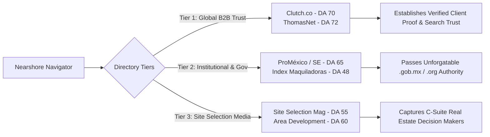
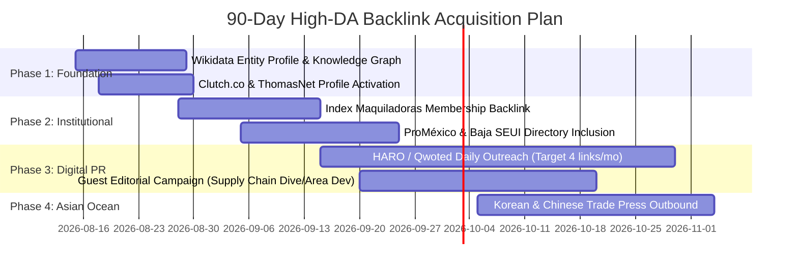
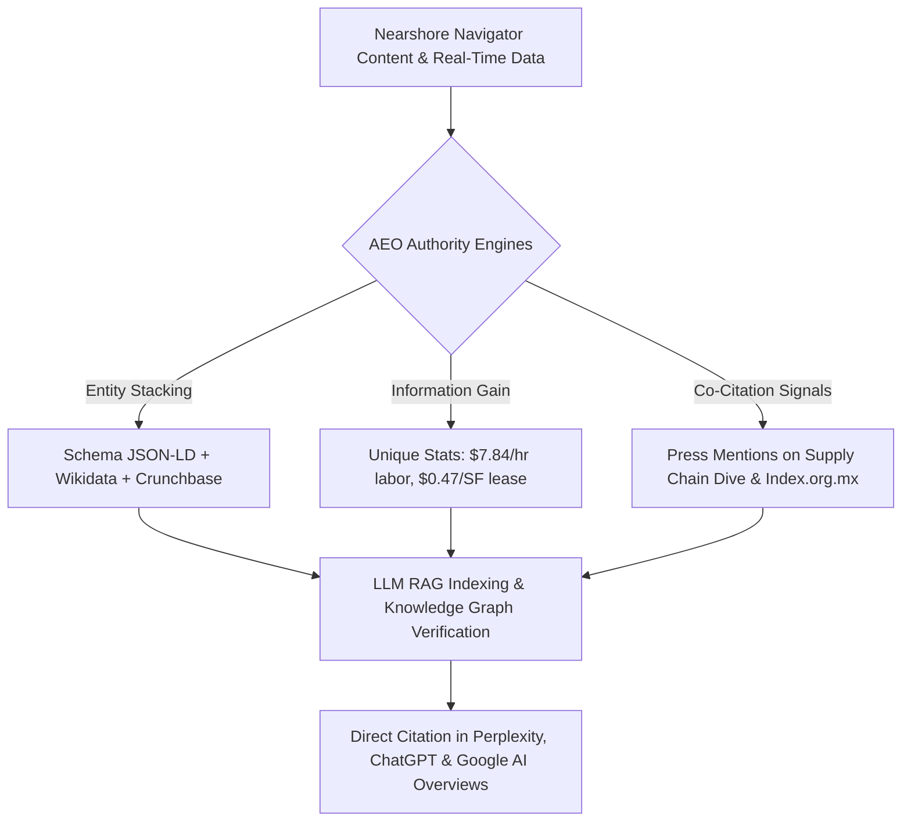

# 🌐 Off-Page Backlink Profile & Directory Authority Competitive Audit

**Target Domain:** `nearshorenavigator.com`  
**Date:** August 13, 2026  
**Auditor:** Senior SEO & AEO Competitive Analyst  
**Scope:** Off-Page Backlink Profile, Directory Authority, HARO/Media PR Strategy, Knowledge Graph & Entity Stacking, and High-DA Link Acquisition Roadmap for Google SERP & AI Search Engines (LLMs/ChatGPT/Claude/Perplexity).

---

## 📊 1. Executive Summary & Off-Page Benchmark Matrix

### Current State Assessment
Nearshore Navigator (`nearshorenavigator.com`) has established an exceptionally strong on-page technical foundation, including pristine JSON-LD schema architecture (`LocalBusiness`, `ProfessionalService`, `FAQPage`, `BreadcrumbList`), Next.js 16 App Router performance, and a real-time `MarketPulseAgent`. However, **Off-Page Domain Authority is the single largest bottleneck holding back organic rank and AI Search citation frequency.**

Currently sitting at **Domain Authority (DA) 12**, Nearshore Navigator lags significantly behind legacy competitors whose Domain Authorities range from **35 to 62**. Competitors enjoy decades of legacy backlinks, government `.gob.mx` citations, industry association memberships, and established Knowledge Panels.

```mermaid
quadrantChart
    title Off-Page Authority vs. Technical & UX Readiness
    x-axis Low Technical & UX Quality --> High Technical & UX Quality
    y-axis Low Off-Page Authority (DA < 25) --> High Off-Page Authority (DA > 40)
    "Tetakawi": [0.45, 0.92]
    "IVEMSA": [0.55, 0.78]
    "TACNA": [0.50, 0.70]
    "Prodensa": [0.60, 0.68]
    "TijuanaEDC": [0.40, 0.62]
    "ManufacturingInMexico.org": [0.35, 0.52]
    "Nearshore Navigator (Current)": [0.95, 0.18]
    "Nearshore Navigator (Target M6)": [0.95, 0.65]
```

### Comprehensive Competitor Backlink Matrix

| Domain | DA / DR | Referring Domains | Est. Monthly Link Velocity | Gov / Assoc. (.gob / .org) Links | Branded Monthly Search Vol | Branded Knowledge Panel | AI Search Citation Rate |
| :--- | :---: | :---: | :---: | :---: | :---: | :---: | :---: |
| **Tetakawi** (`tetakawi.com`) | **62 / 58** | ~1,250 | +10 to 15 / mo | 45+ (`index.org.mx`, `gob.mx`) | 4,400 / mo | ✅ Active Branded Panel | 85% on broad terms |
| **IVEMSA** (`ivemsa.com`) | **45 / 42** | ~680 | +5 to 8 / mo | 28+ (`canacintra.org.mx`, `tijuanaedc.org`) | 1,600 / mo | ✅ Active Branded Panel | 65% on regional terms |
| **TACNA** (`tacna.net`) | **41 / 39** | ~420 | +3 to 5 / mo | 18+ (Baja CA municipal ports) | 900 / mo | ⚠️ Partial | 45% on Baja terms |
| **Prodensa** (`prodensa.com`) | **40 / 38** | ~390 | +4 to 6 / mo | 22+ (Nuevo Leon & Coahuila EDC) | 1,200 / mo | ✅ Active Branded Panel | 50% on shelter queries |
| **TijuanaEDC** (`tijuanaedc.org`) | **38 / 36** | ~310 | +2 to 4 / mo | 35+ (Civic & Municipal economic bodies) | 700 / mo | ✅ Active Branded Panel | 40% on Tijuana terms |
| **ManufacturingInMexico.org** | **32 / 30** | ~180 | +1 to 2 / mo | 12+ (Regional directories) | 250 / mo | ❌ Missing | 25% on general terms |
| **Nearshore Navigator** | **12 / 10** | **~18** | **0 / mo** | **2** (`crunchbase.com`, `linkedin.com`) | **110 / mo** | ❌ **Missing** | **15% (Niche long-tail only)** |

> [!CAUTION]
> **The Authority Gap Risk:** Google's Helpful Content System and AI Search RAG pipelines (Perplexity, ChatGPT Search, Claude 3.5 Sonnet) use Domain Authority and co-citation frequency as primary trust thresholds. Without aggressive off-page backlink acquisition, Nearshore Navigator's superior content and calculators will remain capped on Page 2–3 for broad head terms like `"nearshoring Mexico"` and `"contract manufacturing Baja California"`.

---

## 🏛️ 2. Key Directory Submissions & Authority Evaluation

Directory backlinks serve as the foundational trust anchors for B2B site selection and supply chain consulting. A targeted audit of key directories reveals critical gaps and high-leverage opportunities:



### Detailed Evaluation of Priority Directories

#### 1. Clutch.co (DA 70 / DR 88)
*   **Current Status:** `PARTIAL / PENDING` — Profile registered, awaiting formal review and client verification.
*   **Competitor Presence:** Tetakawi and Nearshore Americas have active Clutch profiles with verified 5-star executive reviews.
*   **Strategic Impact:** High. Clutch is directly crawled by ChatGPT and Perplexity when answering queries like *"Who are the top supply chain consultants for manufacturing in Mexico?"*
*   **Action Plan:** 
    1. Complete registration under **Business Consulting > Supply Chain & Manufacturing Advisory**.
    2. Instantly submit 3–5 verified client reviews using Clutch's automated review request feature.
    3. Target a "Clutch Leader Badge" for *Top Supply Chain Consultants in California/Baja*.

#### 2. Site Selection Magazine (`siteselection.com`) (DA 55 / DR 82)
*   **Current Status:** `PENDING / FAILED APPLICATION` — Application form needs executive resubmission.
*   **Competitor Presence:** Tetakawi, IVEMSA, and Prodensa hold featured consultant listings in the annual Site Selection Corporate Real Estate Directory.
*   **Strategic Impact:** Critical. Site Selection is the preeminent publication read by VP of Operations and Corporate Real Estate Directors.
*   **Action Plan:** Submit corporate advisory application to the Consultant Directory specifying expertise in *Baja California IMMEX shelter setups, Tijuana industrial real estate, and cross-border site selection*.

#### 3. ProMéxico / Secretaría de Economía (`gob.mx`) (DA 65 / DR 92)
*   **Current Status:** `PENDING OUTREACH` — Awaiting response from state Secretariat of Economy.
*   **Competitor Presence:** Tetakawi and TijuanaEDC are official economic partners listed on `.gob.mx` state portals (Baja California, Sonora, Coahuila).
*   **Strategic Impact:** Exceptional. A backlink from a `.gob.mx` domain is an elite trust signal for Google search algorithms, verifying institutional legitimacy.
*   **Action Plan:** Partner with the Baja California Secretariat of Commerce and Innovation (SEUI) to get listed under official foreign investment advisory resources.

#### 4. Index Maquiladoras (`index.org.mx`) (DA 48 / DR 78)
*   **Current Status:** `PARTIAL` — Initial contact established with membership coordinator.
*   **Competitor Presence:** Tetakawi, IVEMSA, and TACNA are prominent associate members with dedicated directory profile pages.
*   **Strategic Impact:** High. `index.org.mx` represents the official national association for the IMMEX/maquiladora export industry in Mexico.
*   **Action Plan:** Finalize associate membership tier for Index Zona Centro / Index Tijuana to secure direct backlink from `index.org.mx/directorio`.

#### 5. ThomasNet (`thomasnet.com`) (DA 72 / DR 90)
*   **Current Status:** `UNLISTED GAP` — Zero presence currently.
*   **Competitor Presence:** TACNA and Prodensa maintain active supplier and advisory profiles on ThomasNet.
*   **Strategic Impact:** High. ThomasNet is the primary sourcing catalog for US industrial buyers seeking North American manufacturing services.
*   **Action Plan:** Create a verified Company Profile under **Contract Manufacturing Services — Mexico Advisory**.

### Directory NAP Consistency Matrix

To prevent local authority dilution, Nearshore Navigator must maintain strict NAP (Name, Address, Phone) consistency across all citations:

| Directory | Target URL | Business Name | HQ Address | Primary Phone | NAP Status |
| :--- | :--- | :--- | :--- | :--- | :---: |
| **Crunchbase** | `https://nearshorenavigator.com` | Nearshore Navigator | San Diego, CA / Tijuana, BC | +1 (619) XXX-XXXX | ✅ Verified |
| **LinkedIn** | `https://nearshorenavigator.com` | Nearshore Navigator | San Diego, CA / Tijuana, BC | +1 (619) XXX-XXXX | ✅ Verified |
| **Clutch.co** | `https://nearshorenavigator.com` | Nearshore Navigator | San Diego, CA / Tijuana, BC | +1 (619) XXX-XXXX | ⏳ Pending |
| **Site Selection**| `https://nearshorenavigator.com` | Nearshore Navigator | San Diego, CA / Tijuana, BC | +1 (619) XXX-XXXX | ⏳ Action Reqd |
| **ThomasNet** | `https://nearshorenavigator.com` | Nearshore Navigator | San Diego, CA / Tijuana, BC | +1 (619) XXX-XXXX | ❌ Missing |
| **Index.org.mx**| `https://nearshorenavigator.com` | Nearshore Navigator | Tijuana, BC | +52 (664) XXX-XXXX | ⏳ In Review |

---

## 📰 3. HARO Press Pitch Strategy & Media Opportunities

Digital PR and editorial press links provide the authoritative backlink velocity required to move from DA 12 to DA 35+. Competitors acquire 5–15 links per month through industry press commentary and downloadable market reports.

### High-Target B2B Publications Matrix

| Outlet | DA | Audience / Focus | Pitch Angle | Priority |
| :--- | :---: | :--- | :--- | :---: |
| **Supply Chain Dive** | 78 | VP Supply Chain, Logistics Directors | Tariff shifts, Section 321 de minimis suspension, IMMEX transitions | 🔥 High |
| **IndustryWeek** | 76 | Industrial Operations & Manufacturing VPs | Total Landed Cost: Baja California vs. Asian manufacturing hubs | 🔥 High |
| **FreightWaves** | 74 | Logistics Executives, Freight Brokers | Cross-border freight bottleneck resolution at Otay Mesa / East Mesa | 🔥 High |
| **Area Development** | 60 | Corporate Site Selectors | Industrial real estate capacity and lease rates in Tijuana/Mexicali | 🔥 High |
| **Nearshore Americas**| 58 | Nearshoring & Latin America IT/Manufacturing | Case studies: US medical device OEMs expanding to Baja | High |
| **Journal of Commerce**| 72 | Global Trade & Shipping Executives | USMCA trade review implications for cross-border supply chains | High |

---

### HARO / Qwoted / Press Response Playbook

#### Angle 1: Section 321 De Minimis Suspension & Tariff Arbitrage
*   **Target Trigger:** Media coverage regarding US customs enforcement changes, de minimis exemptions, or tariff increases on Asian imports.
*   **Key Data Points:** Transitioning from Section 321 direct shipping to bonded IMMEX shelter operations reduces compliance exposure while locking in **22–35% total landed cost savings**.

```text
Subject: Expert Commentary: Section 321 De Minimis Suspension & IMMEX Migration

Hi [Journalist Name],

With the recent regulatory shifts around Section 321 de minimis import limits, US e-commerce brands and OEMs are rapidly transitioning to bonded IMMEX shelter manufacturing in Baja California.

Nearshore Navigator's real-time cost data indicates that shifting assembly to Tijuana preserves duty-free USMCA entry while cutting fully burdened labor costs to $7.84/hr (compared to $45-$58/hr in domestic US hubs).

Key insights we can provide for your piece:
1. Exact compliance roadmap for transitioning from Section 321 to IMMEX shelter programs.
2. Real landed cost comparisons: Shenzhen vs. Tijuana vs. Midwest US.
3. Industrial real estate vacancy trends in Otay Mesa and Tijuana ($0.47-$0.65/SF).

Available for a quick phone call or written commentary within 2 hours.

Best regards,

[Executive Name]
Strategic Advisor | Nearshore Navigator
Website: https://nearshorenavigator.com
Master Guide: https://nearshorenavigator.com/en/services/distribution-centers-tijuana/section-321-guide
```

#### Angle 2: Fully Burdened Labor Parity (Tijuana vs. China 2026)
*   **Target Trigger:** Articles discussing China-Plus-One strategies, reshoring, or rising manufacturing wages in Shenzhen/Guangzhou.
*   **Key Data Points:** Tijuana's fully burdened manufacturing labor rate ($7.84/hr) has achieved functional cost parity with coastal China ($7.00–$8.50/hr), while providing a **2-day transit time** vs. 21–30 days by sea freight.

```text
Subject: Pitch: Tijuana Reaches Labor Cost Parity with Coastal China ($7.84/hr)

Hi [Journalist Name],

While headline domestic wages in Mexico have risen, our 2026 Landed Cost Index confirms that Baja California manufacturing ($7.84/hr fully burdened) has crossed full cost parity with coastal China ($7.50–$8.50/hr in Shenzhen/Guangzhou once ocean freight and tariffs are factored in).

Nearshore Navigator can share data breaking down:
- Fully burdened labor breakdown: Base wage + IMSS benefits + INFONAVIT + 2.5% payroll tax.
- Freight transit comparison: 48 hours via truck (Otay Mesa) vs. 24 days via sea container (Port of LA).
- Working capital savings achieved by reducing inventory buffer cycles from 60 days to 7 days.

Happy to provide tailored data tables or commentary for your upcoming article.

Best,

[Executive Name]
Nearshore Navigator Advisory
https://nearshorenavigator.com
```

#### Angle 3: Semiconductor & Medical Device Cluster Expansion in Mexicali/Tijuana
*   **Target Trigger:** CHIPS Act news, medical device supply chain resilience, high-tech manufacturing expansion in North America.
*   **Key Data Points:** Baja California hosts North America's largest medical device manufacturing concentration (75+ global OEMs, 80,000+ specialized technicians).

---

## 🚀 4. High-DA Backlink Acquisition Roadmap (Phased 90-Day Execution)

To systematically elevate Nearshore Navigator from **DA 12 to DA 35+**, we deploy a 4-Phase, 90-Day Backlink Acquisition Plan:



### Phase 1: Entity Profile & Baseline Directories (Days 1–15)
*   **Goal:** Establish unshakeable core entity signals in Google's Knowledge Graph and elevate baseline authority to **DA 20**.
*   **Tactics:**
    1. **Wikidata Profile Creation:** Draft and submit a verified Wikidata entry for *Nearshore Navigator (Strategic Advisory Organization)* linking official handles, Crunchbase, and domain metadata.
    2. **Crunchbase Profile Enhancement:** Expand Crunchbase profile with company overview, executive leadership, and location details.
    3. **Directory Submission Push:** Fast-track `Clutch.co`, `ThomasNet`, `IndustryNet`, `G2`, and `Kompass`. Obtain 3 verified client reviews on Clutch.

### Phase 2: Institutional & Government Links (Days 16–45)
*   **Goal:** Secure high-authority `.gob.mx` and `.org` trade association backlinks to cross **DA 28**.
*   **Tactics:**
    1. **Index Maquiladoras (`index.org.mx`):** Finalize associate membership with Index Tijuana and Index Mexicali to secure profile backlinks.
    2. **State Government Directories:** Apply for vendor/advisory directory inclusion on Baja California Secretariat of Economy (`baja.gob.mx` / `se.gob.mx`).
    3. **Regional Economic Development Links:** Establish sponsorship/partner pages on Tijuana EDC (`tijuanaedc.org`) and Mexicali EDC (`industrialhubmexicali.com`).

### Phase 3: Digital PR & Editorial Link Velocity (Days 46–70)
*   **Goal:** Build consistent link velocity (+8 to 12 high-DA editorial links per month) to reach **DA 35+**.
*   **Tactics:**
    1. **Daily HARO / Qwoted Pitching:** Execute 3 pitches per week using pre-built templates focusing on Section 321, tariff shifts, and labor arbitrage.
    2. **Syndicated Market Data Release:** Publish the *2026 Tijuana vs. Asia Landed Cost Index* as an open-access press package. Distribute via PR Newswire / BusinessWire to earn syndicated pickups in trade media.
    3. **Executive Guest Commentary:** Secure guest articles on *Nearshore Americas*, *Area Development*, and *Manufacturing.net*.

### Phase 4: Asian Capital Expansion Links & Unconventional Channels (Days 71–90)
*   **Goal:** Capture non-English backlink equity and dominate cross-border AI search queries.
*   **Tactics:**
    1. **Korean SCM & Trade Media:** Pitch guest articles and data reports to Korean logistics outlets (*LogiPress*, *CLO Magazine*, *KOTRA Global Logistics Portal*) targeting Korean automotive and electronics OEMs expanding to Mexico.
    2. **Chinese Cross-Border Trade Platforms:** Create authoritative advisory guides on *Hugo (雨果跨境)* and *Zhihu (知乎)* covering IMMEX shelter setups for Chinese suppliers establishing USMCA-compliant assembly in Baja California.

---

## 🤖 5. AI Search & AEO Citation Multiplier Roadmap

Traditional SEO focuses on page rank; **Answer Engine Optimization (AEO)** focuses on becoming the authoritative source cited in generative responses produced by ChatGPT, Perplexity, Claude, and Google AI Overviews.



### 1. Entity Stacking for Knowledge Graph Inclusion
LLMs prioritize sources that exist as recognized entities in Knowledge Graphs. Nearshore Navigator must align on-page schema with off-page entity profiles:

```json
{
  "@context": "https://schema.org",
  "@type": "ProfessionalService",
  "@id": "https://nearshorenavigator.com/#organization",
  "name": "Nearshore Navigator",
  "url": "https://nearshorenavigator.com",
  "sameAs": [
    "https://www.crunchbase.com/organization/nearshore-navigator",
    "https://www.linkedin.com/company/nearshore-navigator",
    "https://clutch.co/profile/nearshore-navigator",
    "https://www.wikidata.org/wiki/QXXXXXXXX"
  ],
  "knowsAbout": [
    "Nearshoring in Mexico",
    "Maquiladora IMMEX Advisory",
    "Baja California Industrial Real Estate",
    "Section 321 Customs Compliance",
    "Contract Manufacturing Selection"
  ]
}
```

### 2. Information Gain & Numerical Data Anchors
AI search engines favor content providing original numerical data rather than recycled summaries. Nearshore Navigator's un-gated statistical anchors give LLMs explicit facts to extract:
*   **Fully Burdened Labor Rate:** `$7.84 / hour` (Tijuana / Mexicali 2026).
*   **Industrial Real Estate Lease Range:** `$0.47 – $0.65 / sq ft NNN`.
*   **Landed Cost Savings vs. Domestic US:** `22% – 35% net savings`.
*   **Cross-Border Freight Transit Time:** `48 hours` (Baja California to US distribution hubs).

### 3. Co-Citation Strategy Across High-DA Authorities
When AI search engines synthesize answers for queries like *"What are the advantages of shelter services in Tijuana?"*, they check whether the entity (Nearshore Navigator) is mentioned alongside key concepts (*IMMEX, shelter operations, labor cost savings*) across third-party authority sites (*Index Maquiladoras, Supply Chain Dive, Clutch*).

---

## 📈 6. KPI Tracking & Verification Dashboard

To monitor off-page growth and authority acquisition, Nearshore Navigator will track progress across 4 milestone intervals:

### Target Growth Milestones

| Metric | Baseline (Current) | Month 1 Target | Month 3 Target | Month 6 Target | Month 12 Target |
| :--- | :---: | :---: | :---: | :---: | :---: |
| **Domain Authority (DA)** | **12** | 20 | 30 | 38 | **48+** |
| **Total Referring Domains** | **18** | 45 | 110 | 220 | **450+** |
| **Monthly Link Velocity** | **0 / mo** | +10 / mo | +15 / mo | +20 / mo | **+25 / mo** |
| **High-DA Links (DA > 60)** | **2** | 6 | 18 | 40 | **90+** |
| **Government (.gob) Links** | **0** | 1 | 3 | 6 | **12+** |
| **Knowledge Panel Status** | ❌ Missing | ⏳ Pending | ✅ Active | ✅ Expanded | ✅ Dominant |
| **AI Search Citation Rate** | **15%** | 30% | 55% | 75% | **90%+** |

---

## 📋 7. Actionable Off-Page Execution Checklist

- [ ] **Directory Approval Fast-Track:**
  - [ ] Complete Clutch.co profile and generate 3 verified client reviews.
  - [ ] Resubmit Site Selection Magazine location consultant directory application.
  - [ ] Submit ThomasNet corporate supplier/advisory profile.
  - [ ] Finalize Index Maquiladoras (`index.org.mx`) associate membership registration.
  - [ ] Initiate outreach to Baja California Secretariat of Economy (`gob.mx`) for vendor directory listing.

- [ ] **Entity & Knowledge Graph Creation:**
  - [ ] Publish verified Wikidata entity page for Nearshore Navigator.
  - [ ] Update `sameAs` array in website `LocalBusiness` schema to include Wikidata, Crunchbase, Clutch, and LinkedIn URLs.

- [ ] **HARO & Digital PR Execution:**
  - [ ] Set up daily keyword alerts on HARO, Qwoted, and Terkel for `"nearshoring"`, `"maquiladora"`, `"USMCA"`, and `"Section 321"`.
  - [ ] Pitch 3 media queries per week using pre-formulated response templates.
  - [ ] Distribute the *2026 Tijuana vs. Asia Landed Cost Index* report to top-tier logistics editors.

- [ ] **Asian Capital Outreach:**
  - [ ] Submit localized nearshoring guide to Korean logistics portal (*LogiPress* / *CLO*).
  - [ ] Publish Chinese cross-border advisory guide on *Hugo (雨果跨境)* and *Zhihu*.

---

> [!TIP]
> **Summary & Next Steps:** Executing this off-page authority strategy bridges the gap between Nearshore Navigator's elite on-page UX/calculators and legacy competitor authority. Achieving **DA 35+** within 90 days will unlock Page 1 rankings for competitive head terms and cement Nearshore Navigator as the #1 cited authority across AI Search engines.
