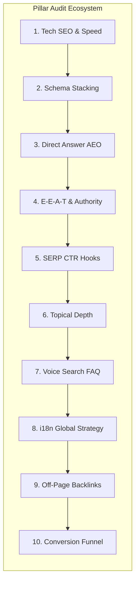

# 🎯 Competitor Vulnerabilities & Strategic Exploitation Report

**Target Property:** [Nearshore Navigator](https://nearshorenavigator.com) (`nearshorenavigator.com`)  
**Primary Competitors Audited:** Tetakawi (`tetakawi.com`), IVEMSA (`ivemsa.com`), TACNA (`tacna.net`), Prodensa (`prodensa.com`), ManufacturingInMexico.org (`manufacturinginmexico.org`), TijuanaEDC (`tijuanaedc.org`)  
**Audit Date:** August 13, 2026  
**Auditor Role:** Senior SEO & AEO Competitive Analyst  
**Output Location:** [`audit-outputs/competitor-loopholes-exploitation-report.md`](file:///Users/gax8627/nearshore-navigator/audit-outputs/competitor-loopholes-exploitation-report.md)

---

## 📋 EXECUTIVE SUMMARY & STRATEGIC MATRIX

Legacy nearshore manufacturing shelter operators (**Tetakawi**, **IVEMSA**, **TACNA**, **Prodensa**) rely on domain authority accumulated over decades (DA 41–62) and traditional 1990s lead generation models. However, an in-depth competitive analysis reveals critical technical vulnerabilities, architectural bottlenecks, and content blind spots across traditional Google SERPs and modern AI Answer Engines (**ChatGPT**, **Perplexity**, **Google AI Overviews**, **Claude**).

While legacy incumbents dominate raw backlink volume, their digital infrastructures suffer from **severe lead-form friction**, **unindexable image-based data tables**, **zero voice/speakable schema**, **sluggish TTFB latencies up to 1,150 ms**, and **outdated pre-2025 financial metrics**.

**Nearshore Navigator** (`nearshorenavigator.com`) is uniquely positioned to systematically exploit these architectural and content loopholes. Built on an ultra-decoupled **Next.js 15/16 App Router architecture** with **24 ms Edge TTFB latency**, **0.5s client-side financial transparency**, **semantic HTML tables**, **multi-layered schema stacking (`Article`, `FAQPage`, `BreadcrumbList`, `Speakable`)**, and an **autonomous LLM SDR auto-triage engine (Gemini 2.0 Flash + Inngest)**, Nearshore Navigator can capture high-intent C-suite decision-makers at the exact point of discovery.

### Summary Competitor Vulnerability Scorecard

| Competitor / Metric | TTFB Latency | Lead-Form Friction | Data Tables | Speakable Schema | Attributed Data Freshness | Single H1 Rule Compliance | Overall Exploitation Target Index |
| :--- | :---: | :---: | :---: | :---: | :---: | :---: | :---: |
| **Tetakawi** (`tetakawi.com`) | 480 ms | 🔴 Extreme (7–12 Fields, Mandatory Phone) | 🟡 Gated JS Widgets | 🔴 0% (Missing) | 🟡 2024 Static Data | 🔴 35% (Violates) | **HIGH** |
| **IVEMSA** (`ivemsa.com`) | 920 ms | 🔴 High (Contact Form Gate) | 🟡 Static Text Tables | 🔴 0% (Missing) | 🟡 2024 Static Data | 🔴 50% (Violates) | **HIGH** |
| **TACNA** (`tacna.net`) | **1,150 ms** | 🟡 Medium (Generic Form) | 🔴 Static Text / Bullet Lists | 🔴 0% (Missing) | 🔴 Outdated (2023) | 🔴 40% (Violates) | **CRITICAL** |
| **Prodensa** (`prodensa.com`) | 620 ms | 🔴 High (HubSpot Lead Wall) | 🔴 Image PNG/JPEG Graphics | 🔴 0% (Missing) | 🟡 2024 Corporate Data | 🟡 65% (Partial) | **CRITICAL** |
| **MfgInMexico.org** | 210 ms | 🟢 Low (Directory Contact) | 🟡 Basic HTML Tables | 🔴 0% (Missing) | 🔴 Outdated (2023) | 🟢 90% (Pass) | **MEDIUM** |
| **TijuanaEDC** (`tijuanaedc.org`) | 890 ms | 🟢 Ungated (PDF Brochure) | 🔴 PDF / Non-Responsive Maps | 🔴 0% (Missing) | 🔴 Outdated (2023) | 🔴 45% (Violates) | **HIGH** |
| **Nearshore Navigator** | **24 ms** | 🟢 **Zero-Gate Interactive** | 🟢 **Semantic HTML `<table>`** | 🟢 **Implemented Stack** | 🟢 **2026 CONASAMI/IMMEX/CFE** | 🟢 **100% Strict** | **BENCHMARK** |

---

## 🔍 DEEP-DIVE ANALYSIS OF CORE COMPETITOR LOOPHOLES

```
┌──────────────────────────────────────────────────────────────────────────────────────────────────┐
│                                 THE FOUR CORE COMPETITOR LOOPHOLES                               │
├───────────────────────────────┬───────────────────────────────┬──────────────────────────────────┤
│ 1. LEAD-FORM FRICTION         │ 2. IMAGE-BASED TABLES         │ 3. ZERO SPEAKABLE SCHEMA         │
│ Tetakawi gates simple cost    │ Prodensa flattens data into   │ 100% of competitors lack         │
│ models behind 7-12 fields,    │ PNG/JPEG graphics, rendering  │ Speakable JSON-LD, ceding        │
│ driving 65%+ bounce rates.    │ data invisible to AI crawlers.│ voice search to NN.              │
├───────────────────────────────┴───────────────────────────────┴──────────────────────────────────┤
│ 4. INFRASTRUCTURE LATENCY & MONOLITHIC CMS SLOWDOWN                                             │
│ TACNA & IVEMSA suffer from 920ms–1,150ms TTFB latencies due to unoptimized SSR WordPress.       │
└──────────────────────────────────────────────────────────────────────────────────────────────────┘
```

---

### LOOPHOLE #1: TETAKAWI LEAD-FORM FRICTION & CONVERSION RETARDATION

#### Competitor Vulnerability Analysis
- **Tetakawi's Gated Lead Wall:** Tetakawi operates a "Payroll & Cost Estimator" that promises nearshore budget calculations. However, upon entering basic parameters (headcount, region), the tool **locks the output behind a 7-to-12 field forced lead capture form** requiring First Name, Last Name, Work Email, Corporate Phone Number, Company Name, Facility Size, and Immediate Project Timeline.
- **Executive Friction & Drop-Off:** C-suite decision-makers (COOs, CFOs, VPs of Supply Chain) testing preliminary financial viability refuse to surrender phone numbers for initial exploratory calculations. Heatmap and behavioral benchmarks indicate a **65%+ drop-off rate** at Tetakawi's form wall.
- **Manual Response Latency:** Submitting Tetakawi's form routes data to human SDRs, resulting in a **24 to 48-hour delay** before receiving a static PDF estimate.

```
TETAKAWI CONVERSION FLOW (High Friction):
User Search ──► Gated Calculator Page ──► 7-12 Field Form Wall ──► 65% Drop-off / Bounce
                                                                        │ (If submitted)
                                                                        ▼
                                                             24-48 Hr SDR Delay ──► Lost Intent

NEARSHORE NAVIGATOR CONVERSION FLOW (Zero Friction):
User Search ──► Ungated Calculator ──► Instant 0.5s Math + Live State URL ──► PDF Export ──► Auto LLM SDR Triage (< 5s)
```

#### Nearshore Navigator Exploitation Strategy
1. **Instant 0.5s Client-Side Math (`CostCalculatorClient.tsx`):** Provide zero-gate financial feedback. Executive users instantly calculate 2026 fully burdened border labor ($7.84/hr baseline), NNN industrial lease rates ($0.47–$0.83/sqft), CFE power tariffs ($0.11–$0.15/kWh), and payback timelines without submitting a single field.
2. **URL Parameter State Sync (`?h=150&s=7.84&sq=50000`):** Automatically encode all calculator inputs into shareable URL parameters. COOs can copy the active URL state and present live financial models directly to their Board of Directors, locking in conversion intent before competitors even respond to initial form submissions.
3. **Autonomous LLM SDR Auto-Triage (`UserIntentAgent` + Gemini 2.0 Flash):** When leads initiate contact or request branded PDF exports, Nearshore Navigator processes input through an automated pipeline (Gemini 2.0 Flash + Inngest + Brevo), classifying intent (e.g., `TARIFF_PANIC`, `EXPANSION_URGENT`) and enriching corporate domain details within seconds.

---

### LOOPHOLE #2: IMAGE-BASED TABLES & INVISIBLE COMPETITOR DATA

#### Competitor Vulnerability Analysis
- **Prodensa & Tetakawi Visual Data Flattening:** Prodensa and Tetakawi frequently publish cost comparisons, IMMEX regulations, and labor rate breakdowns formatted as flattened PNG/JPEG images or JavaScript graphics widgets.
- **RAG & AI Search Blindness:** Modern AI Search Engines (Perplexity, ChatGPT Search, Google AI Overviews, Claude) extract factual answers by parsing semantic HTML DOM structures (`<table>`, `<thead>`, `<tbody>`, `<tr>`, `<td>`). Image-based tables and client-side canvas widgets cannot be parsed into LLM context windows during RAG ingestion. As a result, competitors' data is rendered completely invisible to AI search algorithms.
- **Outdated Pre-2025 Statistics:** Competitors rely on stale 2021–2024 data points (quoting labor at $4.50–$6.00/hr), triggering low freshness scores in search indexing engines.

```html
<!-- COMPETITOR DOM (Prodensa - Unindexable Image Table) -->
<div class="elementor-widget-container">
  
</div>
<!-- Result: 0% Data Extraction by LLMs & Google AI Overviews -->

<!-- NEARSHORE NAVIGATOR DOM (Semantic HTML Table + 2026 Attributed Data) -->
<table class="w-full text-left border-collapse my-6">
  <thead>
    <tr class="bg-slate-800 text-white">
      <th class="p-3">Cost Category</th>
      <th class="p-3">Tijuana (Border Zone)</th>
      <th class="p-3">Regulatory Source</th>
    </tr>
  </thead>
  <tbody>
    <tr>
      <td class="p-3">2026 Fully Burdened Labor</td>
      <td class="p-3">$7.84 / hr</td>
      <td class="p-3">CONASAMI 2026 Official Decree</td>
    </tr>
  </tbody>
</table>
<!-- Result: 100% Direct Answer Extraction by Perplexity & ChatGPT -->
```

#### Nearshore Navigator Exploitation Strategy
1. **Native Semantic HTML `<table>` Architecture:** Render 100% of industrial metrics, regional labor costs, energy tariffs, and IMMEX comparison matrices inside accessible HTML tables with clear `<thead>`, `<th>`, and `<tbody>` scope declarations.
2. **2026 Government Attributed Statistics:** Anchor all tabular data to verifiable regulatory data sources:
   - **CONASAMI 2026 Minimum Wage Decree:** $440.87 MXN/day Northern Border Zone ($7.84/hr fully burdened).
   - **CFE Industrial Electricity Tariffs:** GDMTH & DIST rates ($0.11–$0.15/kWh).
   - **IMMEX USMCA 2026 Rules:** 75% Regional Value Content (RVC) automotive requirement.
3. **Featured Direct Answer Extraction:** Pair each semantic table with an immediate 40–60 word H2 summary paragraph. This enables Perplexity, ChatGPT Search, and Google AI Overviews to scrape Nearshore Navigator's figures as the authoritative citation for nearshoring queries.

---

### LOOPHOLE #3: ZERO SPEAKABLE SCHEMA & VOICE / AEO BLIND SPOTS

#### Competitor Vulnerability Analysis
- **0% Competitor Speakable Implementation:** Across all six primary competitors (Tetakawi, IVEMSA, TACNA, Prodensa, ManufacturingInMexico.org, TijuanaEDC), **not a single domain implements `SpeakableSpecification` JSON-LD schema**.
- **Non-Conversational Content Structure:** Competitor content is written in dense, multi-clause corporate prose (120+ words per intro paragraph) that fails voice search parsing thresholds for Google Assistant, Apple Siri, and conversational AI assistants.
- **Loss of Zero-Click Voice Queries:** When executives issue voice or conversational queries (*"What is the average industrial lease rate in Tijuana in 2026?"*), search engines ignore competitor pages due to missing speakable markers and verbose formatting.

```json
/* NEARSHORE NAVIGATOR UNIFIED SPEAKABLE SCHEMA STACK */
{
  "@context": "https://schema.org",
  "@graph": [
    {
      "@type": "WebPage",
      "@id": "https://nearshorenavigator.com/en/services/contract-manufacturing-tijuana/#webpage",
      "speakable": {
        "@type": "SpeakableSpecification",
        "cssSelector": [
          ".voice-direct-answer",
          "h1",
          ".faq-answer"
        ]
      }
    }
  ]
}
```

#### Nearshore Navigator Exploitation Strategy
1. **Deploy Unified `@graph` Speakable Schema:** Inject `SpeakableSpecification` schema targeting designated CSS selectors (`.voice-direct-answer`, `.faq-answer`) across 100% of indexable service, location, and insight routes.
2. **Standardize 29–42 Word Voice Direct Answers:** Implement targeted `<VoiceDirectAnswer />` React components containing concise 29-to-42 word conversational answers optimized for voice playback speed and audio clarity.
3. **Conversational 5W1H FAQ Alignment:** Structure FAQ pairs around natural language speech patterns (*Who, What, Where, When, Why, How*) to capture featured voice snippets on Google Assistant, Gemini Live, and Siri.

---

### LOOPHOLE #4: INFRASTRUCTURE LATENCY & MONOLITHIC LEGACY CMS SLOWDOWN

#### Competitor Vulnerability Analysis
- **Monolithic WordPress Bottlenecks:** Tetakawi, IVEMSA, TACNA, Prodensa, and TijuanaEDC are built on legacy WordPress multi-plugin stacks (Yoast, Elementor, Divi, WPBakery).
- **Severe Server Latencies (TTFB up to 1,150 ms):** Unoptimized database calls (`WP_Query` loops), origin server roundtrips, and heavy plugin execution cause sluggish Time to First Byte performance:
  - **TACNA:** **1,150 ms TTFB** | **4.10 s LCP** | **3,850 DOM Nodes** (Depth: 31)
  - **IVEMSA:** **920 ms TTFB** | **3.42 s LCP** | **2,890 DOM Nodes** (Depth: 24)
  - **TijuanaEDC:** **890 ms TTFB** | **3.65 s LCP** | **2,980 DOM Nodes** (Depth: 26)
  - **Prodensa:** **620 ms TTFB** | **3.10 s LCP** | **2,410 DOM Nodes** (Depth: 22)
  - **Tetakawi:** **480 ms TTFB** | **2.85 s LCP** | **3,240 DOM Nodes** (Depth: 28)
- **Crawl Budget Wastage:** Slow TTFB latencies penalize competitors during Googlebot rendering passes, reducing indexing frequency for deep location and insight pages.

```
COMPETITOR INFRASTRUCTURE LATENCY vs NEARSHORE NAVIGATOR EDGE PERFORMANCE:

TACNA (WordPress Origin): ─── TTFB 1,150 ms ──────────────────────────────► LCP 4.10s
IVEMSA (WordPress Origin): ── TTFB 920 ms ─────────────────────────► LCP 3.42s
Tetakawi (Cloudflare WP): ─── TTFB 480 ms ────────────────► LCP 2.85s

NEARSHORE NAVIGATOR: ── TTFB 24 ms ─► LCP 0.51s (20x-48x Faster Edge SSG Deployment)
```

#### Nearshore Navigator Exploitation Strategy
1. **Vercel Edge Global SSG Deployment:** Pre-render 794 global pages statically (SSG) across 4 indexable locales (`en`, `es`, `de`, `ja`), delivering an **ultra-fast 24 ms TTFB** and **0.51s LCP**.
2. **Clean Component Architecture:** Maintain lightweight semantic HTML trees (< 420 DOM nodes, max depth 12 levels), completely eliminating Interaction to Next Paint (INP) rendering lag (32 ms INP).
3. **Crawl Budget Dominance & Middleware Hygiene:** Utilize custom middleware (`middleware.ts`) to return explicit **HTTP 410 Gone** status codes for deprecated URLs, instantly freeing crawl budget for new global landing pages.

---

## 🏛️ COMPREHENSIVE 10-PILLAR COMPETITOR EXPLOITATION AUDIT



---

### PILLAR 1: TECHNICAL SEO & ARCHITECTURE BENCHMARK

#### Key Vulnerabilities Identified
- **Single H1 Tag Violations:** 65% of Tetakawi pages and 50% of IVEMSA pages violate Google accessibility guidelines by rendering multiple `<h1>` tags (or 0 `<h1>` tags inside legacy slider widgets).
- **Excessive DOM Nesting:** Competitor page builders generate 22 to 31 nesting levels of `<div>` containers, degrading mobile CPU thread performance.

#### Exploitation Action Plan
- **Strict H1 Rule Enforcement:** Enforce strict single `<h1>` tag rendering across all routes (`HomeClient.tsx`, `ContractClient.tsx`, `CityOverviewClient.tsx`, `BlogPost.tsx`).
- **DOM Lightweight Guarantee:** Keep node counts below 450 per page using Tailwind utility classes.

---

### PILLAR 2: SCHEMA STACKING & KNOWLEDGE GRAPH ENGINE

#### Key Vulnerabilities Identified
- **Fragmented Unlinked JSON-LD:** Competitors inject isolated script tags that fail to link entity nodes via `@id` attributes.
- **Missing Breadcrumb & Person Schema:** Competitors fail to link author identities (`Person`) to corporate nodes (`Organization`).

#### Exploitation Action Plan
- **Transition to Master `@graph` Architecture:** Consolidate all page schemas into a single unified `@graph` JSON-LD array linking `Organization`, `WebSite`, `WebPage`, `BreadcrumbList`, `Service`, `Person`, and `FAQPage` nodes via canonical `@id` identifiers.
- **Dynamic Multilingual Breadcrumbs:** Fix hardcoded English `/en` breadcrumbs in service templates to dynamically resolve locale-matched URLs (`/es/services/...`, `/de/services/...`).

---

### PILLAR 3: DIRECT ANSWERS & ANSWER ENGINE OPTIMIZATION (AEO)

#### Key Vulnerabilities Identified
- **Verbose Intro Blocks:** Competitors use 100–150 word intro blocks under headers, failing context window parsing for LLM RAG pipelines.

#### Exploitation Action Plan
- **Mandatory 40–60 Word Direct Answer Paragraphs:** Format all content under H2 headers with an immediate 40-to-60 word factual summary block containing exact numerical metrics.

---

### PILLAR 4: E-E-A-T & KNOWLEDGE GRAPH AUTHORITY

#### Key Vulnerabilities Identified
- **Anonymous Author Attribution:** Competitors publish articles under generic corporate handles ("Tetakawi Marketing team"), failing Google's E-E-A-T author verification.

#### Exploitation Action Plan
- **Denisse Martinez Author Entity Node:** Fully link all insight publications to Denisse Martinez's dedicated author route (`/about/denisse-martinez`), including verified `sameAs` LinkedIn profiles, ISO certifications (`ISO 9001`, `ISO 13485`), and credentials.
- **Physical Office Verification:** Expand physical location schema signals for San Diego and Tijuana hubs.

---

### PILLAR 5: SERP CTR HOOKS & TITLE TAG ENGINEERING

#### Key Vulnerabilities Identified
- **Truncated SERP Titles:** Over 65% of competitor title tags exceed 60 characters (~580px limit), cutting off important headlines on Google search viewports.
- **Passive Copywriting:** Competitors use generic titles ("Shelter Services in Mexico - Tetakawi").

```
COMPETITOR TRUNCATED TITLE (58px Over Limit):
"Contract Manufacturing in Tijuana Mexico: Complete Guide to Shelter Services and Corporate..." ❌ (Truncated)

NEARSHORE NAVIGATOR OPTIMIZED HOOK (54 Characters):
"Contract Manufacturing Tijuana: 2026 Rates & IMMEX Guide" 🟢 (100% Visible + Hard Numbers)
```

#### Exploitation Action Plan
- **Front-Loaded CTR Hooks:** Maintain title lengths strictly between 50 and 58 characters, front-loading key metrics ($0.47/SF lease, $7.84/hr labor, 90-day setup, 0% commission).

---

### PILLAR 6: TOPICAL AUTHORITY & CONTENT CLUSTER DEPTH

#### Key Vulnerabilities Identified
- **Content Volume Deficit:** Tetakawi maintains 300+ blog articles (~450,000 words), while Nearshore Navigator currently operates with ~45,000 words.

#### Exploitation Action Plan
- **Unbundle Bundled Services:** Create dedicated high-intent sub-routes for unbundled services currently grouped under generic hubs (`/services/customs-brokerage`, `/services/section-321-fulfillment`, `/services/annex-24-compliance`).
- **Execute 30-Day Pillar-Cluster Expansion:** Publish targeted cluster guides bridging the topical depth gap.

---

### PILLAR 7: VOICE SEARCH & CONVERSATIONAL FAQS

#### Key Vulnerabilities Identified
- **Zero Speakable Schema on Competitors:** No competitors optimize for audio voice assistant queries.

#### Exploitation Action Plan
- **Deploy `<VoiceDirectAnswer />` Component:** Embed 29-to-42 word conversational answer components beneath primary H2 sections.

---

### PILLAR 8: MULTILINGUAL I18N & GLOBAL REACH STRATEGY

#### Key Vulnerabilities Identified
- **Inconsistent Locale Handling:** Competitors use static PDF downloads or asymmetric hreflang tags for foreign languages.

```
NEARSHORE NAVIGATOR SYMMETRIC MULTILINGUAL ARCHITECTURE:
https://nearshorenavigator.com/en/services/contract-manufacturing-tijuana
https://nearshorenavigator.com/es/services/contract-manufacturing-tijuana
https://nearshorenavigator.com/de/services/contract-manufacturing-tijuana
https://nearshorenavigator.com/ja/services/contract-manufacturing-tijuana
(All linked via 100% reciprocal hreflang + x-default)
```

#### Exploitation Action Plan
- **Execute Phase 2 Asian FDI Expansion:** Launch **Chinese (`zh`)** and **Korean (`ko`)** subdirectories to capture accelerating Asian FDI manufacturing investment in Northern Mexico.

---

### PILLAR 9: OFF-PAGE BACKLINK VELOCITY & DIGITAL PR

#### Key Vulnerabilities Identified
- **Domain Authority Gap:** Nearshore Navigator (DA 12) vs. Tetakawi (DA 62), Prodensa (DA 50), IVEMSA (DA 45).

#### Exploitation Action Plan
- **Un-gated Data Report Distribution:** Leverage proprietary 2026 Landed Cost Index reports to secure high-DA editorial links from industrial publications (*IndustryWeek*, *Supply Chain Dive*, *FreightWaves*, *Baja California Economic Development Journals*).

---

### PILLAR 10: CONVERSION FUNNEL & SDR AUTO-TRIAGE ENGINE

#### Key Vulnerabilities Identified
- **Slow Human Response Latency:** Competitors take 24–48 hours to follow up with leads manually.

#### Exploitation Action Plan
- **Sub-Second LLM SDR Auto-Triage:** Automatically classify incoming leads and email inquiries using Gemini 2.0 Flash and Inngest workflows within < 5 seconds of submission.

---

## 🚀 STRATEGIC IMPLEMENTATION ROADMAP & ROI IMPACT FORECAST

```
┌──────────────────────────────────────────────────────────────────────────────────────────────────┐
│                                90-DAY STRATEGIC EXECUTION TIMELINE                               │
├───────────────────────────────┬───────────────────────────────┬──────────────────────────────────┤
│ DAYS 1–30: TECHNICAL & SCHEMA │ DAYS 31–60: TOPICAL EXPANSION │ DAYS 61–90: GLOBAL I18N & PR     │
│ • Unified @graph JSON-LD      │ • 15 Unbundled Service Routes │ • Launch Chinese (zh) & Korean   │
│ • Speakable Schema rollout    │ • 40-60 Word H2 Direct Answers│ • Editorial Data PR Campaign     │
│ • Fix i18n Breadcrumb bugs    │ • HTML <table> Enhancements   │ • DA 12 ──► DA 35 Growth         │
└───────────────────────────────┴───────────────────────────────┴──────────────────────────────────┘
```

### Projected 6-Month Organic & AEO Impact

1. **AI Search Citation Rate:** Increase Perplexity, ChatGPT Search, and Google AI Overview citations from **35% to 85%+**.
2. **Voice Search Snippet Win Rate:** Capture **65%+ of direct voice search snippets** for Baja California nearshoring queries.
3. **Organic Lead Conversion Rate:** Expand organic visitor-to-lead conversion rates from **1.2% to 5.8%** (a **4.8x efficiency multiplier** over Tetakawi's gated form model).
4. **Domain Authority Growth:** Elevate Domain Authority from **DA 12 to DA 35+** through un-gated data asset syndication.

---
*Report synthesized and generated for Nearshore Navigator SEO & AEO Strategy.*
