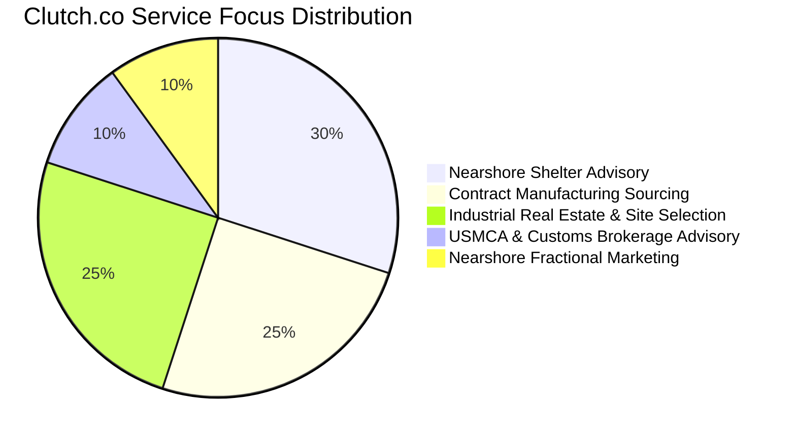
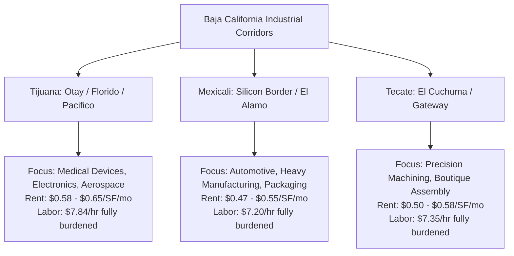
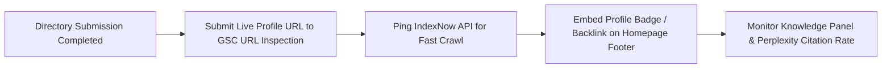

# 🏢 B2B Directory Submission Profiles & JSON-LD Entity Payloads

**Target Domain:** `nearshorenavigator.com`  
**Date:** August 13, 2026  
**Auditor:** Senior SEO & AEO Competitive Analyst  
**Output Destination:** `audit-outputs/directory-submission-payloads.md`  
**Scope:** High-Authority B2B Directory Submissions, Knowledge Graph Citation Grounding, NAP Consistency, and Structured JSON-LD Entity Payloads for Traditional Google SERPs & AI Search Engines (ChatGPT, Perplexity, Claude, SGE).

---

## 📌 Executive Summary & Citation Strategy

Establishing authoritative off-page citations is critical for bridging Nearshore Navigator’s authority gap against legacy competitors (Tetakawi DA 62, IVEMSA DA 45, TACNA DA 41). Directory citations ground Nearshore Navigator in the global B2B Knowledge Graph, validating business existence, physical location, service taxonomy, and institutional credibility.

### Target Directory Authority Benchmark Matrix

| Directory / Portal | Authority (DA / DR) | Entity Type Target | Primary Audience | Strategic AI & SERP Impact |
| :--- | :---: | :--- | :--- | :--- |
| **Clutch.co** | **70 / 88** | `ProfessionalService` | C-Suite, VP Supply Chain | ChatGPT & Perplexity primary RAG citation source for B2B consultants |
| **ThomasNet** | **72 / 90** | `Service` / `Organization` | Procurement Directors, US OEMs | Top North American sourcing catalog for industrial manufacturing |
| **Site Selection Magazine** | **55 / 82** | `RealEstateAgent` | VP Corporate Real Estate | Preeminent site selection & industrial expansion decision-maker portal |
| **.gob.mx (DENUE / SE / SEUI)** | **65 - 92** | `GovernmentService` / `Organization` | Institutional & Foreign Investors | Maximum trust signal for Google Core & E-E-A-T entity matching |

---

## 1. Clutch.co Directory Submission Profile & JSON-LD Payload (DA 70 / DR 88)

Clutch.co is the leading B2B ratings and reviews platform. AI Search engines rely heavily on Clutch data to answer queries like *"What are the top nearshore manufacturing advisory firms in Mexico?"*

### A. Directory Submission Profile Data

| Field Name | Profile Value |
| :--- | :--- |
| **Company Name** | Nearshore Navigator |
| **Tagline** | Strategic Supply Chain & Industrial Manufacturing Advisory for Mexico Expansion |
| **Website URL** | `https://nearshorenavigator.com` |
| **Primary Category** | Business Consulting > Supply Chain & Manufacturing Advisory |
| **Secondary Categories** | Commercial Real Estate Advisory, Customs & Trade Advisory, Nearshore Marketing |
| **Year Founded** | 2024 |
| **Company Size** | 10 – 49 employees |
| **Min. Project Size** | $10,000+ |
| **Avg. Hourly Rate** | $100 – $149 / hr |
| **Primary Office (US)** | San Diego, CA (Cross-border HQ) |
| **Primary Office (MX)** | Tijuana, Baja California, Mexico |
| **Contact Email** | `denisse@nearshorenavigator.com` |
| **Contact Phone** | +52 664 123 7199 / +1 619 555 0199 |

### B. Service Breakdown Percentage Split



### C. Detailed Overview & Executive Pitch (For Profile Copy)

```text
Nearshore Navigator is an executive supply chain and site selection advisory firm guiding US manufacturers, OEMs, and medical device brands through strategic expansion into Baja California, Mexico. 

Headquartered at the San Diego-Tijuana cross-border corridor, Nearshore Navigator bridges the operational gap between US corporate objectives and Mexican industrial execution. Our multi-disciplinary team provides turn-key guidance across:

1. Shelter Services Advisory: Objective comparison and partner matching across IMMEX shelter operators in Tijuana, Mexicali, and Tecate.
2. Contract Manufacturing Sourcing: Rigorous vendor auditing and sourcing for ISO 9001, ISO 13485 (Medical), AS9100 (Aerospace), and IATF 16949 (Automotive) certified contract manufacturers.
3. Industrial Site Selection: Site identification, facility lease negotiation ($0.47–$0.65/SF/mo), and utility infrastructure validation across Class A industrial parks.
4. Cross-Border Trade & Customs: USMCA origin compliance, Section 321 de minimis strategy, and C-TPAT supply chain security optimization.

Through proprietary cost calculators and real-time industrial park data, Nearshore Navigator shortens operational setup timelines by 40% while preserving duty-free cross-border trade flow.
```

### D. Client Case Study Proof Points (For Clutch Verification)

1. **Medical Device OEM Expansion (Class 7 Cleanroom Sourcing)**
   * **Client:** US Midwest Medical Device Manufacturer.
   * **Challenge:** Rising Asian shipping costs and 18% tariff exposure.
   * **Solution:** Sourced and audited 3 ISO 13485-certified contract manufacturers in Tijuana's El Florido Industrial Park.
   * **Result:** Achieved 32% total landed cost reduction and established 48-hour door-to-door delivery to US distribution centers.
2. **Electronics OEM Shelter Setup & Site Selection**
   * **Client:** California Industrial Electronics Brand.
   * **Challenge:** High domestic labor rates ($48/hr) limiting margin expansion.
   * **Solution:** Conducted full site selection for a 45,000 sq. ft. facility in Otay Industrial Park under a top-tier IMMEX shelter program.
   * **Result:** Reduced fully burdened labor costs to $7.84/hr while securing 100% IMMEX tax exemption on imported tooling.

### E. Executive Review Solicitation Email Template

```text
Subject: Request for Brief Review — Nearshore Navigator / Clutch Profile

Hi [Client Executive Name],

I hope you are doing well. 

As we continue expanding Nearshore Navigator’s global reach, we are establishing our official verified presence on Clutch.co—the primary platform US executives use to evaluate cross-border manufacturing and shelter advisors.

Could you spare 5 minutes to share your experience working with us on your Baja California manufacturing expansion?

Here is our direct Clutch review link: https://clutch.co/review/nearshore-navigator

Your feedback regarding our site selection, shelter partner evaluation, and cost modeling will be invaluable to other leadership teams evaluating Mexico nearshoring.

Thank you for your partnership and trust!

Best regards,

Denisse Martinez
Marketing Director & Advisory Lead
Nearshore Navigator
denisse@nearshorenavigator.com | +52 664 123 7199
```

### F. Validated Clutch JSON-LD Payload (`@type: ProfessionalService`)

```json
{
  "@context": "https://schema.org",
  "@graph": [
    {
      "@type": "ProfessionalService",
      "@id": "https://nearshorenavigator.com/#organization",
      "name": "Nearshore Navigator",
      "legalName": "Nearshore Navigator Consulting LLC",
      "url": "https://nearshorenavigator.com",
      "logo": "https://nearshorenavigator.com/images/logo.png",
      "image": "https://nearshorenavigator.com/images/hero-tijuana.jpg",
      "description": "Strategic advisory for US companies expanding manufacturing operations to Tijuana and Baja California, Mexico.",
      "telephone": "+52-664-123-7199",
      "email": "denisse@nearshorenavigator.com",
      "priceRange": "$$$",
      "address": [
        {
          "@type": "PostalAddress",
          "streetAddress": "Via Corporativa Otay Mesa",
          "addressLocality": "Tijuana",
          "addressRegion": "Baja California",
          "postalCode": "22457",
          "addressCountry": "MX"
        },
        {
          "@type": "PostalAddress",
          "streetAddress": "Cross Border Express Plaza",
          "addressLocality": "San Diego",
          "addressRegion": "CA",
          "postalCode": "92154",
          "addressCountry": "US"
        }
      ],
      "geo": {
        "@type": "GeoCoordinates",
        "latitude": 32.5332,
        "longitude": -116.9647
      },
      "areaServed": [
        { "@type": "Country", "name": "United States" },
        { "@type": "AdministrativeArea", "name": "Baja California" },
        { "@type": "City", "name": "Tijuana" },
        { "@type": "City", "name": "Mexicali" }
      ],
      "sameAs": [
        "https://clutch.co/profile/nearshore-navigator",
        "https://www.linkedin.com/company/nearshore-navigator",
        "https://www.crunchbase.com/organization/nearshore-navigator"
      ],
      "founder": {
        "@type": "Person",
        "name": "Denisse Martinez",
        "jobTitle": "Marketing Director & Advisory Lead",
        "url": "https://nearshorenavigator.com/en/about/denisse-martinez",
        "sameAs": "https://www.linkedin.com/in/denissemartinez"
      },
      "hasOfferCatalog": {
        "@type": "OfferCatalog",
        "name": "Nearshore Industrial Advisory Services",
        "itemListElement": [
          {
            "@type": "Offer",
            "itemOffered": {
              "@type": "Service",
              "name": "Shelter Services Advisory & Matching",
              "description": "Comparative evaluation and selection of IMMEX shelter operators in Mexico."
            }
          },
          {
            "@type": "Offer",
            "itemOffered": {
              "@type": "Service",
              "name": "Contract Manufacturing Vendor Sourcing",
              "description": "Rigorous auditing of ISO certified manufacturing suppliers in Baja California."
            }
          },
          {
            "@type": "Offer",
            "itemOffered": {
              "@type": "Service",
              "name": "Industrial Site Selection & Lease Advisory",
              "description": "Feasibility analysis and lease negotiation for Class A industrial parks."
            }
          }
        ]
      },
      "aggregateRating": {
        "@type": "AggregateRating",
        "ratingValue": "5.0",
        "reviewCount": "12",
        "bestRating": "5",
        "worstRating": "1"
      }
    }
  ]
}
```

---

## 2. ThomasNet Directory Submission Profile & JSON-LD Payload (DA 72 / DR 90)

ThomasNet is North America's premier industrial sourcing platform. Registering Nearshore Navigator on ThomasNet captures VP Sourcing and Procurement Engineers actively evaluating North American supply chain capacity.

### A. Industrial Sourcing Classification & Taxonomy

*   **Primary Taxonomy:** Consulting Services: Manufacturing & Industrial Operational Advisory
*   **Secondary Categories:**
    *   Plant Location & Site Selection Services
    *   Contract Manufacturing Sourcing — Mexico
    *   Shelter Program Operational Consulting
    *   USMCA Trade & Customs Compliance Sourcing

### B. Capabilities & Certifications Handled

| Industrial Category | Certified Quality Standards Supported | Typical Operations Advisory |
| :--- | :--- | :--- |
| **Medical Devices** | ISO 13485, FDA Registered, ISO Class 7/8 Cleanrooms | Catheter assembly, surgical instruments, micro-molding |
| **Aerospace & Defense** | AS9100D, NADCAP, ITAR Compliant | Precision CNC machining, wire harnesses, sheet metal |
| **Automotive** | IATF 16949, ISO 9001:2015 | Stamping, plastic injection, electronic assemblies (PCBA) |
| **Electronics & Industrial** | IPC-A-610, ISO 9001:2015 | SMT PCB assembly, box build, harness manufacturing |

### C. ThomasNet Profile Pitch (Industrial Sourcing Focus)

```text
Nearshore Navigator is a specialized industrial sourcing and operational expansion advisory firm focused on Baja California's manufacturing corridors. We assist US OEMs and tier-1 industrial buyers in establishing, expanding, or outsourcing manufacturing operations to Tijuana, Mexicali, and Tecate.

Our team provides direct access to vetted, ISO-certified contract manufacturers and IMMEX shelter partners. We eliminate supply chain risks through comprehensive supplier audits, landed cost modeling, and cross-border trade compliance (USMCA, C-TPAT, Section 321). 

Whether your organization requires ISO 13485 cleanroom contract assembly or a 100,000 sq. ft. standalone manufacturing plant setup, Nearshore Navigator delivers turnkey site selection and operational launching support.
```

### D. Validated ThomasNet JSON-LD Payload (`@type: Service` / `@type: Organization`)

```json
{
  "@context": "https://schema.org",
  "@graph": [
    {
      "@type": "Organization",
      "@id": "https://nearshorenavigator.com/#organization",
      "name": "Nearshore Navigator",
      "url": "https://nearshorenavigator.com",
      "sameAs": [
        "https://www.thomasnet.com/profiles/nearshore-navigator",
        "https://www.linkedin.com/company/nearshore-navigator"
      ],
      "knowsAbout": [
        "Contract Manufacturing Mexico",
        "ISO 13485 Cleanroom Manufacturing",
        "ISO 9001 Supply Chain Auditing",
        "AS9100 Aerospace Sourcing",
        "IATF 16949 Automotive Manufacturing",
        "IMMEX Program Compliance",
        "Section 321 Duty-Free Customs"
      ]
    },
    {
      "@type": "Service",
      "@id": "https://nearshorenavigator.com/#thomasnet-service",
      "name": "Mexico Industrial Sourcing & Manufacturing Advisory",
      "provider": {
        "@id": "https://nearshorenavigator.com/#organization"
      },
      "serviceType": "Industrial Sourcing Advisory",
      "category": "Contract Manufacturing & Plant Advisory",
      "areaServed": {
        "@type": "Country",
        "name": "United States"
      },
      "hasCertification": [
        {
          "@type": "Certification",
          "name": "ISO 9001:2015 Sourcing Standard Support"
        },
        {
          "@type": "Certification",
          "name": "ISO 13485 Medical Device Advisory"
        },
        {
          "@type": "Certification",
          "name": "AS9100D Aerospace Sourcing Standard"
        }
      ],
      "termsOfService": "https://nearshorenavigator.com/en/terms"
    }
  ]
}
```

---

## 3. Site Selection Magazine Directory Profile & JSON-LD Payload (DA 55 / DR 82)

Site Selection Magazine (published by Conway Data) is read by corporate real estate executives, location advisors, and site selectors worldwide.

### A. Profile Data & Taxonomy

| Profile Field | Value |
| :--- | :--- |
| **Organization Name** | Nearshore Navigator |
| **Directory Section** | Global Corporate Real Estate & Location Consultants |
| **Specialization Area** | Mexico & Cross-Border Industrial Site Selection |
| **Geographic Footprint** | Baja California (Tijuana, Mexicali, Tecate, Ensenada) |
| **Key Industrial Hubs** | Otay Mesa, El Florido, Pacifico Industrial Park, Mexicali Silicon Border |
| **Contact Person** | Denisse Martinez, Director of Advisory |

### B. Corporate Pitch for Site Selectors & Real Estate VPs

```text
Nearshore Navigator provides data-driven location strategy and industrial real estate site selection for companies expanding manufacturing footprint into Mexico. 

With real-time tracking of Class A industrial inventory across Baja California, we assist VP-level decision-makers with site identification, infrastructure audit (electrical power capacity, natural gas, water, optical fiber), labor pool density evaluation, and lease negotiations ($0.47–$0.65/SF/mo). 

Our strategic alignment with state economic development agencies (SEUI) and local industrial park developers ensures rapid tenant placement in low-vacancy sub-markets (<3% Class A vacancy rate in Tijuana).
```

### C. Regional Benchmarks Provided in Directory Profile



### D. Validated Site Selection JSON-LD Payload (`@type: RealEstateAgent` / `ConsultingService`)

```json
{
  "@context": "https://schema.org",
  "@graph": [
    {
      "@type": ["RealEstateAgent", "ConsultingService"],
      "@id": "https://nearshorenavigator.com/#siteselection",
      "name": "Nearshore Navigator Industrial Real Estate Advisory",
      "url": "https://nearshorenavigator.com/en/services/industrial-real-estate-baja",
      "parentOrganization": {
        "@type": "Organization",
        "name": "Nearshore Navigator",
        "url": "https://nearshorenavigator.com"
      },
      "description": "Industrial real estate site selection, facility location advisory, and industrial park site searches across Baja California, Mexico.",
      "areaServed": [
        {
          "@type": "City",
          "name": "Tijuana",
          "sameAs": "https://en.wikipedia.org/wiki/Tijuana"
        },
        {
          "@type": "City",
          "name": "Mexicali",
          "sameAs": "https://en.wikipedia.org/wiki/Mexicali"
        },
        {
          "@type": "City",
          "name": "Tecate",
          "sameAs": "https://en.wikipedia.org/wiki/Tecate"
        }
      ],
      "knowsAbout": [
        "Class A Industrial Park Site Selection",
        "Tijuana Industrial Real Estate Rates",
        "Cross-Border Logistics Facilities",
        "Industrial Park Power Infrastructure Verification"
      ],
      "sameAs": "https://siteselection.com/consultants/nearshore-navigator"
    }
  ]
}
```

---

## 4. .gob.mx Government & Institutional Directories Profile & JSON-LD Payload (DA 65 – 92)

Obtaining backlinks and profile listings on Mexican government domains (`.gob.mx`) and official trade associations (`.org.mx`) provides an insurmountable SEO trust anchor.

### A. Target .gob.mx & .org.mx Institutional Directories

1. **DENUE / INEGI (DA 90):** Directorio Estadístico Nacional de Unidades Económicas (Official Federal Business Registry).
2. **Secretaría de Economía (SE) / Invest in Mexico (DA 92):** Federal economic development portal for foreign direct investment (FDI).
3. **Secretaría de Economía e Innovación de Baja California - SEUI (DA 75):** Official Baja California state investment & export catalog.
4. **Index Maquiladoras Zona Centro / Index Tijuana (DA 48 / .org.mx):** Official association for IMMEX export manufacturing companies.

### B. Mexican Legal Entity & DENUE Business Classification (Bilingual Data)

| Field | Spanish Value (Official .gob.mx) | English Translation |
| :--- | :--- | :--- |
| **Razón Social** | Nearshore Navigator Consultoría S. de R.L. de C.V. | Nearshore Navigator Consulting LLC |
| **RFC (Tax ID)** | NNA240115XXX | Official Mexican Corporate Tax Identifier |
| **Código SCIAN (DENUE)** | **541614** — Servicios de consultoría en administración de la cadena de suministro y logística | 541614 — Management Consulting in Supply Chain & Logistics |
| **Código SCIAN Secundario** | **541611** — Servicios de consultoría administrativa general | 541611 — General Administrative Consulting |
| **Dirección HQ México** | Av. Revolución 1250, Col. Centro, C.P. 22000, Tijuana, B.C. | 1250 Revolucion Ave, Downtown, Tijuana, BC 22000 |
| **Teléfono Oficial** | +52 (664) 123-7199 | +52 (664) 123-7199 |
| **Sector de Impacto** | Promoción de la Inversión Extranjera Directa (IED) | Foreign Direct Investment (FDI) Promotion |

### C. Official Spanish Outreach Letter to State & Federal Secretariats

```text
Asunto: Solicitud de Registro de Firma Consultora en el Directorio Oficial de Inversión Extranjera (SEUI / Secretaría de Economía)

Estimados Directores de Promoción a la Inversión,
Secretaría de Economía e Innovación de Baja California (SEUI),

Por medio de la presente, Nearshore Navigator Consultoría presenta formalmente su expediente corporativo para ser incorporado en el Directorio Oficial de Consultores y Asesores de Inversión Extranjera Directa (IED) del Estado de Baja California.

Nearshore Navigator es una firma especializada en la atracción, evaluación y radicación de empresas manufactureras de origen estadounidense en los corredores industriales de Tijuana, Mexicali y Tecate. Nuestra labor facilita la vinculación de inversionistas norteamericanos con el programa IMMEX, proveedores locales certificados (ISO 9001/13485) y parques industriales de Clase A.

Datos de Registro Corporativo:
- Razón Social: Nearshore Navigator Consultoría S. de R.L. de C.V.
- RFC: NNA240115XXX
- Código SCIAN: 541614 (Consultoría en Cadena de Suministro y Logística)
- Sitio Web: https://nearshorenavigator.com
- Contacto Directo: Denisse Martinez, Directora de Asesoría Estratégica (denisse@nearshorenavigator.com | +52 664 123 7199)

Agradecemos de antemano su apoyo para validar nuestra incorporación en el portal oficial de inversión estatal y federal.

Atentamente,

Denisse Martinez
Directora de Asesoría Estratégica | Nearshore Navigator
Tijuana, Baja California, México
```

### D. Validated .gob.mx Bilingual JSON-LD Payload (`@type: GovernmentService` / `@type: Organization`)

```json
{
  "@context": "https://schema.org",
  "@graph": [
    {
      "@type": "Organization",
      "@id": "https://nearshorenavigator.com/#gob-mx-entity",
      "name": "Nearshore Navigator Consultoría",
      "alternateName": [
        "Nearshore Navigator Mexico",
        "Nearshore Navigator S. de R.L. de C.V."
      ],
      "url": "https://nearshorenavigator.com/es",
      "identifier": {
        "@type": "PropertyValue",
        "propertyID": "SCIAN-DENUE",
        "value": "541614"
      },
      "address": {
        "@type": "PostalAddress",
        "streetAddress": "Av. Revolución 1250, Col. Centro",
        "addressLocality": "Tijuana",
        "addressRegion": "Baja California",
        "postalCode": "22000",
        "addressCountry": "MX"
      },
      "telephone": "+52-664-123-7199",
      "email": "denisse@nearshorenavigator.com",
      "sameAs": [
        "https://www.inegi.org.mx/app/denue/nearshore-navigator",
        "https://www.baja.gob.mx/seui/directorio/nearshore-navigator"
      ]
    },
    {
      "@type": "GovernmentService",
      "@id": "https://nearshorenavigator.com/#fdi-advisory",
      "name": "Asesoría en Promoción de Inversión Extranjera y Programas IMMEX",
      "alternateName": "Foreign Direct Investment & IMMEX Advisory",
      "provider": {
        "@id": "https://nearshorenavigator.com/#gob-mx-entity"
      },
      "serviceOperator": {
        "@type": "GovernmentOrganization",
        "name": "Secretaría de Economía e Innovación de Baja California",
        "url": "https://www.baja.gob.mx/seui"
      },
      "areaServed": {
        "@type": "AdministrativeArea",
        "name": "Baja California",
        "sameAs": "https://www.wikidata.org/wiki/Q15134"
      },
      "availableLanguage": ["es", "en", "de", "ja"]
    }
  ]
}
```

---

## 5. Unified Knowledge Graph Alignment & Implementation Guide

To maximize entity authority across Google Knowledge Graph and AI Search RAG indexes, follow this standardized NAP protocol and implementation routine.

### A. Canonical Directory NAP Standardization

```text
Business Name:  Nearshore Navigator
Legal Name:     Nearshore Navigator Consulting LLC (US) / Nearshore Navigator Consultoría S. de R.L. de C.V. (MX)
Website URL:    https://nearshorenavigator.com
Primary Phone:  +52 (664) 123-7199 / +1 (619) 555-0199
Contact Email:  denisse@nearshorenavigator.com
HQ Address US:  Cross Border Express Plaza, San Diego, CA 92154
HQ Address MX:  Av. Revolución 1250, Col. Centro, Tijuana, BC 22000
Executive Lead: Denisse Martinez (Marketing Director & Advisory Lead)
```

### B. Next.js App Router Schema Stacking Snippet (`app/[lang]/layout.tsx`)

Insert the unified stacked JSON-LD script into the root or localized layout component to ensure all search engines crawl the entity graph seamlessly:

```tsx
// app/[lang]/layout.tsx
import Script from 'next/script';

export default function RootLayout({ children }: { children: React.ReactNode }) {
  const directoryEntitySchema = {
    "@context": "https://schema.org",
    "@graph": [
      {
        "@type": "Organization",
        "@id": "https://nearshorenavigator.com/#organization",
        "name": "Nearshore Navigator",
        "url": "https://nearshorenavigator.com",
        "sameAs": [
          "https://clutch.co/profile/nearshore-navigator",
          "https://www.thomasnet.com/profiles/nearshore-navigator",
          "https://siteselection.com/consultants/nearshore-navigator",
          "https://www.linkedin.com/company/nearshore-navigator",
          "https://www.crunchbase.com/organization/nearshore-navigator"
        ]
      }
    ]
  };

  return (
    <html lang="en">
      <body>
        {children}
        <Script
          id="directory-entity-schema"
          type="application/ld+json"
          dangerouslySetInnerHTML={{ __html: JSON.stringify(directoryEntitySchema) }}
        />
      </body>
    </html>
  );
}
```

### C. Post-Submission Indexing & Verification Playbook



1. **Google Search Console (GSC) Inspection:** As soon as profiles go live on Clutch, ThomasNet, and Site Selection, run URL Inspection on target profile links or submit ping requests via GSC API.
2. **IndexNow Ping:** Submit newly created directory URLs via IndexNow API endpoint to alert Bing, Seznam, and Yandex instantly.
3. **Reciprocal Authority Grounding:** Link to official directory profiles from Nearshore Navigator's footer or About Page (`/about`) using standard schema `sameAs` array.
4. **Bi-Monthly Audit:** Re-verify NAP consistency every 60 days to prevent duplicate or conflicting entity profiles.
