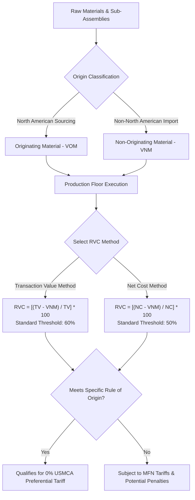
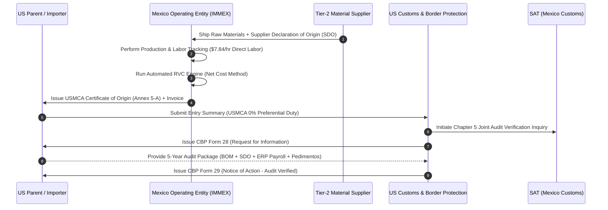
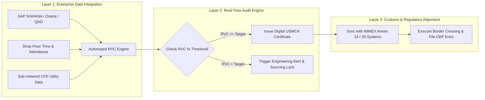

<script type="application/ld+json">
{
  "@context": "https://schema.org",
  "@graph": [
    {
      "@type": "Article",
      "@id": "https://nearshorenavigator.com/en/blogs/compliance-as-architecture-usmca-rvc#article",
      "headline": "Compliance-as-Architecture: Audit-Proofing USMCA Regional Value Content (RVC) in Mexico",
      "description": "Comprehensive executive guide for North American manufacturers on audit-proofing USMCA Regional Value Content (RVC) in Mexico, covering BOM auditing, labor accounting under $7.84/hr border rates, CFE utility allocation, and SAT/CBP joint audit defense.",
      "datePublished": "2026-03-15T08:00:00+00:00",
      "dateModified": "2026-08-13T11:00:00+00:00",
      "author": {
        "@type": "Person",
        "name": "Denisse Martinez",
        "url": "https://nearshorenavigator.com/about/denisse-martinez",
        "jobTitle": "Nearshoring & Trade Compliance Specialist"
      },
      "publisher": {
        "@type": "Organization",
        "name": "Nearshore Navigator",
        "url": "https://nearshorenavigator.com",
        "logo": {
          "@type": "ImageObject",
          "url": "https://nearshorenavigator.com/images/logo.png"
        }
      },
      "mainEntityOfPage": {
        "@type": "WebPage",
        "@id": "https://nearshorenavigator.com/en/blogs/compliance-as-architecture-usmca-rvc"
      },
      "keywords": "USMCA RVC Mexico, Regional Value Content calculation, BOM auditing Mexico, USMCA direct labor accounting, SAT CBP joint audit defense"
    },
    {
      "@type": "FAQPage",
      "@id": "https://nearshorenavigator.com/en/blogs/compliance-as-architecture-usmca-rvc#faq",
      "mainEntity": [
        {
          "@type": "Question",
          "name": "What is the difference between the Net Cost and Transaction Value methods under USMCA?",
          "acceptedAnswer": {
            "@type": "Answer",
            "text": "The Net Cost (NC) method calculates RVC based on total production costs minus non-originating materials, sales, marketing, and royalty costs, making it mandatory for automotive products and optimal for complex industrial assemblies. The Transaction Value (TV) method bases RVC on the price paid or payable for the good (F.O.B. price) minus non-originating materials. Net Cost generally requires lower RVC percentages (e.g., 50% vs 60%) but demands rigorous cost-accounting documentation."
          }
        },
        {
          "@type": "Question",
          "name": "How is direct labor calculated under Mexican border wage rates ($7.84/hr)?",
          "acceptedAnswer": {
            "@type": "Answer",
            "text": "Direct labor under USMCA includes hands-on assembly operators, inline quality control inspectors, and direct tooling technicians. At Mexico's Northern Border fully burdened rate of $7.84/hr, direct labor accounts for base wages, statutory social security (IMSS), housing funds (INFONAVIT 5%), 13th-month mandatory bonus (Aguinaldo), profit sharing (PTU 10%), and shift premiums. Indirect labor, such as general plant management and EHS, must be segregated into production overhead or excluded depending on the calculation method."
          }
        },
        {
          "@type": "Question",
          "name": "How are CFE electricity costs allocated in USMCA Net Cost calculations?",
          "acceptedAnswer": {
            "@type": "Answer",
            "text": "Electricity charges from CFE (Comisión Federal de Electricidad) under industrial tariffs like GDMTH are categorized as Direct Overhead if power is consumed directly by production machinery (metered per cell or allocated by machine run-time), or Indirect Overhead if used for general facility HVAC and lighting. Direct overhead power contributes positively toward reducing net cost deductions for originating value, provided energy sub-metering logs support the allocation."
          }
        },
        {
          "@type": "Question",
          "name": "What triggers a joint SAT-CBP audit under USMCA Chapter 5?",
          "acceptedAnswer": {
            "@type": "Answer",
            "text": "Joint SAT and CBP audits are triggered by discrepancies between Mexican IMMEX Annex 24/30 customs inventory records and US entry summary pedimentos, sudden shifts in claimed tariff classifications, high-volume sourcing from non-USMCA countries (e.g., China, Vietnam), or high-risk origin certifications issued without backing Supplier Declarations of Origin (SDOs)."
          }
        },
        {
          "@type": "Question",
          "name": "What is the record retention requirement for USMCA Certificates of Origin in Mexico and the US?",
          "acceptedAnswer": {
            "@type": "Answer",
            "text": "Both US Customs and Border Protection (19 U.S.C. 1508) and Mexico's Servicio de Administración Tributaria (SAT Fiscal Code Article 30) mandate a minimum 5-year retention period from the date of import certification. Retention records must include complete BOMs, cost accounting logs, supplier origin declarations, bills of lading, and IMMEX pedimento import/export files."
          }
        }
      ]
    },
    {
      "@type": "BreadcrumbList",
      "@id": "https://nearshorenavigator.com/en/blogs/compliance-as-architecture-usmca-rvc#breadcrumb",
      "itemListElement": [
        {
          "@type": "ListItem",
          "position": 1,
          "name": "Home",
          "item": "https://nearshorenavigator.com/"
        },
        {
          "@type": "ListItem",
          "position": 2,
          "name": "Blogs",
          "item": "https://nearshorenavigator.com/en/blogs"
        },
        {
          "@type": "ListItem",
          "position": 3,
          "name": "USMCA RVC Compliance Architecture",
          "item": "https://nearshorenavigator.com/en/blogs/compliance-as-architecture-usmca-rvc"
        }
      ]
    }
  ]
}
</script>

# Compliance-as-Architecture: Audit-Proofing USMCA Regional Value Content (RVC) in Mexico

For C-suite manufacturing executives, supply chain Vice Presidents, and corporate general counsel, navigating trade rules under the **United States-Mexico-Canada Agreement (USMCA)** has evolved from an administrative duty into a core strategic imperative. Far too many North American Original Equipment Manufacturers (OEMs) treat tariff-free cross-border trade as a static paperwork exercise—signing blanket Certificates of Origin once a year and filing them away until an inquiry arrives.

In 2026, that passive approach represents a multi-million-dollar corporate liability.

With **U.S. Customs and Border Protection (CBP)** and Mexico’s **Servicio de Administración Tributaria (SAT)** executing joint, data-synchronized audits under USMCA Chapter 5, the margin for error in qualifying goods has vanished. Claiming 0% duty preferences without rigorous, defensible proof of **Regional Value Content (RVC)** leaves companies vulnerable to retroactive tariff clawbacks, steep negligence penalties, and potential suspension of Mexican **IMMEX** operating privileges.

To protect operating margins and preserve cross-border velocity, leading enterprise manufacturers are abandoning paper-based, reactive compliance. Instead, they are implementing **Compliance-as-Architecture**: embedding automated, real-time trade auditability directly into their bill of materials (BOM) management, enterprise resource planning (ERP) cost accounting, and plant floor execution.

This comprehensive guide details the mathematical, operational, and legal methodologies required to audit-proof your USMCA RVC footprint in Mexico.

---

## 1. Decoupling USMCA Origin Rules: Net Cost vs. Transaction Value Methodologies

To qualify for preferential duty-free treatment under USMCA, non-originating raw materials and sub-components imported into Mexico must undergo an essential transformation—either through a specified **Change in Tariff Classification (CTC)**, a qualifying threshold of **Regional Value Content (RVC)**, or a combination of both.

When evaluating RVC compliance, corporate controllers must choose between two statutory calculation methods defined under **USMCA Chapter 4 (Rules of Origin)**: the **Transaction Value Method** and the **Net Cost Method**.

```
Transaction Value (TV) Method:
RVC = [(TV - VNM) / TV] * 100

Net Cost (NC) Method:
RVC = [(NC - VNM) / NC] * 100
```

Where:
* **TV** = Transaction Value of the good, adjusted to an F.O.B. (Free On Board) basis.
* **NC** = Net Cost of the good, representing total production costs minus excluded costs (sales promotion, marketing, royalties, shipping, and non-allowable interest).
* **VNM** = Value of Non-Originating Materials used by the producer in the production of the good.



### The Transaction Value Method vs. Net Cost Method

While the Transaction Value method relies on the commercial sale price of the finished product, the Net Cost method isolates internal factory cost dynamics. The table below outlines key operational differences:

| Parameter | Transaction Value (TV) Method | Net Cost (NC) Method |
| :--- | :--- | :--- |
| **Typical RVC Threshold** | **60%** North American Content | **50%** North American Content (Sectors vary) |
| **Baseline Metric** | F.O.B. Sales Price to Customer | Total Manufacturing Cost minus Excluded Expenses |
| **Mandatory Applicability** | General industrial, consumer assembly | Mandatory for Automotive, Heavy Machinery, High-VNM Goods |
| **Exposure to Price Volatility** | High (Market price fluctuations alter RVC %) | Low (Grounded strictly in plant floor cost accounting) |
| **Audit Burden** | Low to Moderate | High (Requires detailed job costing & labor logs) |
| **Utility Overhead Inclusion** | Excluded from direct ratio | Included as Direct Production Overhead |

> [!IMPORTANT]
> **Automotive & Specialized Sector Mandates:** Under USMCA Article 4.5, the Net Cost method is mandatory for all passenger vehicles, light trucks, heavy trucks, and listed automotive parts (core, principal, and complementary components). Industrial OEMs operating in high-volume, thin-margin sectors should also default to Net Cost to eliminate market price swings from their compliance calculations.

### Tracing VNM, Intermediate Materials, and De Minimis Thresholds

Audit-proofing an RVC calculation requires granular tracing across three critical BOM attributes:

1. **Value of Non-Originating Materials (VNM):** VNM is not merely the purchase price of Asian or European components. Under USMCA Article 4.7, VNM includes all freight, insurance, packing, duties, and customs brokerage costs incurred in transporting non-originating materials to the facility in Mexico. Failing to add landed freight costs to VNM artificially inflates your RVC score, creating severe audit exposure.
2. **Intermediate Material Designations:** Producers in Mexico can designate a self-produced subassembly manufactured in-house as an "Intermediate Material." If this subassembly qualifies as originating under tariff shift rules, its total cost (including labor and overhead) is treated as originating material when incorporated into the final product, neutralizing non-originating inputs used inside that subassembly.
3. **De Minimis Rule (Article 4.12):** If non-originating components fail a required Tariff Shift (CTC), the finished good still qualifies as originating if the total value of non-originating inputs does not exceed **10% of the total transaction value or net cost** of the good (or 10% of total weight for textile goods).

---

## 2. Financial Precision in Labor & Overhead: $7.84/hr Border Rates & CFE Utility Accounting

In calculating Net Cost ($NC$), labor and facility overhead represent the primary internal mechanisms for building originating value within Mexico. However, customs authorities closely scrutinize how labor and utility expenses are categorized.

```
Net Cost (NC) = Direct Materials + Direct Labor + Direct Overhead + Allocated Factory Overhead - Excluded Costs
```

### Direct vs. Indirect Labor Accounting under $7.84/hr Border Rates

In Mexico's Northern Border industrial hubs—such as Tijuana, Mexicali, and Ciudad Juárez—the baseline fully burdened operator rate averages **$7.84 per hour**. To incorporate labor costs legally into an RVC calculation, corporate controllers must separate **Direct Labor** from **Indirect Labor**.

> [!NOTE]
> **Defining Fully Burdened Border Labor ($7.84/hr):**  
> The $7.84 fully burdened hourly wage reflects the true employer cost of border labor in Mexico. It includes base daily wages alongside mandatory social benefits: Social Security (IMSS), Housing Fund (INFONAVIT at 5%), Mandatory 13th-Month Bonus (Aguinaldo - minimum 15 days), Profit Sharing (PTU - 10%), Holiday Premium (Prima Vacacional - 25%), and regional shift/attendance bonuses.

```
Fully Burdened Labor Rate ($7.84/hr) = Base Daily Wage + Statutory Benefits (IMSS + INFONAVIT) + Payroll Taxes + Annual Bonuses (Aguinaldo + PTU)
```

The matrix below illustrates how CBP and SAT auditors classify different plant personnel:

| Employee Role | Classification under USMCA | RVC Treatment in Net Cost Method | Mandatory Documentation Required |
| :--- | :--- | :--- | :--- |
| **Assembly Line Operators** | **Direct Labor** | **100% Direct Cost** (Included in Net Cost) | Daily shift logs, line time cards, IMSS filings |
| **Inline Quality Control (QC)** | **Direct Labor** | **100% Direct Cost** (Included in Net Cost) | Workstation assignment logs, job descriptions |
| **Direct Tooling Technicians** | **Direct Labor** | **Direct Cost** (Pro-rated to production run) | Machine setup logs, work orders |
| **Plant Maintenance Engineers** | **Indirect Overhead** | **Allocated Factory Overhead** | Plant floor square footage / machine hour ratio |
| **EHS & Safety Officers** | **Indirect Overhead** | **Allocated Factory Overhead** | Facility-wide labor overhead pool |
| **Plant Manager & HR Staff** | **Administrative Overhead** | **Excluded Cost** (Must be deducted from NC) | Salary allocation logs, org chart |
| **Corporate Legal & Sales** | **Excluded Cost** | **Strictly Excluded** (Deducted from NC) | Separate corporate ledger entries |

### CFE Industrial Power Tariffs: Allocating Utility Overhead

Energy is a substantial component of industrial overhead in Mexico. Electricity provided by the state utility, **Comisión Federal de Electricidad (CFE)**, under medium and high-voltage industrial tariffs—such as **GDMTH (Gran Demanda en Media Tensión Horaria)**—comprises dynamic pricing structures:

* **Base, Intermediate, and Peak Energy Charges (kWh):** Fluctuating hourly rates based on grid demand windows.
* **Capacity Charges (Cargo por Capacidad):** Monthly charges based on maximum kW demand during peak periods.
* **Distribution Charges (Cargo por Distribución):** Infrastructure maintenance fees based on non-coincident peak demand.
* **Power Factor Penalties / Credits:** Adjustments applied based on electrical efficiency (below or above 90% power factor).

```
Direct Power Overhead = Sub-metered Machine kWh * Time-of-Use Rate + Pro-rated Machine Capacity Charge
```

To include CFE power expenses within **Direct Overhead** under the Net Cost method, manufacturers must maintain sub-metered electricity logs tracking energy consumption directly to specific production machinery. General plant lighting, executive office air conditioning, and administrative building power are categorized as **Indirect Facility Overhead**, requiring reasonable allocation formulas (e.g., machine-operating hours or production square footage).

> [!TIP]
> **Sub-Metered Utility Optimization:** Installing smart sub-meters across primary manufacturing cells establishes an unassailable audit trail. It allows plant managers to claim 100% of machine power consumption as Direct Production Overhead, maximizing originating value contributions while optimizing peak-hour CFE tariff schedules.

---

## 3. Origin Certification & Audit Trail Engineering

Under USMCA Chapter 5, the traditional, standardized Form 434 Certificate of Origin used under NAFTA has been abolished. In its place, the treaty allows for a flexible **Certification of Origin** embedded directly into commercial invoices or standalone documents, provided it contains **9 Mandatory Data Elements**.

```
Mandatory USMCA Annex 5-A Data Elements:
1. Certifier Identification (Importer, Exporter, or Producer)
2. Certifier Details (Name, Title, Address, Phone, Email)
3. Exporter Details (Name, Address, Email, Phone)
4. Producer Details (Name, Address, Email, Phone)
5. Importer Details (Name, Address, Email, Phone)
6. Description and HS Tariff Classification of the Good (6-Digit Level)
7. Origin Criterion (A through D under Article 4.2)
8. Blanket Period (Up to 12 months for multiple shipments)
9. Authorized Signature and Date (With explicit certification statement)
```



### Exporter vs. Producer Certification & Blanket Risk Management

USMCA permits origin certification by the **Importer**, **Exporter**, or **Producer**. However, issuing a certification as an Importer or Exporter without written, validated proof from the Mexican Producer represents a significant operational hazard.

Furthermore, companies frequently issue **12-Month Blanket Certificates of Origin**. While blanket certificates streamline logistics velocity, they create cumulative audit vulnerability:

> [!WARNING]
> **The Blanket Certificate Risk Trap:**  
> If an engineering team alters a Bill of Materials midway through a 12-month blanket period—substituting a North American aluminum supplier with a lower-cost Asian alternative—the blanket certification becomes invalid immediately. Importing goods under an invalidated blanket certificate exposes the importer to retroactive duty assessments across every shipment executed during that 12-month window, accompanied by civil fraud penalties under 19 U.S.C. 1592.

### Dual-Jurisdiction 5-Year Record Retention Mandate

Audit defense requires maintaining an unbroken digital thread across both sides of the border. Record retention requirements differ slightly between federal jurisdictions but enforce a strict baseline:

* **United States (CBP):** Mandates a 5-year retention period from the date of importation under **19 U.S.C. 1508**.
* **Mexico (SAT):** Mandates a 5-year retention period under **Article 30 of the Fiscal Code of the Federation (Código Fiscal de la Federación)**, extending up to 10 years if fiscal losses or asset depreciations are involved.

The required audit package must contain:
1. Complete, dated, engineering-approved Bills of Materials (BOMs).
2. Written **Supplier Declarations of Origin (SDOs)** for all claimed originating inputs.
3. Import and export pedimentos under Mexican IMMEX **Annex 24** (Automated Inventory Control System) and **Annex 30** (VAT/IEPS Certification System).
4. Direct labor payroll registers (IMSS filings) reflecting fully burdened labor rates.
5. CFE utility bills and machine allocation sheets.
6. US Customs Entry Summaries (CBP Form 7501) and Bills of Lading.

---

## 4. SAT & CBP Joint Audit Defense: Navigating Chapter 5 Verification

Under USMCA Chapter 5, cross-border customs enforcement has transitioned into a collaborative, data-sharing framework between CBP and SAT. Joint verification visits and mutual administrative assistance allow regulatory bodies to audit records on both sides of the border simultaneously.

```
Audit Verification Timeline (CBP Form 28 / Form 29 Workflow):

[Trigger: Discrepancy in RVC / Pedimento Data]
       │
       ▼
[CBP Form 28 Issued (Request for Information)] ──► Response Window: 30 Days
       │
       ▼
[Internal Compliance Audit & BOM Reconstruction]
       │
       ▼
[Submission of Backing Proof (SDOs, Payroll, CFE Logs)]
       │
       ├───────────────────────────────┐
       ▼                               ▼
[CBP Form 29: Verified]    [CBP Form 29: Negative Finding]
(0% Duty Preserved)               │
                                  ▼
                     [Retroactive Tariff Assessment + Penalties + Section 301]
```

### Interrogatories & Formal Verification Procedures

Customs verification typically initiates via formal administrative inquiries:

* **CBP Form 28 (Request for Information):** Sent to the US Importer requesting detailed cost breakdowns, BOMs, and supplier origin proof. Importers have **30 days** to respond.
* **CBP Form 29 (Notice of Action):** Sent when CBP intends to reclassify goods, deny USMCA preferential duty treatment, or assess retroactive duties.
* **SAT Verification Visits (Visitas de Verificación):** SAT officials inspect physical manufacturing premises in Mexico to confirm that machinery, workforce, and production operations match claimed IMMEX pedimentos and RVC accounting sheets.

### Labor Value Content (LVC) Verification in High-Tech & Automotive

For automotive manufacturers, USMCA Article 7 of the Automotive Appendix imposes a specialized **Labor Value Content (LVC)** mandate requiring that **40% to 45%** of the vehicle's content be produced by workers earning at least **$16.00 USD per hour**.

While baseline border operators in Mexico earn $7.84/hr fully burdened, OEMs fulfill LVC targets by combining:
1. High-wage R&D and engineering expenditures located in the US or Canada.
2. Regional direct production labor at specialized US/Canadian plants.
3. Up to 10% credit for regional high-wage technology and assembly operations.

Auditors evaluate LVC using average hourly base wage rates, strictly excluding overtime premiums, bonuses, and indirect administrative salaries.

### Financial Consequences of Audit Failures

The financial fallout of a negative audit determination extends far beyond minor duty adjustments:

```
Total Failure Liability = Retroactive MFN Duties + Section 301 Penalties (25%-100%) + Statutory Interest + Negligence Penalties (up to 400% of duty) + IMMEX Suspension Costs
```

| Failure Risk | Financial / Operational Exposure | Statutory Basis |
| :--- | :--- | :--- |
| **Retroactive Duty Assessment** | Full MFN duty rates applied retroactively across 5 years of imports | 19 U.S.C. 1505 |
| **Section 301 Penalty Application** | 25% to 100% tariffs applied to non-qualifying Asian component values | Executive Order / Section 301 |
| **Civil Customs Fraud / Negligence** | Fines ranging from 20% to 400% of total unpaid duties | 19 U.S.C. 1592 |
| **IMMEX Program Suspension** | Immediate freeze on tax-free temporary raw material imports into Mexico | Mexican Decree for IMMEX Development |
| **VAT / IEPS Credit Revocation** | Immediate assessment of 16% Mexican VAT on all imported inventory | Mexican Value Added Tax Law Article 28-A |

### Audit Defense Readiness Scorecard

To evaluate enterprise vulnerability, corporate compliance officers should benchmark their Mexican operations against the following audit readiness criteria:

| Audit Parameter | Red Flag (High Risk) | Amber Flag (Moderate Risk) | Gold Standard (Audit-Proof) |
| :--- | :--- | :--- | :--- |
| **BOM Provenance Tracking** | Manual spreadsheets updated annually | Quarterly ERP updates without SDO backing | Automated ERP integration with validated real-time SDOs |
| **Labor Burden Allocation** | Blended average labor rate applied across all products | Direct labor tracked manually on paper time cards | Digital badge logs linked directly to shop-floor ERP job numbers |
| **Utility Cost Treatment** | General facility power included without sub-metering | Pro-rated square footage allocation | Sub-metered machine cell logging for direct overhead |
| **Supplier Declarations (SDOs)** | Self-certified without tier-2 backup | Over 70% valid SDOs collected on file | 100% digitally verified SDOs linked to 6-digit HS codes |
| **IMMEX Synchronization** | Annex 24 inventory balanced monthly | Annex 24 updated weekly with manual entry | Real-time Annex 24 & 30 automated pedimento reconciliation |

---

## 5. Building a Compliance-as-Architecture Framework

Transitioning from reactive risk management to proactive **Compliance-as-Architecture** requires integrating trade compliance directly into operational workflows.



### Core Architecture Implementation Steps

1. **Automate Real-Time BOM RVC Scoring:** Connect enterprise resource planning (ERP) platforms (such as SAP S/4HANA, Oracle SCM, or QAD) with specialized trade automation software. Every engineering change order (ECO) must automatically re-calculate the product’s RVC percentage based on live component purchase orders and landed freight costs.
2. **Synchronize IMMEX Annex 24 and Annex 30 Systems:** Establish automated data pipelines between Mexican customs inventory software and US entry summary filings. Eliminating manual data re-entry prevents discrepancies between temporary import pedimentos and US duty-free claims.
3. **Establish a Supplier Origin Portal:** Mandate that all Tier-2 and Tier-3 component vendors submit annual, digitally signed Supplier Declarations of Origin (SDOs) through an automated portal prior to purchase order release.
4. **Deploy Sub-Metered Utility Costing:** Install IoT-enabled sub-meters on high-power machinery to convert CFE electrical costs into documented Direct Production Overhead under the Net Cost calculation.
5. **Leverage Shelter Operations Expertise:** For enterprise OEMs operating under a Mexican **Shelter Service Provider**, partner directly with the shelter’s trade compliance department. Experienced shelter operators provide turnkey IMMEX Annex 24/30 management, bilingual legal defense teams, and direct interface with SAT customs authorities.

> [!TIP]
> **Shelter Compliance Advantage:** Operating under an established shelter program allows US manufacturers to leverage pre-audited IMMEX permits, certified VAT/IEPS status, and established SAT relationships—significantly compressing regulatory setup times while maintaining full compliance insulation.

---

## 6. Frequently Asked Questions (FAQ)

### What is the difference between the Net Cost and Transaction Value methods under USMCA?
The Net Cost (NC) method calculates RVC based on total production costs minus non-originating materials, sales, marketing, and royalty costs, making it mandatory for automotive products and optimal for complex industrial assemblies. The Transaction Value (TV) method bases RVC on the price paid or payable for the good (F.O.B. price) minus non-originating materials. Net Cost generally requires lower RVC percentages (e.g., 50% vs 60%) but demands rigorous cost-accounting documentation.

### How is direct labor calculated under Mexican border wage rates ($7.84/hr)?
Direct labor under USMCA includes hands-on assembly operators, inline quality control inspectors, and direct tooling technicians. At Mexico's Northern Border fully burdened rate of $7.84/hr, direct labor accounts for base wages, statutory social security (IMSS), housing funds (INFONAVIT 5%), 13th-month mandatory bonus (Aguinaldo), profit sharing (PTU 10%), and shift premiums. Indirect labor, such as general plant management and EHS, must be segregated into production overhead or excluded depending on the calculation method.

### How are CFE electricity costs allocated in USMCA Net Cost calculations?
Electricity charges from CFE (Comisión Federal de Electricidad) under industrial tariffs like GDMTH are categorized as Direct Overhead if power is consumed directly by production machinery (metered per cell or allocated by machine run-time), or Indirect Overhead if used for general facility HVAC and lighting. Direct overhead power contributes positively toward reducing net cost deductions for originating value, provided energy sub-metering logs support the allocation.

### What triggers a joint SAT-CBP audit under USMCA Chapter 5?
Joint SAT and CBP audits are triggered by discrepancies between Mexican IMMEX Annex 24/30 customs inventory records and US entry summary pedimentos, sudden shifts in claimed tariff classifications, high-volume sourcing from non-USMCA countries (e.g., China, Vietnam), or high-risk origin certifications issued without backing Supplier Declarations of Origin (SDOs).

### What is the record retention requirement for USMCA Certificates of Origin in Mexico and the US?
Both US Customs and Border Protection (19 U.S.C. 1508) and Mexico's Servicio de Administración Tributaria (SAT Fiscal Code Article 30) mandate a minimum 5-year retention period from the date of import certification. Retention records must include complete BOMs, cost accounting logs, supplier origin declarations, bills of lading, and IMMEX pedimento import/export files.

---

## Strategic Action Plan: Audit-Proof Your Mexican Operations

Navigating USMCA Regional Value Content compliance requires a sophisticated blend of customs law, cost accounting, and industrial engineering. Treating trade compliance as an integrated architectural system ensures your Mexican operations deliver predictable cost savings without regulatory friction.

### Model Your RVC and Labor Cost Structures

Are your current Bill of Materials and labor allocations fully audit-proofed under USMCA guidelines? Use our interactive nearshore intelligence suite to benchmark your operations:

* **Calculate Fully Burdened Cost Structures:** Model exact labor, freight, and utility allocations with our [/en/tools/cost-calculator](/en/tools/cost-calculator).
* **Explore Regional Infrastructure Hubs:** Review industrial park capabilities, labor availability, and logistics velocity across [/en/locations/tijuana](/en/locations/tijuana) and [/en/locations/mexicali](/en/locations/mexicali).
* **Request an Executive Compliance Audit:** Speak directly with our nearshore trade architecture specialists to review your IMMEX, RVC, and shelter operation frameworks. Visit [/en/contact](/en/contact) to schedule a confidential consultation.
