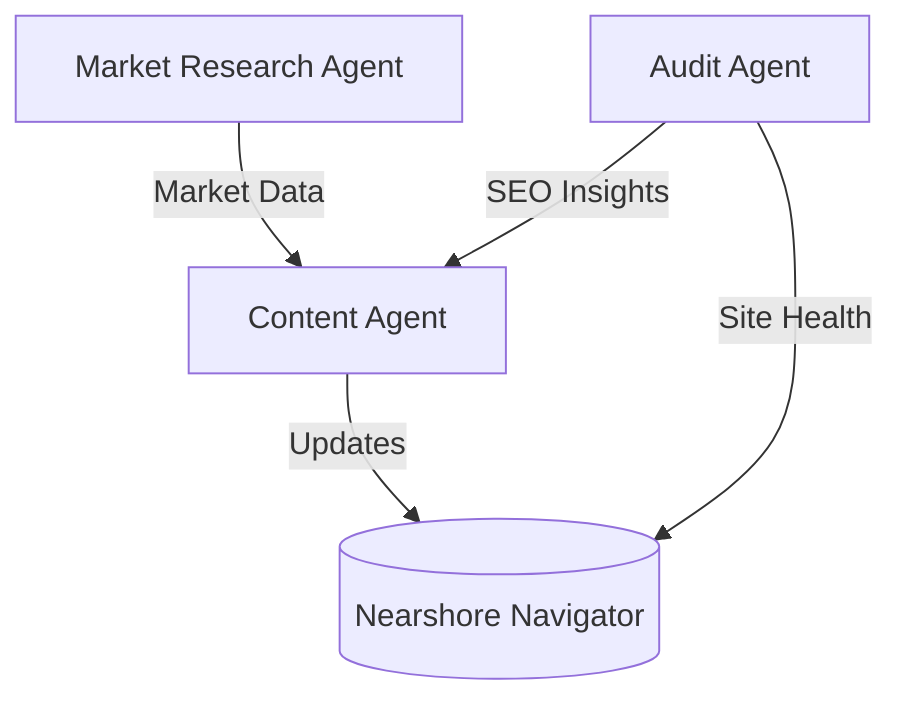

# Agentic Architecture - Nearshore Navigator

This document defines the autonomous agent layer designed to grow and maintain the Nearshore Navigator platform.

## Agent Personas

### 1. Market Research Agent (MRA) - "Navigator Researcher"

- **Mandate**: Monitor global nearshoring trends and local Baja California business news.
- **Tools**: `web_search`, `reddit_scanner`, `x_tracker`.
- **Workflow**:
  1. Scan X/Reddit for keywords: "nearshoring mexico", "tijuana factory", "USMCA 2026".
  2. Identify top 3 industry pain points (e.g., "energy availability", "labor costs").
  3. Generate a weekly "Market Pulse" report for the Content Agent.

### 2. Technical & SEO Audit Agent (TAA) - "Navigator Guardian"

- **Mandate**: Ensure the site is technically perfect and ranking for high-intent keywords.
- **Tools**: `browser_audit`, `seo_analyzer`, `performance_monitor`.
- **Workflow**:
  1. Run weekly crawls to check for broken links and missing meta descriptions.
  2. Compare site metrics against competitors (Tecma, CPI).
  3. Audit conversion rates on the "Site Assessment" lead form.

### 3. Content Optimization Agent (COA) - "Navigator Scribe"

- **Mandate**: Transform research and audit data into high-converting copy.
- **Tools**: `content_generator`, `image_engine`, `i18n_translator`.
- **Workflow**:
  1. Receive reports from MRA.
  2. Draft new "Insights" posts or update the `StatsGrid` with fresh data (e.g., the $6B investment figure).
  3. Optimize pages for long-tail keywords identified by TAA.

## Skill Sets

| Skill                      | Description                                        | Agent |
| -------------------------- | -------------------------------------------------- | ----- |
| `Social Intelligence`      | Ability to parse sentiment from X/Reddit threads.  | MRA   |
| `Competitive Benchmarking` | Comparing site features against industrial giants. | TAA   |
| `Multilingual Content Ops` | Managing translations (EN/ES/FR) for all blogs.    | COA   |

## Communication Flow

